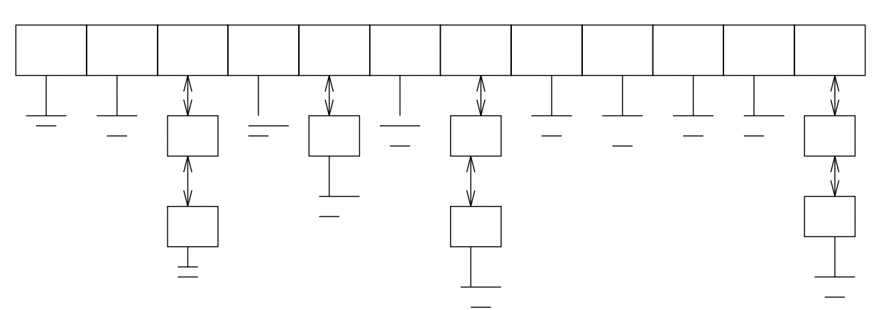

# Google Interview

## Steve Skiena Algorithm Design Manual

### Data Structures

- Changing a data structure in a slow program can work the same way an organ transplant does in a sick patient.
- Important classes of abstract data types such as containers, dictionaries, and priority queues, have many different but functionally equivalent data structures that implement them.

#### 1. Contiguous vs. Linked Data Structures

1. ***Contiguously-allocated structures:***
   - Composed of single slabs of memory
   - Include arrays, matrices, heaps, and hash tables.
2. ***Linked data structures:***
   - Composed of distinct chunks of memory bound together by pointers
   - Include lists, trees, and graphs.

###### Arrays

- Linked structures require extra space for storing pointer fields.
- Linked lists do not allow efficient random access to items.
- Arrays allow better memory locality and cache performance than random pointer jumping.
- Dynamic memory allocation provides us with flexibility on how and where we use our limited storage resources.

###### Lists

- Insertions and deletions are simpler than for contiguous (array) lists.
- With large records, moving pointers is easier and faster than moving the items themselves.

 

#### 2. Stacks & Queues

- Container denotes a data structure that permits storage and retrieval of data items independent of content.
- By contrast, dictionaries are abstract data types that retrieve based on key values or content.
- Containers are distinguished by the particular retrieval order they support.

###### Stacks

- Supports LIFO and are simple to implement and very efficient.
- Stacks are probably the right container to use when retrieval order doesn’t matter at all, such as when processing batch jobs.

###### Queues

- Supports FIFO and surely the fairest way to control waiting times for services.
- Queues are somewhat trickier to implement than stacks and thus are most appropriate when the order is important.
- Queues act as the fundamental data structure controlling breadth-first searches in graphs.

> [Note:]() Stacks and queues can be effectively implemented using either arrays or linked lists. The key issue is whether an upper bound on the size of the container is known in advance, thus permitting the use of a statically-allocated array.

 

#### 3. Dictionaries

- The dictionary data type permits access to data items by content.
- Mostly implemented using doubly linked list.

 

> [Note:]() Data structure design must balance all the different op- erations it supports. The fastest data structure to support both operations A and B may well not be the fastest structure to support either operation A or B.

 

#### 4. Binary Search Trees

- We have seen data structures that allow fast search or flexible update, but not fast search and flexible update.
- Unsorted, doubly-linked lists supported insertion and deletion in O(1) time but search took linear time in the worse case.
- Sorted arrays support binary search and logarithmic query times, but at the cost of linear-time update.

###### Normal BST

- Takes O(h) time for insertion, deletion and query.
- The smallest height we can hope for occurs when the tree is perfectly balanced, where h = ⌈log n⌉.
- They have left and right pointer fields, an (optional) parent pointer, and a data field.

###### Balanced BST

- Adjusts a bit after insertion and deletion operation and maintains its balanced state.
- Guarantees the logarithmic time for insertion, deletion and query.

 

#### 5. Priority Queues

- Priority queues are data structures that provide more flexibility than simple sorting.
- Because they allow new elements to enter a system at arbitrary intervals.
- It is much more cost-effective to insert a new job into a priority queue than to re-sort everything on each such arrival.

 

> [Note:]() Building algorithms around data structures such as dictio- naries and priority queues leads to both clean structure and good performance.

 

#### 6. Hashing

- Hash tables are a very practical way to maintain a dictionary.
- They exploit the fact that looking an item up in an array takes constant time once you have its index.
- A hash function is a mathematical function that maps keys to integers.
- We will use the value of our hash function as an index into an array, and store our item at that position.

###### Collision Resolution

- No matter how good our hash function is, we had better be prepared for collisions.
- Because two distinct keys will occasionally hash to the same value.
- Chaining is the easiest approach to collision resolution.
- Represent the hash table as an array of m linked lists.

 

#### 8. Graphs

- Adjacency List
- Adjacency Matrix

 

#### 7. Strings

- Suffix Trees
- Suffix Arrays

 

#### 8. Sets

- Set
- Bit Vectors

 

#### 9. Geometric Data Structures

- KD Trees - Polygon Representation

