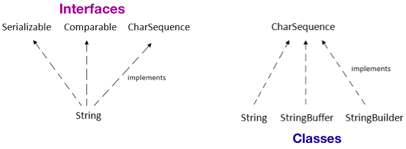

# Arrays and Strings

This section discussed about the the 2 major concepts in Java programming language.

- Arrays 
- Strings

## Arrays

###### What are arrays in Java ?

An array is a group of like-typed variables that are referred to by a common name. Arrays in Java work differently than they do in C/C++.

Following are some important point about Java arrays.

- In Java all arrays are ***dynamically allocated***.
- Since arrays are objects in Java, we can find their length using member length. This is different from C/C++ where we find length using sizeof.
- A Java array variable can also be declared like other variables with [] after the data type.
- The variables in the array are ordered and each have an index beginning from 0.
- Java array can be also be used as a static field, a local variable or a method parameter.
- *The size of an array must be specified by an int value and not long or short.*
- The direct superclass of an array type is [Object]().
- Every array type implements the interfaces [Cloneable]() and [java.io.Serializable]().

##### Important Points

- Array can contains primitives data types as well as objects of a class depending on the definition of array. 
- In case of primitives data types, the actual values are stored in ***contiguous memory locations***. In case of objects of a class, the actual objects are stored in ***heap segment***.


### Creating / Declaring Array : 

- The general form of a one-dimensional array declaration is:

```java
type var-name[];
or
type[] var-name;
```

- We can create an array of any java data types either primitive data types, Boxed types,  Object type, Collection Type or user defined data types:

```java
// Array of Primitive data types
int[] intArr;
byte[] byteArr;
short[] shortArr;
long[] longArr;
float[] floatArr;
double[] doubleArr;
char[] charArr;

// Array of Boxed Types
Integer[] integerArr;

// Array of Object of unknown type
Object[] objArr;

// Array of Collection of unknown type
Collection[] collArr;

// Array of User Defined Type
MyClass[] myClassArr;

public static void main(String[] args){
  System.out.println("hello");
  System.out.println("hello");
  System.out.println("hello");
}
```

- Although the above first declaration establishes the fact that intArr is an array variable, **no array actually exists**. 
- It simply tells to the compiler that this(intArr) variable will hold an array of the integer type.
- To link intArray with an actual, physical array of integers, we must allocate one using **new** and assign it to intArray.


### Instantiating / Initializing Array :

- When an array is declared, only a reference of array is created.
- To actually create or give memory to array, you create an array like this:

```java
var-name = new type [size];
```

- To use *new* to allocate an array, **you must specify the type and number of elements to allocate.**

```java
int intArr[];    //declaring array
intArr = new int[20];  // allocating memory to array
```

- We can even combine declaration and allocation of memory into a single statement.

```java
int[] intArr = new int[20]; // combining both statements in one
```

- Elements in the array allocated by ***new*** will automatically be initialized to :
    - **zero** (for numeric types)
    - **false** (for boolean)
    - **null** (for reference types)
- Obtaining an array is a two-step process. First, we must declare a variable of the desired array type. Second, we must allocate the memory that will hold the array, using new, and assign it to the array variable. Thus, **in Java all arrays are dynamically allocated.**

###### Array Literal:

- In a situation, where the size of the array and variables of array are already known, array literals can be used.

```java
 int[] intArray = new int[]{ 1,2,3,4,5,6,7,8,9,10 }; // Declaring array literal
```

- The length of this array determines the length of the created array.
- There is no need to write the new int[] part in the latest versions of Java.

```java
 int[] intArray = { 1,2,3,4,5,6,7,8,9,10 }; // Declaring array literal in newer Java Versions
```


### Accessing Array :

- Each element in the array is accessed via its index.
- The index begins with 0 and ends at (total array size)-1.
- All the elements of array can be accessed using Java for Loop.

```java
// accessing the elements of the specified array
for (int i = 0; i < arr.length; i++) {
  System.out.println("Element at index " + i + " : "+ arr[i]);
}
```

***Example:***

```java
class Student { 
    public int roll_no; 
    public String name; 
    
    Student(int roll_no, String name) { 
        this.roll_no = roll_no; 
        this.name = name; 
    } 
} 
  
// Elements of array are objects of a class Student. 
public class UserDefinedDataTypeArrayExample { 
    public static void main (String[] args) { 
        // declares an Array of of type Student. 
        Student[] arr; 
  
        // allocating memory for 5 objects of type Student. 
        arr = new Student[5]; 
  
        // initialize the first elements of the array 
        arr[0] = new Student(1,"aman"); 
  
        // initialize the second elements of the array 
        arr[1] = new Student(2,"vaibhav"); 
        arr[2] = new Student(3,"shikar"); 
        arr[3] = new Student(4,"dharmesh"); 
        arr[4] = new Student(5,"mohit"); 
  
        // accessing the elements of the specified array 
        for (int i = 0; i < arr.length; i++) 
            System.out.println("Element at " + i + " : " + arr[i].roll_no + " " + arr[i].name); 
    } 
}
```

**Output:**

```
Element at 0 : 1 aman
Element at 1 : 2 vaibhav
Element at 2 : 3 shikar
Element at 3 : 4 dharmesh
Element at 4 : 5 mohit
```


### Multi-dimensional Arrays :

- Multidimensional arrays are arrays of arrays with each element of the array holding the reference of other array also k/a **Jagged Arrays**.
- A multidimensional array is created by appending ***one set of square brackets ([]) per dimension***.

```java
int[][] int2DArr = new int[10][20];  // 2D array or matrix
int[][][] int3DArr = new int[10][20][10];  // 3D array
```

**Example:**

```java
class multiDimensionalArrayExample { 
    public static void main(String args[]) { 
        // declaring and initializing 2D array 
        int arr[][] = { {2,7,9},{3,6,1},{7,4,2} }; 
  
        // printing 2D array 
        for (int i=0; i< 3 ; i++) { 
            for (int j=0; j < 3 ; j++) {
                System.out.print(arr[i][j] + " "); 
            }
            System.out.println(); 
        } 
    } 
} 
```

**Output:**

```
2 7 9 
3 6 1 
7 4 2 
```


### Other Array Concepts :

###### 1. Passing Arrays to Methods

- Like variables, we can also pass arrays to methods.
- *Example:* below program pass array to method *sum* for calculating sum of array’s values.

```java
class Test {     
    public static void main(String args[])  { 
        int arr[] = {3, 1, 2, 5, 4}; 
          
        sum(arr);  // passing array to method m1 
    } 
  
    public static void sum(int[] arr) {  
        int sum = 0;  // getting sum of array values
          
        for (int i = 0; i < arr.length; i++) {
            sum += arr[i];
        }
          
        System.out.println("sum of array values : " + sum); 
    } 
} 
```

**Output:**

```
sum of array values : 15
```


###### 2. Array Members

- Arrays are ***object of a class*** and ***direct superclass of arrays is class Object***.
- The members of an array type are all of the following:
    - [`public final length`]() which contains the number of components of the array, length may be positive or zero.
    - All the members and methods ar inherited from class Object.
    - The only method of Object that is not inherited is its clone method.
    - [`public clone()`](), which overrides clone method in class Object and throws no checked exceptions.


### Arrays Class :

###### What is Arrays Class in Java ?

- It is  in **java.util package** and is a part of the Java Collection Framework.
- This class provides static methods to dynamically create and access Java arrays.
- It consists of only static methods and the methods of Object class.
- The methods of this class can be used by the class name itself.

###### Class Hierarchy :

```java
java.lang.Object
 ↳ java.util.Arrays
```

###### Class Declaration :

```java
public class Arrays extends Object
```

###### Basic Syntax:

```java
Arrays.<methodName>;
```

###### Need for Java Arrays Class

- There are often times when **loops** are used to do some tasks on an array like:
    - Fill an array with a particular value.
    - Sort an Arrays.
    - Search in an Arrays.
    - And many more.
- *Arrays class provides several static methods that can be used to perform these tasks directly without the use of loops.*

##### Methods in Arrays Class :

- [`toString(arr):`]() returns a String representation of the contents of this Arrays.
- [`asList(arr):`](): returns a fixed-size list backed by the specified Arrays.
- [`binarySearch(arr, key):`]() searches for the key in the array with the help of Binary Search algorithm.
- [`binarySearch(arr, fromIndex, toIndex, key, comparator):`]() searches key in the specified range in the arr.
- [`fill(arr, newVal):`]() assigns this newVal to each element of this Array.
- [`fill(arr, fromIndex, toIndex, newVal):`]() assigns the new value in given range.
- [`equals(arr1, arr2):`]()  checks if both the arrays are equal or not.
- [`sort(arr):`]() sorts the complete array in ascending order.
- [`sort(arr, fromIndex, toIndex, comparator):`]() sorts the array in range, if comparator provided then a/c to it or else ascending order.
- [`stream(arr):`]() returns a sequential stream with the specified array as its source.

###### New Java 9 Methods:

- [`mismatch(arr1, arr2):`]() finds and returns the index of the first unmatched element between the two arrays.
- [`compare(arr1, arr2)`:]() compares two arrays lexicographically.


**Example:**

```java
import java.util.Arrays;
import java.util.List;
import java.util.stream.Collectors;

public class Ex3ArraysClassOperations {
    public static void main(String[] args){
        // Create an array using :=> Type[] arr = new Type[size]
        int[] arr = new int[5];

        // Filling values in array using : arr[index] = val
        arr[0] = 10; arr[1] = 20; arr[2] = 15;
        arr[3] = 22; arr[4] = 35;

        // Get the length of the arr using : length member
        System.out.println("Length of the arr : " + arr.length);

        // Get string representation of array using : toString(arr)
        String arrString = Arrays.toString(arr);
        System.out.println("String rep of arr : " + arrString);

        // List representation of array using : asList(arr)
        System.out.println("List representation of arr : " + Arrays.asList(arr));

        // Binary Search in arr using : binarySearch(arr, key)
        Arrays.sort(arr);
        System.out.println("Find key 22 in arr : " + Arrays.binarySearch(arr, 22));

        // Binary Search in range using : binarySearch(arr, fromIndex, toIndex, key)
        System.out.println("Find key 22 in arr : " + Arrays.binarySearch(arr, 1, 3, 22));

        // Fill the arr with new value using :=> fill(arr, newVal)
        Arrays.fill(arr, 55);
        System.out.println("Arrays after filling with 55 : " + arr);

        int arr1[] = { 10, 20, 15, 22, 35 };
        int arr2[] = { 10, 15, 22 };

        // Check if arrays are equal using :=> equals(arr1, arr2)
        System.out.println("Are arr1 and arr2 equal ? : " + Arrays.equals(arr1, arr2));

        // sort arr using :=> sort(arr)
        Arrays.sort(arr1);
        System.out.println("Sorted Arr : " + Arrays.toString(arr1));

        // Use stream using :=> stream(arr)
        List<Integer> arrIntegerList = Arrays.stream(arr1)   // Stream of int
                                                .boxed()    // Stream of Integer
                                                .collect(Collectors.toList());
        System.out.println("Integer List of arr : " + arrIntegerList);
    }
}
```

**Output:**

```
Length of the arr : 5
String rep of arr : [10, 20, 15, 22, 35]
List representation of arr : [[I@74a14482]
Find key 22 in arr : 3
Find key 22 in arr : -4
Arrays after filling with 55 : [I@74a14482
Are arr1 and arr2 equal ? : false
Sorted Arr : [10, 15, 20, 22, 35]
Integer List of arr : [10, 15, 20, 22, 35]
```


## Strings

###### What are Strings in Java ?

- Strings in Java are Objects that are backed internally by a char array.
- Since arrays are immutable(cannot grow), Strings are immutable as well.
- Whenever a change to a String is made, an entirely new String is created.

###### Basic Syntax:

```java
String stringVarName = "sequence of chars or words"

// Example:
String str = "Geeks";
```


##### Interfaces and Classes



###### CharSequence Interface : 

- It is used to represent the sequence of  characters.
- **String**, **StringBuffer** and **StringBuilder** classes implement it. It means, we can create strings in java by using these three classes.


### 1. String

- String is a sequence of characters. 
- In java, objects of String are  immutable which means a constant and cannot be changed once created.

###### Constructors :

```java
String str = "ExampleOfString";
String str = new String (“ExampleOfString”);
```

###### Methods :

- [`length():`]() - Returns the length or number of characters.
- [`isEmpty():`]() - Checks if it is empty.
- [`charAt(i):`]() - Returns the character at **i**th index.
- [`substring(i):`]() - Returns the substirng form **i**th character to end.
- [`substring(i, j):`]() - Returns the substirng form **i**th to (j-1)th character.
- [`subsequence(i, j):`]() - returns the subsequence b/w i and j.
- [`concat(s):`]() - Concatenates given string to end.
- [`indexOf(s):`]() - Index of first occurrence.
- [`indexOf(s, i):`]() - Index of first occurrence starting from given index.
- [`lastIndexOf(s):`]() - Last index of the given string.
- [`equals(obj):`]() - Compares string with given object.
- [`equalsIgnoreCase(anotherStr):`]() - Compares string to another string igonoring case.
- [`contentEquals(content):`]() - to check if content from buffer or builder equals to it.
- [`compareTo(anotherStr):`]() - Compares 2 strings lexicographically.
- [`compareToIgnoreCase(anotherStr):`]() - Compares 2 strings lexicographically ignoring case.
- [`contains(anotherStr):`]() - checks if it contains the given str.
- [`startsWith(str):`]() and [`startsWith(str, offset):`]() to check if it starts with givn str.
- [`endsWith(str):`]() - to check if it endswith given str.
- [`matches(regex):`]() - to check if it matches with regex.
- [`split(regex):`]() - splits using regex.
- [`toLowerCase():`]() - Converts all characters in string to lower case.
- [`toUpperCase():`]() - Converts all characters in string to upper case.
- [`trim():`]() - Removes whitespaces at both ends but not in middles.
- [`replace(oldChar, newChar):`]() - Replaces all occurences of old char with new in the string.
- [`replaceAll(regex, replacement):`]() and [`replaceFirst(regex, replacement):`]() - to replace within the string.


***Example:***

```java
import java.util.Arrays;

public class StringCreationAndOperations {
    public static void main(String[] args){
        // Create string using :=> literals
        String s = "Astik Anand";

        // Get count of characters using :=> length()
        System.out.println("Length of string s : " + s.length());

        // Check if it is empty using :=> isEmpty()
        System.out.println("Is string empty ? : " + s.isEmpty());

        // Get the char at ith position using :=> charAt(i)
        System.out.println("Char at 4th index : " + s.charAt(4));

        // Get the substring from ith to end using : s.substring(i)
        System.out.println("Substring from 4th index to end : " + s.substring(4));

        // Get the substring from ith to (j-1)th using : substring(i, j)
        System.out.println("Substring from 4th to 9th : " + s.substring(4, 9));

        // Get the subsequence b/w i and j-1 using :=> subsequence(i, j)
        System.out.println("Subsequence form 6th to 9th : " + s.subSequence(6, 9));

        // Concatenate given string to end using :=> s.concat(anotherStr)
        String s1 = "Hello! ";
        String s2 = "Folks, Welcome";
        System.out.println("Concatenated String : " + s1.concat(s2));

        // Get index of first occurrence using :=> indexOf(str)
        String s3 = "Learn Share Learn";
        System.out.println("Index of \"Share\" : " + s3.indexOf("Share"));

        // Get index of first occurrence starting at ith index using :=> indexOf(str, i)
        System.out.println("Index of 'a' starting at 3 : " + s3.indexOf('a', 3));

        // Get last index using :=> lastIndexOf(str)
        System.out.println("Last index of \"Learn\" : " + s3.lastIndexOf("Learn"));

        // Check equality of Strings using :=> equals(anotherStr)
        String s4 = "WeLcOMe";
        System.out.println("Is \"WeLcOMe\" equal to \"Welcome\" ? : " + s4.equals("Welcome"));

        // Check equality of Strings ignoring case using :=> equalsIgnoreCase(anotherStr)
        System.out.println("Is \"WeLcOMe\" equal to \"Welcome\" after ignoring case ? : "
                + s4.equalsIgnoreCase("Welcome"));

        // Check if content equals if content from StringBuffer or Builder using :=> contentEquals(content)
        System.out.println("Is \"WeLcOMe\" content equal to \"Welcome\" ? : "
                + s4.contentEquals(new StringBuffer("Welcome")));

        // Compare String Lexicographically using :=> compareTo(anotherStr)
        String s5 = "abcde";
        System.out.println("Comparing \"abcde\" to \"abcdb\" : " + s5.compareTo("abcdb"));

        // Check if string contains given str using :=> contains(str)
        System.out.println("Does s5 contains \"cd\" ? : " + s5.contains("cd"));

        // Check if string starts with given str using :=> startsWith(str)
        System.out.println("Does s5 startsWith \"abc\" ? : " + s5.startsWith("abc"));

        // Check if string ends with given str usign :=> endsWith(str)
        System.out.println("Does s5 startsWith \"cde\" ? : " + s5.endsWith("cde"));

        // Split on the basis of regex using :=> split(regex)
        String s6 = "I am   a   Programmer  ";
        String[] splitted = s6.split("\\s+");
        System.out.println("Split using regex : " + Arrays.toString(splitted));

        // Convert to Lower Case using :=> toLowerCase()
        String s7 = "ProGraMMeR";
        System.out.println("Lower case of \"ProGraMMeR\" : " + s7.toLowerCase());

        // Convert to Upper Case using :=> toUpperCase()
        System.out.println("Upper case of \"ProGraMMeR\" : " + s7.toUpperCase());

        // Trim spaces using :=> trim()
        String s8 = " Learn Programming   ";
        System.out.println("After trim : " + s8.trim());

        // Replace characters using : replace(oldChar, newChar)
        String s9 = "abracadabra";
        System.out.println("Replace 'a' with 'm' in \"abracadabra\" : " + s9.replace('a', 'm'));

        // Replace using regex : replaceFirst(regex, replacement)
        String s10 = "java, read, job, practice, senior, java, write, job, senior";
        String regex = "(java|job|senior)";
        System.out.println("Replace s10 using replaceFirst(regex, \"XYZ\") : "
                + s10.replaceFirst(regex , "XYZ"));

        // Replace using regex : replaceAll(regex, replacement)
        System.out.println("Replace s10 using replaceAll(regex, \"XYZ\") : "
                + s10.replaceAll(regex, "XYZ"));
    }
}
```

**Output:**

```
Length of string s : 11
Is string empty ? : false
Char at 4th index : k
Substring from 4th index to end : k Anand
Substring from 4th to 9th : k Ana
Subsequence form 6th to 9th : Ana
Concatenated String : Hello! Folks, Welcome
Index of "Share" : 6
Index of 'a' starting at 3 : 8
Last index of "Learn" : 12
Is "WeLcOMe" equal to "Welcome" ? : false
Is "WeLcOMe" equal to "Welcome" after ignoring case ? : true
Is "WeLcOMe" content equal to "Welcome" ? : false
Comparing "abcde" to "abcdb" : 3
Does s5 contains "cd" ? : true
Does s5 startsWith "abc" ? : true
Does s5 startsWith "cde" ? : true
Split using regex : [I, am, a, Programmer]
Lower case of "ProGraMMeR" : programmer
Upper case of "ProGraMMeR" : PROGRAMMER
After trim : Learn Programming
Replace 'a' with 'm' in "abracadabra" : mbrmcmdmbrm
Replace s10 using replaceFirst(regex, "XYZ") : XYZ, read, job, practice, senior, java, write, job, senior
Replace s10 using replaceAll(regex, "XYZ") : XYZ, read, XYZ, practice, XYZ, XYZ, write, XYZ, XYZ
```


### 2. StringBuffer

- StringBuffer is a peer class of String that provides much of the functionality of strings.
- ***String represents fixed-length***, immutable character sequences.
-  ***StringBuffer represents growable and writable character sequences***.
- It may have characters and substrings inserted in the middle or appended to the end.
- It will automatically grow to make room for such additions and often has more characters preallocated than are actually needed.


##### Important Points :

- String buffers are [`thread-safe`]() for use by multiple threads. The methods can be synchronized wherever necessary so that all the operations on any  particular instance behave as if they occur in some serial order.
- Whenever an operation occurs involving a source sequence (such as  appending or inserting from a source sequence) this class synchronizes  only on the string buffer performing the operation, not on the source.

###### Constructors :

```java
StringBuffer s1 = new StringBuffer(); // reserves room for 16 characters without reallocation
StringBuffer s2 = new StringBuffer(20); // acceepts number to set the size of buffer explicitly
StringBuffer s3 = new StringBuffer("ExampleOfStringBuffer"); // sets the initial contents and reserves 
                                                             // room for 16 more characters without reallocation
```

###### Methods :

- [`length():`]() - gives lenght of buffer and [`capacity():`]() gives the capacity of the buffer.
- [`append(item):`]() - appends item at end of existing string, item can be string, int.
- [`equals(obj)`]() - to check if it equals to given obj.
- [`indexOf(str):`]() - gives index of the first occurrence.
- [`indexOf(str, index):`]() - gives index of the first occurrence starting from index.
- [`lastIndexOf(str):`]() - gives index of the last occurrence.
- [`insert(index, item):`]() - inserts item at given index, item can be string, int, float, double, char etc.
- [`charAt(index):`]() - returns char at the given index.
- [`setCharAt(index, newChar):`]() - Sets the new char at given index.
- [`reverse():`]() - reverses the characters in the buffer.
- [`replace(start, end, anotherStr):`]() - replaces all characters from start to end with antotherStr.
- [`delete(start, end):`]() and [`deleteCharAt(index):`]() - to delete characters.

- [`substring(i):`]() - and [`substring(i, j):`]() - to get the substring from i to end and from i to j-1.
- [`subsequence(i, j):`]() - get subsequence from i to j-1.
- [`toString():`]() - returns a string representing the data in this sequence.


### 3. StringBuilder

- Represents a mutable sequence of characters.
- String Class in Java creates and immutable sequence of characters.
- StringBuilder class provides an alternate to String Class, as it creates a mutable sequence of characters.

##### Why StringBuilder after StringBuffer ?

- Java5 added a new string class to Java’s already powerful string handling capabilities k/a **StringBuilder**. 
- It is identical to StringBuffer except it is not  synchronized, which means that it is [`NOT thread-safe`]().
- The advantage  of StringBuilder is **faster performance**.
- However, in cases in which you  are using multithreading,  you must use StringBuffer rather than  StringBuilder.

###### Constructors :

```java
StringBuilder s1 = new StringBuilder(); // Creates with initial capacity of 16 characters.
StringBuilder s1 = new StringBuilder(20); // Accepts number to set the size explicitly
StringBuilder s1 = new StringBuilder(seq); // Contains the same characters as the specified seq.
StringBuilder s1 = new StringBuilder(str); // Initialized to the contents of the specified string.
```

##### Methods :

Has all the methods same as of StringBuffer.

- [`length():`]() - gives lenght of buffer and [`capacity():`]() gives the capacity of the buffer.
- [`append(item):`]() - appends item at end of existing string, item can be string, int.
- [`equals(obj)`]() - to check if it equals to given obj.
- [`indexOf(str):`]() - gives index of the first occurrence.
- [`indexOf(str, index):`]() - gives index of the first occurrence starting from index.
- [`lastIndexOf(str):`]() - gives index of the last occurrence.
- [`insert(index, item):`]() - inserts item at given index, item can be string, int, float, double, char etc.
- [`charAt(index):`]() - returns char at the given index.
- [`setCharAt(index, newChar):`]() - Sets the new char at given index.
- [`reverse():`]() - reverses the characters in the buffer.
- [`replace(start, end, anotherStr):`]() - replaces all characters from start to end with antotherStr.
- [`delete(start, end):`]() and [`deleteCharAt(index):`]() - to delete characters.

- [`substring(i):`]() - and [`substring(i, j):`]() - to get the substring from i to end and from i to j-1.
- [`subsequence(i, j):`]() - get subsequence from i to j-1.
- [`toString():`]() - returns a string representing the data in this sequence.


----

