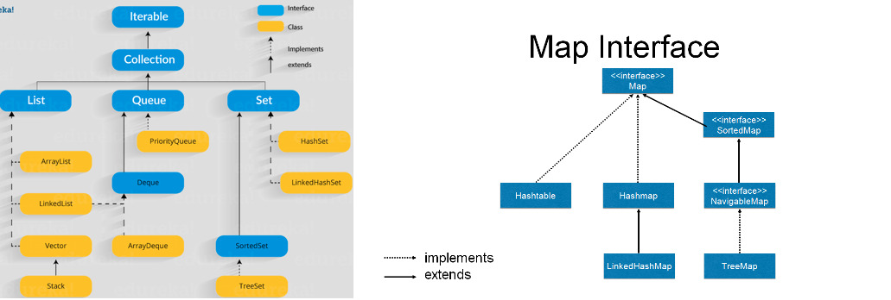
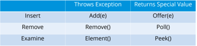
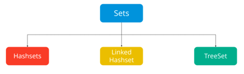

# Collections in Java

###### What are Java Collections ?

- A Collection is a group of individual objects represented as a single unit.
- Java provides Collection Framework which defines several classes and interfaces to represent a group of objects as a single unit.

###### Two main root interfaces of Java collection classes

- The Collection interface: [java.util.Collection]() 
- Map interface: [java.util.Map]() 

### Collections Framework

- A Java collection framework provides an architecture to store and manipulate a group of objects.
- A Java collection framework includes the following:

    - [Collection Interfaces:]()
        - Interface in Java refers to the abstract data types.
        - They allow Java collections to be manipulated independently from the details of their representation.
        - Also, they form a hierarchy in object-oriented programming languages.
    - [Collection Classes:]()
        - Classes in Java are the implementation of the collection interface. 
        - It basically refers to the data structures that are used again and again.
    - [Collections Algorithms:]()
        - Algorithm refers to the methods which are used to perform operations such as searching and sorting, on objects that implement collection interfaces.
        - Algorithms are polymorphic in nature as the same method can be used to take many forms or you can say perform different implementations of the Java collection interface.
- The Java collection framework provides the developers to access prepackaged data structures as well as algorithms to manipulate data.


### Collections: Interfaces

- [Iterator interface]()
  
    - Iterataor is an interface that iterates the elements.
    - It is used to traverse the list and modify the elements. 
    - Iterator interface has three methods which are mentioned below: 
        1. **public boolean hasNext()** – This method returns true if iterator has more elements.
        2. **public object next()** – It returns the element and moves the cursor pointer to the next element.
    3. **public void remove()** – This method removes the last elements returned by the iterator.
    
- [Collection Interface]()

    There are **3 components that extend the collection interface:** 

    1. List
    2. Queue
    3. Sets

- [Map Interface]()

  


##### Important Points:

- [Collection:]()
    - Root interface with basic methods .
    - Like add(), remove(),  contains(), isEmpty(), addAll(), ... etc.
- [Set:]() 
    - Doesn't allow duplicates. 
    - Example implementations of Set interface are HashSet (Hashing based) and TreeSet (balanced BST based).
    - Note that TreeSet implements SortedSet.
- [List:]() 
    - Can contain duplicates and elements are ordered. 
    - Example implementations are LinkedList (linked list based) and ArrayList (dynamic array based)
- [Queue:]() 
    - Typically order elements in FIFO order except exceptions like PriorityQueue.  
- [Deque:]() 
    - Elements can be inserted and removed at both ends. 
    - Allows both LIFO and FIFO. 
- [Map:]() 
    - Contains Key value pairs. Doesn't allow duplicates.  
    - Example implementation are HashMap and TreeMap. 
    - TreeMap implements SortedMap. 
- The difference between Set and Map interface is that in Set we have only keys, whereas in Map, we have key, value pairs.


###### Advantages of Collection Framework:

1. **Consistent API :** The API has a basic set of interfaces like Collection, Set, List, or Map. All classes (ArrayList, LinkedList, Vector, etc) that implement these interfaces have *some* common set of methods.
2. **Reduces programming effort:** A programmer doesn’t have to worry about the design of Collection, and he can focus on its best use in his program.
3. **Increases program speed and quality:** Increases performance by providing high-performance implementations of useful data structures and algorithms.


## Java Collections: Lists

###### What are Lists in Java ?

- A List is an ordered Collection of elements which may contain duplicates.
- It is an interface that extents the Collection interface.

##### Implementations:

- In order to use the List Interface, we ***need to instantiate a concrete class***. 
- Following are the few implementations that can be used:
    - util.ArrayList
    - util.LinkedList
    - util.Vector
    - util.Stack
- In all the above implementations only **Vector** is **thread-safe**.
- For others we need to make it thread safe using [`Collections.synchronizedList`]().

```java
import java.math.BigDecimal;
import java.util.*;

public class ListExample {
    public static void main(String[] args){
        List<String> arrayList = new ArrayList<>();
        List<Integer> linkedList = new LinkedList<>();
        List<Double> vectorList = new Vector<>();
        List<BigDecimal> stackList = new Stack<>();
    }
}
```


### 1. ArrayList

- ArrayList is a re-sizable array, also called a [*dynamic array*]() ***similar to vector in C++***.
- It grows its size to accommodate new elements and shrinks the size when the elements are removed.
- ArrayList ***inherits AbstractList class*** and ***implements List interface***.
- It internally uses an array to store the elements. Just like arrays, It allows you to retrieve the elements by their index.
- It allows duplicate and null values.
- It is an ordered collection maintains the insertion order of the elements.
- ***ArrayList can not be used for primitive types, like [`int`](), [`char`](), etc, need a wrapper class for such cases*** (refer [this](https://www.geeksforgeeks.org/array-vs-arraylist-in-java/) for details).
- We need to use boxed types like [ `Integer`](), [`Character`](),[ `Boolean`]() etc.
- It is **not synchronized**, if multiple threads try to modify it at the same time, then the final outcome will be non-deterministic.
- We must explicitly synchronize access to an ArrayList if multiple threads are gonna modify it.

###### Constructors in Java ArrayList:

- [ArrayList():]() This constructor is used to build an empty array list.
- [ArrayList(Collection c):]() This constructor is used to build an array list initialized with the elements from collection c.
- [ArrayList(int capacity):]() This constructor is used to build an array list with initial capacity being specified.

###### Syntax

```java
List<Integer> al = new ArrayList<>();
ArrayList<Integer> arrli = new ArrayList<>();
```


#### 1. Creating a ArrayList and adding new elements to it

- Use [ `ArrayList()`]() to create an empty Array List.
- Use [`add(element)`]() and [`add(index, element)`]() methods to add elements.
- Use [`ArrayList(collection)`]() to create Array List from existing collection.
- Use [`addAll(collection)`]() to add all the elements of a collection at once.


```java
public class Ex1CreateArrayListAndAddElements {
    public static void main(String[] args){
        // Creation an empty ArrayList using :=> ArrayList()
        List<String> friends = new ArrayList<>();

        // Adding new elements to the ArrayList using :=> add(element)
        friends.add("Rajeev");
        friends.add("John");
        friends.add("David");
        friends.add("Chris");
        System.out.println("Initial Friend List: " + friends);

        // Add an element at a particular index in an ArrayList using :=> add(index, element)
        friends.add(2, "Steve");
        System.out.println("Friends List after friends.add(2, \"Steve\") : " + friends);

        // Create a  ArrayList from existing collection using :=> ArrayList(collection)
        ArrayList<String> familyFriends = new ArrayList<>(friends);
        System.out.println("\nFamily Friends initially : " + familyFriends);

        ArrayList<String> spouseFriends = new ArrayList<>();
        spouseFriends.add("Jesse");
        spouseFriends.add("Walt");
        System.out.println("Spouse Friends : " + spouseFriends);

        // Add a collection to existing using :=> addAll(collection)
        familyFriends.addAll(spouseFriends);
        System.out.println("Family Friends after addAll(spouseFriends) : " + familyFriends);
    }
}
```

 **Output:**

```
First 10 Primes are: [2, 3, 5, 7, 11, 13, 17, 19, 23, 29]
```


#### 2. Access and Modify elements in an ArrayList

- Check if an ArrayList is empty using the [`isEmpty()`]() method.

- Find the size of an ArrayList using the [`size()`]() method.

- Access the element at a particular index in an ArrayList using the [`get(index)`]() method.

- Modify the element at a particular index in an ArrayList using the [`set(index, element)`]() method.

    

```java
public class Ex2AccessModifyElementInArrayList {
    public static void main(String[] args){
        List<String> topCompanies = new ArrayList<>();

        // Check if an ArrayList is empty using :=>  isEmpty()
        System.out.println("Is the topCompanies list empty? : " + topCompanies.isEmpty());

        topCompanies.add("Google");
        topCompanies.add("Apple");
        topCompanies.add("Microsoft");
        topCompanies.add("Amazon");
        topCompanies.add("Facebook");

        // Find the size of the ArrayList using :=> size()
        System.out.println("Here are the top " + topCompanies.size() + " companies in the world.");
        System.out.println(topCompanies);

        // Retrieve the element at first, last and given index using :=> get(index)
        String bestCompany = topCompanies.get(0);
        String lastCompany = topCompanies.get(topCompanies.size()-1);
        String thirdBestCompany = topCompanies.get(2);

        System.out.println("Best Company: " + bestCompany);
        System.out.println("Third Best Company: " + thirdBestCompany);
        System.out.println("Last Best Company: " + lastCompany);

        // Modify the element at a given index using :=> set(index, element)
        topCompanies.set(4, "Walmart");

        System.out.println("Modified Top Companies List: " + topCompanies);
    }
}
```

**Output:**

```
Is the topCompanies list empty? : true
Here are the top 5 companies in the world.
[Google, Apple, Microsoft, Amazon, Facebook]
Best Company: Google
Third Best Company: Microsoft
Last Best Company: Facebook
Modified Top Companies List: [Google, Apple, Microsoft, Amazon, Walmart]
```


#### 3. Removing elements from an ArrayList

- Remove the element at a given index in an ArrayList using  [`remove(index)`]().
- Remove an element from an ArrayList using  [`remove(element)`]().
- Remove all the elements from an ArrayList that exist in a given collection using [`removeAll(collection)`]().
- Remove all the elements matching a given predicate using [`removeIf(filterCondition)`]().
- Clear an ArrayList completely using [`clear()`]().


```java
public class Ex3RemoveElementFromArrayList {
    public static void main(String[] args) {
        List<String> programmingLanguages = new ArrayList<>();
        programmingLanguages.add("C");
        programmingLanguages.add("C++");
        programmingLanguages.add("Java");
        programmingLanguages.add("Kotlin");
        programmingLanguages.add("Python");
        programmingLanguages.add("Perl");
        programmingLanguages.add("Ruby");

        System.out.println("Initial List : " + programmingLanguages);

        // Remove element at an index using :=> remove(index)
        programmingLanguages.remove(5);
        System.out.println("After remove(5) : " + programmingLanguages);

        // Remove first occurrence of element using :=> remove(element)
        // remove() method returns false if element doesn't exists
        boolean isKotlinRemoved = programmingLanguages.remove("Kotlin");
        System.out.println("After remove(\"Kotlin\") : " + programmingLanguages);

        List<String> scriptingLanguages = new ArrayList<>();
        scriptingLanguages.add("Python");
        scriptingLanguages.add("Ruby");
        scriptingLanguages.add("Perl");

        // Remove all the elements that exist in a given collection using :=> removeAll(collection)
        programmingLanguages.removeAll(scriptingLanguages);
        System.out.println("After removeAll(scriptingLanguages) : " + programmingLanguages);

        // Remove all the elements that satisfy a given condition with
        // Predicate using :=> removeIf(filterCondition)
        programmingLanguages.removeIf(s -> s.startsWith("C"));
        System.out.println("After Removing all elements that start with \"C\" : " + programmingLanguages);

        // Remove all the elements from the ArrayList using :=> clear()
        programmingLanguages.clear();
        System.out.println("After clear() : " + programmingLanguages );
    }
}
```

**Output:**

```
Initial List : [C, C++, Java, Kotlin, Python, Perl, Ruby]
After remove(5) : [C, C++, Java, Kotlin, Python, Ruby]
After remove("Kotlin") : [C, C++, Java, Python, Ruby]
After removeAll(scriptingLanguages) : [C, C++, Java]
After Removing all elements that start with "C" : [Java]
After clear() : []
```


#### 4. Iterating over an ArrayList

1. Simple for loop with index [`for(index, condition, inc/dec)`]().
2. Enhanced for loop [`for (element : collection)`]().
3. Java 8 [`forEach(e -> action on e)`]() and lambda expression.
4. [`iterator()`]() and **hasNext()**.
5. [`iterator()`]() and Java 8 [`forEachRemaining(e -> action on e)`]() method.
6. [`listIterator()`]() and **hasPrevious()** and **haNext()**.
7. The [`iterator()`]() and [`listIterator()`]() methods are useful when we need to modify the ArrayList while traversing.
8. We can remove elements from the ArrayList using [`iterator.remove()`]() method while traversing through it.


```java
public class Ex4IterateOverArrayList {
    public static void main(String[] args){
        List<String> tvShows = new ArrayList<>();
        tvShows.add("Breaking Bad");
        tvShows.add("Game of Thrones");
        tvShows.add("Friends");
        tvShows.add("Prison Break");

        // Iterate by simple for loop with index using :=> for(index, condition, inc/dec)
        System.out.println("\n=== Iterate using simple for loop with index ===");
        for (int i = 0; i < tvShows.size(); ++i){
            System.out.println(tvShows.get(i));
        }

        // Iterate by enhanced for loop using :=> for (element : collection)
        System.out.println("\n=== Iterate using enhanced for loop ===");
        for(String tvShow : tvShows){
            System.out.println(tvShow);
        }

        // Iterate by Java8 forEach and lambda using :=> forEach(e -> { action using e })
        System.out.println("\n=== Iterate using Java 8 forEach and lambda ===");
        tvShows.forEach(tvShow -> {
            System.out.println(tvShow);
        });

        // Iterate by Iterator using :=> iterator() and hasNext()
        System.out.println("\n=== Iterate using an iterator() ===");
        Iterator<String> tvShowIterator = tvShows.iterator();
        while (tvShowIterator.hasNext()){
            String tvShow = tvShowIterator.next();
            System.out.println(tvShow);
        }

        // Iterate by Iterator and Java 8 forEachRemaining using
        // :=> iterator() and forEachRemaining(e -> { action using e }
        System.out.println("\n=== Iterate using an iterator() and Java 8 forEachRemaining() method ===");
        tvShowIterator = tvShows.iterator();
        tvShowIterator.forEachRemaining(tvShow -> {
            System.out.println(tvShow);
        });

        // Iterate by ListIterator to go in both directions using
        // :=> listIterator(), hasPrevious() and hasNext()
        System.out.println("\n=== Iterate using a listIterator() to traverse in both directions ===");
        ListIterator<String> tvShowListIterator = tvShows.listIterator(tvShows.size()); // here starts from end
        while (tvShowListIterator.hasPrevious()){
            String tvShow = tvShowListIterator.previous();
            System.out.println(tvShow);
        }

        // Modify list while traversing by removing elements using :=> iterator.remove()
        tvShowIterator = tvShows.iterator();
        while (tvShowIterator.hasNext()){
            String movieName = tvShowIterator.next();
            if (movieName.startsWith("Game") || movieName.endsWith("Bad")){
                tvShowIterator.remove();
            }
        }
        System.out.println("\n=== Final Movies List after iterator.remove() : ===\n" + tvShows);
    }
}
```

**Output:**

```
=== Iterate using simple for loop with index ===
Breaking Bad
Game of Thrones
Friends
Prison Break

=== Iterate using enhanced for loop ===
Breaking Bad
Game of Thrones
Friends
Prison Break

=== Iterate using Java 8 forEach and lambda ===
Breaking Bad
Game of Thrones
Friends
Prison Break

=== Iterate using an iterator() ===
Breaking Bad
Game of Thrones
Friends
Prison Break

=== Iterate using an iterator() and Java 8 forEachRemaining() method ===
Breaking Bad
Game of Thrones
Friends
Prison Break

=== Iterate using a listIterator() to traverse in both directions ===
Prison Break
Friends
Game of Thrones
Breaking Bad

=== Final Movies List after iterator.remove() : ===
[Friends, Prison Break]
```


#### 5. Searching for elements in an ArrayList

- Check if an ArrayList contains a given element [`contains(element)`]().
- Index of the first occurrence of an element in an ArrayList [`indexOf(element)`]().
- Index of the last occurrence of an element in an ArrayList [`lastIndexOf(element)`]().

```java
public class Ex5SearchInArrayList {
    public static void main(String[] args){
        List<String> names = new ArrayList<>();
        names.add("John");
        names.add("Alice");
        names.add("Bob");
        names.add("Steve");
        names.add("John");
        names.add("Steve");
        names.add("Maria");

        // Check if an ArrayList contains a given element using :=> contains(element)
        System.out.println("Does name array contains \"Bob\" ? : " + names.contains("Bob"));

        // Find the index of the first occurrence of an element in an ArrayList using :=> indexOf(element)
        System.out.println("Index of \"Steve\" : " + names.indexOf("Steve"));
        System.out.println("Index of \"Mark\" : " + names.indexOf("Mark"));

        // Find the index of the last occurrence of an element in an ArrayList
        System.out.println("Last Index of \"John\" : " + names.lastIndexOf("John"));
        System.out.println("Last Index of \"Bill\" : " + names.lastIndexOf("Bill"));
    }
}
```

**Output:**

```
Does name array contains "Bob" ? : true
Index of "Steve" : 3
Index of "Mark" : -1
Last Index of "John" : 4
Last Index of "Bill" : -1
```


#### 6. Sorting an ArrayList using Collections.sort()

- We can sort any collection in Java using [`Collections.sort(collection, lambda_comparator)`]().

```java
public class Ex6SortArrayListUsingCollectionsSort {
    public static void main(String[] args){
        ArrayList<Integer> numbers = new ArrayList<>();
        numbers.add(13);
        numbers.add(7);
        numbers.add(18);
        numbers.add(5);
        numbers.add(2);

        System.out.println("Numbers Initially: " + numbers);

        // Sorting an ArrayList using :=> Collections.sort(collection)
        Collections.sort(numbers);

        System.out.println("Numbers in Natural Order (Sorted Order) : " + numbers);


        //=========== Creating and Sorting User Defined DataTypes ========/
        List<User> users = new ArrayList<>();
        users.add(new User("Sachin", 47));
        users.add(new User("Chris", 34));
        users.add(new User("Rajeev", 25));
        users.add(new User("David", 31));
        users.add(new User("Chris", 54));

        System.out.println("\nUsers List: " + users);
        // Sort users by age
        Collections.sort(users, (user1, user2) -> user1.getAge() - user2.getAge());
        System.out.println("Users List sorted by age: " + users);

        // Sort users by name
        Collections.sort(users, (user1, user2) -> user1.getName().compareTo(user2.getName()));
        System.out.println("Users List sorted by name: " + users);

        // Sort users by name if same name, reverse sort using age
        Collections.sort(users, (user1, user2) -> {
            int val = user1.getName().compareTo(user2.getName());
            return val != 0 ? val : user2.getAge() - user1.getAge();
        });
        System.out.println("Users sorted by name and for same name reverse sorted by age: " + users);

    }
}
```

**Output:**

```
Numbers Initially: [13, 7, 18, 5, 2]
Numbers in Natural Order (Sorted Order) : [2, 5, 7, 13, 18]

Users List: [User{name='Sachin', age=47}, User{name='Chris', age=34}, User{name='Rajeev', age=25}, User{name='David', age=31}, User{name='Chris', age=54}]
Users List sorted by age: [User{name='Rajeev', age=25}, User{name='David', age=31}, User{name='Chris', age=34}, User{name='Sachin', age=47}, User{name='Chris', age=54}]
Users List sorted by name: [User{name='Chris', age=34}, User{name='Chris', age=54}, User{name='David', age=31}, User{name='Rajeev', age=25}, User{name='Sachin', age=47}]
Users sorted by name and for same name reverse sorted by age: [User{name='Chris', age=54}, User{name='Chris', age=34}, User{name='David', age=31}, User{name='Rajeev', age=25}, User{name='Sachin', age=47}]
```


#### 7. Sorting an ArrayList using ArrayList.sort() method

- We can also sort an ArrayList using [`arrayList.sort(lambda_comparator)`]().

```java
public class Ex7SortArrayListUsingArrayListSort {
    public static void main(String[] args){
        List<String> names = new ArrayList<>();
        names.add("Lisa");
        names.add("Jennifer");
        names.add("Mark");
        names.add("David");

        System.out.println("Names: " + names);

        // Sorting an ArrayList using :=> sort(lambdaExpression)
        names.sort((name1, name2) -> name1.compareTo(name2));

        // A concise way using :=> sort(Comparator)
        names.sort(Comparator.naturalOrder());

        System.out.println("Sorted Names: " + names);


        //=========== Creating and Sorting User Defined DataTypes ========/
        List<User> users = new ArrayList<>();
        users.add(new User("Sachin", 47));
        users.add(new User("Chris", 34));
        users.add(new User("Rajeev", 25));
        users.add(new User("David", 31));
        users.add(new User("Chris", 54));

        System.out.println("\nUsers List: " + users);
        // Sort users by age
        users.sort((user1, user2) -> user1.getAge() - user2.getAge());
        System.out.println("Users List sorted by age: " + users);

        // Sort users by name
        users.sort((user1, user2) -> user1.getName().compareTo(user2.getName()));
        System.out.println("Users List sorted by name: " + users);

        // Sort users by name if same name, reverse sort using age
        users.sort((user1, user2) -> {
            int val = user1.getName().compareTo(user2.getName());
            return val != 0 ? val : user2.getAge() - user1.getAge();
        });
        System.out.println("Users sorted by name and for same name reverse sorted by age: " + users);
    }
}
```

**Output:**

```
Names: [Lisa, Jennifer, Mark, David]
Sorted Names: [David, Jennifer, Lisa, Mark]

Users List: [User{name='Sachin', age=47}, User{name='Chris', age=34}, User{name='Rajeev', age=25}, User{name='David', age=31}, User{name='Chris', age=54}]
Users List sorted by age: [User{name='Rajeev', age=25}, User{name='David', age=31}, User{name='Chris', age=34}, User{name='Sachin', age=47}, User{name='Chris', age=54}]
Users List sorted by name: [User{name='Chris', age=34}, User{name='Chris', age=54}, User{name='David', age=31}, User{name='Rajeev', age=25}, User{name='Sachin', age=47}]
Users sorted by name and for same name reverse sorted by age: [User{name='Chris', age=54}, User{name='Chris', age=34}, User{name='David', age=31}, User{name='Rajeev', age=25}, User{name='Sachin', age=47}]
```


#### 8. Thread Unsafe ArrayList when Multiple Threads modifies concurrently

- The ArrayList class is not synchronized. 
- If multiple threads try to modify an ArrayList at the same time then the final result becomes not-deterministic because one thread might override the changes done by another thread.

```java
public class Ex8ThreadUnsafeArrayList {
    public static void main(String[] args) throws InterruptedException {
        List<Integer> unsafeArrayList = new ArrayList<>();
        unsafeArrayList.add(1);
        unsafeArrayList.add(2);
        unsafeArrayList.add(3);

        // Create a thread pool of size 10
        ExecutorService executorService = Executors.newFixedThreadPool(10);

        // Create a runnable task that increments each element of ArrayList by 1
        Runnable task = () -> incrementArrayList(unsafeArrayList);

        // Submit the task to the executor service 100 times.
        // All the tasks will modify the ArrayList concurrently
        for (int i = 0; i < 100; ++i){
            executorService.submit(task);
        }

        // Shutdown the executor and wait for termination
        executorService.shutdown();
        executorService.awaitTermination(60, TimeUnit.SECONDS);

        System.out.println(unsafeArrayList);
    }

    private static void incrementArrayList(List<Integer> unsafeArrayList) {
        for (int i = 0; i < unsafeArrayList.size(); ++i) {
            unsafeArrayList.set(i, unsafeArrayList.get(i) + 1);
        }
    }
}
```

**Output:**

```
[93, 96, 94]
```

> [Note:]() The final output of the above program should be equal to `[101, 102, 103]` because we’re incrementing the values in the ArrayList 100 times. But if we run the program, it will produce different output every time it is run.


#### 9. Making ArrayList Thread Safe by Synchronizing Access to an ArrayList

- We can use [`Collections.synchronizedList()`]() method to get a synchronized view of the ArrayList.
- While doing modifications to the ArrayList inside the [`incrementArrayList()`]() method we will wrap it inside a[ `synchronized(safeArrayList){}`]() block.
- This ensures that no two threads can increment ArrayList elements at the same time.
- We can also use a [`CopyOnWriteArrayList`](https://docs.oracle.com/javase/8/docs/api/java/util/concurrent/CopyOnWriteArrayList.html) if you need thread safety. 
- It is a thread-safe version of the ArrayList class. It implements all the mutating operations by making a fresh copy of the ArrayList.
- Unlike the previous program, the output of this program is deterministic and will always be the same.


```java
public class Ex9ThreadSafeArrayList {
    public static void main(String[] args) throws InterruptedException {
        // Creating Thread Safe ArrayList
        List<Integer> safeArrayList = Collections.synchronizedList(new ArrayList<>());
        safeArrayList.add(1);
        safeArrayList.add(2);
        safeArrayList.add(3);

        // Create a thread pool of size 10
        ExecutorService executorService = Executors.newFixedThreadPool(10);

        // Create a Runnable task that increments each element of the ArrayList by one
        Runnable task = () -> incrementArrayList(safeArrayList);

        // Submit the task to the executor service 100 times
        // All the will modify ArrayList concurrently
        for (int i = 0; i < 100; ++i) {
            executorService.submit(task);
        }

        // Shutdown the executor and wait for termination
        executorService.shutdown();
        executorService.awaitTermination(60, TimeUnit.SECONDS);

        System.out.println(safeArrayList);
    }

    private static void incrementArrayList(List<Integer> safeArrayList){
        synchronized (safeArrayList){ // ensures no two threads performs on this code block at the same time
            for(int i = 0; i < safeArrayList.size(); ++i){
                safeArrayList.set(i, safeArrayList.get(i)+1);
            }
        }
    }
}
```

**Output:**

```
[101, 102, 103]
```


### 2. Linked List

- LinkedList is a [doubly linked list]() implementation of Java’s [`List`]() and [ `Deque`]() interfaces. 
- LinkedList maintains the insertion order of the elements and can have duplicate and null values.
- Implements [`Queue`]() and [`Deque`]() interfaces, and hence can also be used as a [`Queue`](), [`Deque`]() or [`Stack`]().
- **Not thread-safe**,  must explicitly synchronize concurrent modifications to the LinkedList in a multi-threaded environment.

##### Syntax:

```java
Linkedlist<Integer> linkLi = new Linkedlist<>();
```


##### Java ArrayList vs LinkedList

- **Implementation:** Both  implement the [`List`]() interface, but differ completely in the way they store and link to the elements.
- **Storing:** ArrayList stores the elements sequentially based on their index, but LinkedList uses a doubly-linked list to store its elements.
- **Memory Cosumption:** LinkedList consumes more memory because it also stores the next and previous references along with the data.
- **Element Access:** We can access an element in an ArrayList in **O(1)** time,  but it takes **O(n)** time to access an element in a LinkedList 
- **List Modification:** Adding or removing elements are usually slower in an ArrayList compared to LinkedList due to shifting and resizing.


#### 1. Creating a LinkedList and adding new elements to it

- Use [ `LinkedList()`]() to create an empty Linked List.
- Use [`add(element)`]() and [`add(index, element)`]() methods to add elements.
- Also use [`addFirst()`]() and [`addLast()`]() method to add elements, these methods come from [`Deque`]() interface.
- Use [`LinkedList(collection)`]() to create Linked List with existing collection.
- Use [`addAll(collection)`]() to add all the elements of a collection at once.


```java
public class Ex1CreateLinkedListAndAddElements {
    public static void main(String[] args){
        // Creation an empty LinkedList using :=> LinkedList()
        LinkedList<String> friends = new LinkedList<>();

        // Adding elements using :=> add(element)
        friends.add("Rajeev");
        friends.add("John");
        friends.add("David");
        friends.add("Chris");
        System.out.println("Initial Friend List: " + friends);

        // Add elements at a specific index using :=> add(index, element)
        friends.add(3, "Lisa");
        System.out.println("Friends List after add(3, \"Lisa\") : " + friends);

        // Add an element at the beginning of Linked List :=> addFirst(element)
        friends.addFirst("Steve");
        System.out.println("Friends List after addFirst(\"Steve\") : " + friends);

        // Add an element at end (equivalent to add method) using :=> addLast(element)
        friends.addLast("Jennifer");
        System.out.println("Friends List after addLast(\"Jennifer\") : " + friends);

        // Create a Linked List from existing collection using :=> LinkedList(collection)
        LinkedList<String> familyFriends = new LinkedList<>(friends);
        System.out.println("\nFamily Friends initially : " + familyFriends);

        LinkedList<String> spouseFriends = new LinkedList<>();
        spouseFriends.add("Jesse");
        spouseFriends.add("Walt");
        System.out.println("Spouse Friends : " + spouseFriends);

        // Add a collection to existing using :=> addAll(collection)
        familyFriends.addAll(spouseFriends);
        System.out.println("Family Friends after addAll(spouseFriends) : " + familyFriends);
    }
}
```

**Output:**

```
Initial Friend List: [Rajeev, John, David, Chris]
Friends List after add(3, "Lisa") : [Rajeev, John, David, Lisa, Chris]
Friends List after addFirst("Steve") : [Steve, Rajeev, John, David, Lisa, Chris]
Friends List after addLast("Jennifer") : [Steve, Rajeev, John, David, Lisa, Chris, Jennifer]

Family Friends initially : [Steve, Rajeev, John, David, Lisa, Chris, Jennifer]
Spouse Friends : [Jesse, Walt]
Family Friends after addAll(spouseFriends) : [Steve, Rajeev, John, David, Lisa, Chris, Jennifer, Jesse, Walt]
```


#### 2. Access and Modify elements in a LinkedList

- Get the first element in the LinkedList using [`getFirst()`]()  and last element using [`getLast()`]().

- Both the above methods gives **NoSuchElementException** if the LinkedList is empty.

- Get the element at a given position using [`get(index)`]().

- Change the element at a particular index using [`set(index, val)`]().

    

```java
public class Ex2AccessModifyElementsInLinkedList {
    public static void main(String[] args){
        LinkedList<String> topCompanies = new LinkedList<>();

        // Check if an LinkedList is empty using :=>  isEmpty()
        System.out.println("Is the topCompanies list empty? : " + topCompanies.isEmpty());

        topCompanies.add("Google");
        topCompanies.add("Apple");
        topCompanies.add("Microsoft");
        topCompanies.add("Amazon");
        topCompanies.add("Facebook");

        // Find the size of the LinkedList using :=> size()
        System.out.println("Here are the top " + topCompanies.size() + " companies in the world.");
        System.out.println(topCompanies);

        // Retrieve the element at first, last and given index using :=> get(index)
        String bestCompany = topCompanies.getFirst();
        String lastCompany = topCompanies.getLast();
        String thirdBestCompany = topCompanies.get(2);

        System.out.println("Best Company: " + bestCompany);
        System.out.println("Third Best Company: " + thirdBestCompany);
        System.out.println("Last Best Company: " + lastCompany);

        // Modify the element at a given index using :=> set(index, element)
        topCompanies.set(4, "Walmart");

        System.out.println("Modified Top Companies List: " + topCompanies);
    }
}
```

**Output:**

```
Is the topCompanies list empty? : true
Here are the top 5 companies in the world.
[Google, Apple, Microsoft, Amazon, Facebook]
Best Company: Google
Third Best Company: Microsoft
Last Best Company: Facebook
Modified Top Companies List: [Google, Apple, Microsoft, Amazon, Walmart]
```


#### 3. Removing elements from an LinkedList

- Remove last element using [`remove()`]() or [`removeLast()`]()  and first element using [`removeFirst()`]()  .
- Above methods gives **NoSuchElementException** if the LinkedList is empty.
- Remove element at an index using [`remove(index)`]().
- Remove first occurrence of element using  [`remove(element)`]().
- Remove all the elements that exist in a given collection using [`removeAll(collection)`]().
- Remove all the elements that satisfy a given condition with Predicate using [`removeIf(filterCondition)`]().
- Remove all the elements from the ArrayList using [`clear()`]().

###### Note: As Queue, Deque and Stack can also be implemented using LinkedList, so it additionally gives methods suited to them.

- ***Add*** element at last using [`offer(element)`]() or [`offerLast(element)`]() and at start using [`offerFirst(element)`]().
- ***Retrieve*** element without removing using methods [`peek()`](), [`peekFirst()`]() and [`peekLast()`]().
- ***Remove and retrieve*** using methods [`poll()`](), [`pollFirst()`]() and [`pollLast()`]().
- For stack represented using LinkedList [`push()`]() to add element and [`pop()`]() to remove.


```java
public class Ex3RemoveElementFromLinkedList {
    public static void main(String[] args){
        LinkedList<String> programmingLanguages = new LinkedList<>();
        programmingLanguages.add("Fortran");
        programmingLanguages.add("C");
        programmingLanguages.add("C++");
        programmingLanguages.add("Java");
        programmingLanguages.add("Kotlin");
        programmingLanguages.add("Python");
        programmingLanguages.add("Perl");
        programmingLanguages.add("Ruby");
        programmingLanguages.add("GoLang");

        System.out.println("Initial LinkedList : " + programmingLanguages);

        // Remove first element using :=> removeFirst()
        programmingLanguages.removeFirst(); // Throws NoSuchElementException if empty
        System.out.println("After removeFirst() : " + programmingLanguages);

        // Remove last element using :=> removeLast()
        programmingLanguages.removeLast(); // Throws NoSuchElementException if empty
        System.out.println("After removeLast() : " + programmingLanguages);

        // Remove element at an index using :=> remove(index)
        programmingLanguages.remove(5);
        System.out.println("After remove(5) : " + programmingLanguages);

        // Remove first occurrence of element using :=> remove(element)
        // remove() method returns false if element doesn't exists
        boolean isKotlinRemoved = programmingLanguages.remove("Kotlin");
        System.out.println("After remove(\"Kotlin\") : " + programmingLanguages);

        LinkedList<String> scriptingLanguages = new LinkedList<>();
        scriptingLanguages.add("Python");
        scriptingLanguages.add("Ruby");
        scriptingLanguages.add("Perl");

        // Remove all the elements that exist in a given collection using :=> removeAll(collection)
        programmingLanguages.removeAll(scriptingLanguages);
        System.out.println("After removeAll(scriptingLanguages) : " + programmingLanguages);

        // Remove all the elements that satisfy a given condition with
        // Predicate using :=> removeIf(filterCondition)
        programmingLanguages.removeIf(s -> s.startsWith("C"));
        System.out.println("After Removing all elements that start with \"C\" : " + programmingLanguages);

        // Remove all the elements from the LinkedList using :=> clear()
        programmingLanguages.clear();
        System.out.println("After clear() : " + programmingLanguages );
    }
}
```

**Output:**

```
Initial LinkedList : [Fortran, C, C++, Java, Kotlin, Python, Perl, Ruby, GoLang]
After removeFirst() : [C, C++, Java, Kotlin, Python, Perl, Ruby, GoLang]
After removeLast() : [C, C++, Java, Kotlin, Python, Perl, Ruby]
After remove(5) : [C, C++, Java, Kotlin, Python, Ruby]
After remove("Kotlin") : [C, C++, Java, Python, Ruby]
After removeAll(scriptingLanguages) : [C, C++, Java]
After Removing all elements that start with "C" : [Java]
After clear() : []
```


#### 4. Iterating Over a Linked List

- Enhanced for loop [`for (element : collection)`]().
- Java 8 [`forEach(e -> action on e)`]() and lambda expression.
- [`iterator()`]() and **hasNext()**.
- [`iterator()`]() and Java 8 [`forEachRemaining(e -> action on e)`]() method.
- [`descedingIterator`]() and **hasNext()** to iterate from end.
- [`listIterator()`]() and **hasPrevious()** and **haNext()**.
- The [`iterator()`]() and [`listIterator()`]() methods are useful when we need to modify the LinkedList while traversing.
- We can remove elements from the ArrayList using [`iterator.remove()`]() method while traversing through it.


```java
public class Ex4IterateOverLinkedList {
    public static void main(String[] args){
        LinkedList<String> tvShows = new LinkedList<>();
        tvShows.add("Breaking Bad");
        tvShows.add("Game of Thrones");
        tvShows.add("Friends");
        tvShows.add("Prison Break");

        // Iterate by enhanced for loop using :=> for (element : collection)
        System.out.println("\n=== Iterate using enhanced for loop ===");
        for(String tvShow : tvShows){
            System.out.println(tvShow);
        }

        // Iterate by Java8 forEach and lambda using :=> forEach(e -> { action using e })
        System.out.println("\n=== Iterate using Java 8 forEach and lambda ===");
        tvShows.forEach(tvShow -> {
            System.out.println(tvShow);
        });

        // Iterate by Iterator using :=> iterator() and hasNext()
        System.out.println("\n=== Iterate using an iterator() ===");
        Iterator<String> tvShowIterator = tvShows.iterator();
        while (tvShowIterator.hasNext()){
            String tvShow = tvShowIterator.next();
            System.out.println(tvShow);
        }

        // Iterate by Iterator and Java 8 forEachRemaining using
        // :=> iterator() and forEachRemaining(e -> { action using e }
        System.out.println("\n=== Iterate using an iterator() and Java 8 forEachRemaining() method ===");
        tvShowIterator = tvShows.iterator();
        tvShowIterator.forEachRemaining(tvShow -> {
            System.out.println(tvShow);
        });

        // Iterate by descendingIterator using :=> descendingIterator() and hasNext()
        System.out.println("\n=== Iterate over a LinkedList using descendingIterator() ===");
        Iterator<String> tvShowDecendingIterator = tvShows.descendingIterator();
        while (tvShowDecendingIterator.hasNext()){
            String tvShow = tvShowDecendingIterator.next();
            System.out.println(tvShow);
        }

        // Iterate by ListIterator to go in both directions using
        // :=> listIterator(), hasPrevious() and hasNext()
        System.out.println("\n=== Iterate using a listIterator() to traverse in both directions ===");
        ListIterator<String> tvShowListIterator = tvShows.listIterator(tvShows.size()); // here starts from end
        while (tvShowListIterator.hasPrevious()){
            String tvShow = tvShowListIterator.previous();
            System.out.println(tvShow);
        }

        // Modify list while traversing by removing elements using :=> iterator.remove()
        tvShowIterator = tvShows.iterator();
        while (tvShowIterator.hasNext()){
            String movieName = tvShowIterator.next();
            if (movieName.startsWith("Game") || movieName.endsWith("Bad")){
                tvShowIterator.remove();
            }
        }
        System.out.println("\n=== Final Movies List after iterator.remove() : ===\n" + tvShows);
    }
}
```

**Output:**

```
=== Iterate using enhanced for loop ===
Breaking Bad
Game of Thrones
Friends
Prison Break

=== Iterate using Java 8 forEach and lambda ===
Breaking Bad
Game of Thrones
Friends
Prison Break

=== Iterate using an iterator() ===
Breaking Bad
Game of Thrones
Friends
Prison Break

=== Iterate using an iterator() and Java 8 forEachRemaining() method ===
Breaking Bad
Game of Thrones
Friends
Prison Break

=== Iterate over a LinkedList using descendingIterator() ===
Prison Break
Friends
Game of Thrones
Breaking Bad

=== Iterate using a listIterator() to traverse in both directions ===
Prison Break
Friends
Game of Thrones
Breaking Bad

=== Final Movies List after iterator.remove() : ===
[Friends, Prison Break]
```


#### 5. Searching for elements in an LinkedList

- Similar to searching done in ArrayList.
- Check if an LinkedList contains a given element [`contains(element)`]().
- Index of the first occurrence of an element in an LinkedList [`indexOf(element)`]().
- Index of the last occurrence of an element in an LinkedList [`lastIndexOf(element)`]().


```java
public class Ex5SearchInLinkedList {
    public static void main(String[] args){
        LinkedList<String> names = new LinkedList<>();
        names.add("John");
        names.add("Alice");
        names.add("Bob");
        names.add("Steve");
        names.add("John");
        names.add("Steve");
        names.add("Maria");

        // Check if an LinkedList contains a given element using :=> contains(element)
        System.out.println("Does name array contains \"Bob\" ? : " + names.contains("Bob"));

        // Find the index of the first occurrence of an element in an LinkedList using :=> indexOf(element)
        System.out.println("Index of \"Steve\" : " + names.indexOf("Steve"));
        System.out.println("Index of \"Mark\" : " + names.indexOf("Mark"));

        // Find the index of the last occurrence of an element in an LinkedList
        System.out.println("Last Index of \"John\" : " + names.lastIndexOf("John"));
        System.out.println("Last Index of \"Bill\" : " + names.lastIndexOf("Bill"));
    }
}
```

**Output:**

```
Does name array contains "Bob" ? : true
Index of "Steve" : 3
Index of "Mark" : -1
Last Index of "John" : 4
Last Index of "Bill" : -1
```


#### 6. Sorting in LinkedList

- We can sort the Linked List the same way we sorted the ArrayList.
- Here also we can use [`Collections.sort(list, lambda_comparator)`]() and [`LinkedList.sort(lambda_comparator)`]().


#### 7. Making LinkedList Thread Safe (Synchronization)

- We can synchronize the LinkedList the same way as we did for ArrayList.

```java
List<String> safeLinkedList = Collections.synchronizedList(new LinkedList<>());
```


### 3. Vector

- It implements a growable array of objects.
- Vectors basically fall in legacy classes but now it is fully compatible with collections.
- Vector implements a dynamic array that means it can grow or shrink as required. 
- Like an array, it contains components that can be ***accessed using an integer index***.
- It is very similar to ArrayList but [Vector is synchronised]() .
- It extends **AbstractList** and implements **List** interfaces.


### 4. Stack

- Java Collection framework provides a Stack class which models and implements Stack data structure.

- The class is based on the basic principle of last-in-first-out.

- With [`push(element)`]() and [`pop()`]() operations, the class provides three more functions of [`empty()`](),  [`search(element)`]() and [`peek()`](). 

- [`search(element):`]() Searches for element in the stack, returns offset from the top of the stack if found else returns -1. 

- The class can also be said to **extend Vector** and ***treats the class as a stack with the five mentioned functions***. 

- The class can also be referred to as the subclass of Vector.

    

```java
public class ExStackOperations {
    public static void main(String[] args){
        Stack<String> topCompanies = new Stack<>();

        // Check if an Stack is empty using :=>  isEmpty()
        System.out.println("Is the topCompanies stack empty? : " + topCompanies.isEmpty());

        // Push the element to stack using :=> push(element)
        topCompanies.push("Facebook");
        topCompanies.push("Amazon");
        topCompanies.push("Microsoft");
        topCompanies.push("Apple");
        topCompanies.push("Google");

        // Find the size of the Stack using :=> size()
        System.out.println("Here are the top " + topCompanies.size() + " companies in the world :");
        System.out.println(topCompanies);

        // Retrieve and remove the top element using :=> pop()
        String bestCompany = topCompanies.pop();

        // Only retrieve the top element now using :=> top()
        String secondBestCompany = topCompanies.peek();

        System.out.println("Best Company: " + bestCompany);
        System.out.println("Second Best Company: " + secondBestCompany);

        // Search the element in stack using :=> search(element)
        System.out.println("Find \"Amazon\" : " + topCompanies.search("Amazon"));
    }
}
```

**Output:**

```
Is the topCompanies stack empty? : true
Here are the top 5 companies in the world :
[Facebook, Amazon, Microsoft, Apple, Google]
Best Company: Google
Second Best Company: Apple
Find "Amazon" : 3
```


> [Note:]() A more complete and consistent set of LIFO stack operations is provided by the [Deque]() interface and its implementations, which should be used in preference to this class.  For example:
>
> `Deque<Integer> stack = new ArrayDeque<Integer>();`

## Java Collections: Queues

###### What are Queues in Java ?

- A queue is a data structure which follows the principle of FIFO (First-In-First-Out).
- This interface is available in the java.util.package and extends the Collection Interface.
- **LinkedList**, **PriorityQueue**, **ArrayDeque** and **ArrayBlockingQueue** are the most frequently used implementations.
- BlockingQueues have **thread-safe** implementations.
- The Queues which are available in java.util packasge are ***Unbounded Queues***.
- The Queues which are available in java.util.concurrent package are the ***Bounded Queues***.
- All Queues except the Deques supports insertion and removal at the tail and head of the queue respectively.
- The Deques support element insertion and removal at both ends.

##### Implementation:

- In order to use the queue interface, we ***need to instantiate a concrete class***. 
- Following are the few implementations that can be used:
    - [Queue Interface:]()
        - PriorityQueue
        - LinkedList
        - [Deque Interface:]()
            - ArrayDeque
            - LinkedList
- Above implementations are **not thread safe**, **PriorityBlockingQueue** acts as an alternative for thread safe implementation.

```java
import java.util.ArrayDeque;
import java.util.LinkedList;
import java.util.PriorityQueue;
import java.util.Queue;

public class QueueExample {
    public static void main(String[] args){
        Queue<String> linkedListQueue = new LinkedList<>();
        Queue<Integer> priorityQueueQueue = new PriorityQueue<>();
        Queue<Double> arrayDequeQueue = new ArrayDeque<>();
    }
}
```

##### Methods in Queue:



##### Operations on Queue:

- **Searching**, **Sorting** and **Iterating** over the queue, can be done the same way it is done for their concrete class.
- If we use **LinkedList** implementation, we can do things similar to LinkedList explained earlier.

### 1. Priority Queue / Heap

- Priority queue implements Queue interface.
- Minimum element will always be on top or head according to natural order if compartor is not provided.
- Use [`PriorityQueue()`]() or [`PriorityQueue(comaprator)`]() to create a heap / priority queue.
- Use [`isEmpty()`]() to check if it is empty or [`size()`]() to get the size.
- Use [`add(element)`]() or [`offer(element)`]() to  add element to priority queue.
- Use [`peek()`]() or [`element()`]() to get the head element without removing.
- Use [`remove()`]() or [`poll()`]() to remove the head element.

#### 1. Create simple Priority Queue / Heap

```java
public class Ex1CreatePriorityQueueNormal {
    public static void main(String[] args){
        // Create a Priority Queue using :=> PriorityQueue() -> Natural Order maintained
        PriorityQueue<String> names = new PriorityQueue<>();

        // Check if Priority Queue is empty using :=> isEmpty()
        System.out.println("Is names empty ? : " + names.isEmpty());

        // Add element using :=> add(element) or offer(element)
        names.add("Rachit");
        names.add("Amit");
        names.offer("Zayed");
        names.offer("Musa");

        // Get the size of the Priority Queue using :=> size()
        System.out.println("Total names : " + names.size());

        // Get the head element of Priority Queue using :=> peek() or element()
        System.out.println("Head : "+ names.peek());
        System.out.println("Head : " + names.element());

        // Remove the element from Priority Queue using :=> remove() or poll()
        System.out.print("Removing elements one by one :");
        while (!names.isEmpty()){
            System.out.print(" " + names.remove());
        }
        System.out.println();
    }
}
```

**Output:**

```
Is names empty ? : true
Total names : 4
Head : Amit
Head : Amit
Removing elements one by one : Amit Musa Rachit Zayed
```


#### 2. Create Priority Queue / Heap of user defined objects

- Priority queue needs to compare its elements and order them accordingly.

- The requirement for a PriorityQueue of user defined objects is that:

    1. Either the class ***should implement the Comparable interface and provide the implementation for the compareTo()*** function.

    2. Or we should ***provide a custom Comparator*** while creating the PriorityQueue.

```java
import java.util.Objects;
import java.util.PriorityQueue;

public class Employee implements Comparable<Employee>{
    private String name;
    private double salary;

    public Employee(String name, double salary) {
        this.name = name;
        this.salary = salary;
    }

    public String getName() {
        return name;
    }

    public void setName(String name) {
        this.name = name;
    }

    public double getSalary() {
        return salary;
    }

    public void setSalary(double salary) {
        this.salary = salary;
    }

    @Override
    public boolean equals(Object o) {
        if (this == o) return true;
        if (o == null || getClass() != o.getClass()) return false;
        Employee employee = (Employee) o;
        return Double.compare(employee.salary, salary) == 0 &&
                Objects.equals(name, employee.name);
    }

    @Override
    public int hashCode() {
        return Objects.hash(name, salary);
    }

    @Override
    public String toString() {
        return "Employee{" +
                "name='" + name + '\'' +
                ", salary=" + salary +
                '}';
    }

    // Compare two employee objects by their salary
    @Override
    public int compareTo(Employee employee) {
        if (this.getSalary() == employee.getSalary()){
            return 0;
        } else if (this.getSalary() > employee.getSalary()) {
            return 1;
        } else {
            return -1;
        }
    }
}


public class Ex2CreatePriorityQueueUserDefinedTypes {
    public static void main(String[] args){
         // The requirement for a PriorityQueue of user defined objects is that
         //       1. Either the class should implement the Comparable interface and provide the
         //          implementation for the compareTo() function.
         //       2. Or we should provide a custom Comparator while creating the PriorityQueue.

        // Create a PriorityQueue
        PriorityQueue<Employee> employeePriorityQueue = new PriorityQueue<>();

        // Add items to the Priority Queue
        employeePriorityQueue.add(new Employee("Rajeev", 100000.00));
        employeePriorityQueue.add(new Employee("Chris", 145000.00));
        employeePriorityQueue.add(new Employee("Andrea", 115000.00));
        employeePriorityQueue.add(new Employee("Jack", 167000.00));

        // Note:- The compareTo() method implemented in the Employee class is used to determine
        //        in what order the objects should be dequeued.
        while (!employeePriorityQueue.isEmpty()) {
            System.out.println(employeePriorityQueue.remove());
        }
    }
}
```

**Output:**

```
Employee{name='Rajeev', salary=100000.0}
Employee{name='Andrea', salary=115000.0}
Employee{name='Chris', salary=145000.0}
Employee{name='Jack', salary=167000.0}
```


> #### [Deque Interface:]()

- The Deque is related to the ***double-ended queue*** that supports addition or removal of elements from either end of the data structure.
- It can be used as a **Queue** or as a **Stack**. 
- ***Faster than Stack and LinkedList.***

##### Implementations:

- Implementations of Deque:
    - ArrayDeque
    - LinkedList

```java
import java.util.ArrayDeque;
import java.util.Deque;
import java.util.LinkedList;

public class DequeExample {
    public static void main(String[] args){
        Deque<Integer> arrayDeque = new ArrayDeque<>();
        Deque<String> linkedListDeque = new LinkedList<>();
    }
}
```

##### Methods of Deque: 

-  [`add(element)`]()  and [`addLast(element)`]() to add element at tail and [`addFirst(element)`]() to add element at head.
-  [`offer(element)`]()  and [`offerLast(element)`]() to add element at tail and [`offerFirst(element)`]() to add element at head.
-  [`getFirst()`]() to see element at head and [`getLast()`]() to see element at tail.
-  [`peek()`]() and [`peekFirst()`]()  to see element at head and [`peekLast()`]() to see element at tail.
-  [`remove()`]() and [`removeFirst()`]()  to remove element from head and [`removeLast()`]() to remove element from tail.
-  [`poll()`]() and [`pollFirst()`]()  to remove element from head and [`pollFirst()`]() to remove element from tail.

-  [`iterator()`]() and [`descendingIterator`]() for iterating the queue.

-  [`push(element)`]() and [`pop()`]() to add and remove while using as stack.

### 2. Array Deque

- A special kind of array that grows and allows users to add or remove an element from both the sides of the queue. 
- ***No capacity restrictions*** and they grow as necessary to support usage.
- ***Not thread-safe*** which means that in the absence of external synchronization, it does not support concurrent access by multiple threads.
- Null elements are prohibited in the ArrayDeque.
- ArrayDeque class is likely to be ***faster than Stack when used as a stack***.
- ArrayDeque class is likely to be ***faster than LinkedList when used as a queue***.


> [Note:]() We should prefer to use ArrayDeque in the places when we need either Stack or Queue or Deque.

```java
import java.util.ArrayDeque;
import java.util.Deque;

public class Ex1ArrayDequeAsStackQueueAndDeque {
    public static void main(String[] args){
        Deque<String> stack = new ArrayDeque<>();
        Deque<String> queue = new ArrayDeque<>();
        Deque<Integer> deque = new ArrayDeque<>();
    }
}
```

##### Constructors in ArrayDeque:

1. **ArrayDeque():** Used to create an empty ArrayDeque and by default holds an initial capacity to hold 16 elements.
2. **ArrayDeque(collection):** Used to create an ArrayDeque containing all the elements same as that of the specified collection.
3. **ArrayDeque(numOfElements):** Used to create an empty ArrayDeque and holds the capacity to contain a specified number of elements.

###### Example Usage:

```java
import java.util.ArrayDeque;
import java.util.Deque;
import java.util.Iterator;

public class Ex2ArrayDequeCreateAndUse {
    public static void main(String[] args){
        // Create a deque using :=> ArrayDeque()
        Deque<Integer> numDeque = new ArrayDeque<>(10);

        // Add element using :=> add(element)
        numDeque.add(10);
        numDeque.add(20);
        numDeque.add(30);
        numDeque.add(40);
        numDeque.add(50);

        // Print the numbers in the Deque using :=> enhanced for loop
        System.out.print("Elements in Num Deque :");
        for (Integer element : numDeque) {
            System.out.print(" " + element);
        }
        System.out.println();

        // Clear the Deque using :=> clear()
        System.out.println("Using clear() ");
        numDeque.clear();

        // Insert at start using :=> addFirst()
        numDeque.addFirst(564);
        numDeque.addFirst(291);

        // Insert at end using :=> addLast()
        numDeque.addLast(24);
        numDeque.addLast(14);

        // Iterate in Deque using :=> iterator() and hasNext()
        System.out.print("Elements of deque using Iterator :");
        for(Iterator itr = numDeque.iterator(); itr.hasNext();) {
            System.out.print(" " + itr.next());
        }
        System.out.println();

        // Reverse Iterat using :=> descendingIterator() and hasNext()
        System.out.print("Elements of deque in reverse order :");
        for(Iterator dItr = numDeque.descendingIterator(); dItr.hasNext();) {
            System.out.print(" " + dItr.next());
        }
        System.out.println();

        // Get head element using :=> element()
        System.out.println("\nHead Element using element() : " + numDeque.element());

        // Get head element using :=> getFirst()
        System.out.println("Head Element using getFirst() : " + numDeque.getFirst());

        // Get last element using :=> getLast()
        System.out.println("Last Element using getLast(): " + numDeque.getLast());

        // Convert to Array using :=> toArray()
        Object[] arr = numDeque.toArray();
        System.out.println("\nArray Size : " + arr.length);

        System.out.print("Array elements :");
        for(int i=0; i<arr.length ; i++)
            System.out.print(" " + arr[i]);

        // Get head element using :=> peek()
        System.out.println("\nHead element using peek(): " + numDeque.peek());

        // Get head element using :=> poll()
        System.out.println("Head element poll() : " + numDeque.poll());

        // Push element using :=> push(element)
        numDeque.push(265);
        numDeque.push(984);
        numDeque.push(365);

        // Get head element using :=> remove()
        System.out.println("Head element remove : " + numDeque.remove());

        System.out.println("The final array is : " + numDeque);
    }
}
```

**Output:**

```
Elements in Num Deque : 10 20 30 40 50
Using clear() 
Elements of deque using Iterator : 291 564 24 14
Elements of deque in reverse order : 14 24 564 291

Head Element using element() : 291
Head Element using getFirst() : 291
Last Element using getLast(): 14

Array Size : 4
Array elements : 291 564 24 14
Head element using peek(): 291
Head element poll() : 291
Head element remove : 365
The final array is : [984, 265, 564, 24, 14]
```


## Java Collections: Sets

###### What are Sets ?

- A Set refers to a collection that ***can NOT contain duplicate*** elements.

- It is mainly used to model the mathematical set abstraction.

- Set has its implementation in various classes such as HashSet, TreeSetand LinkedHashSet.

- All the classes of Set interface internally backed up by Map.

    


##### Implementations:

- In order to use the set interface, we ***need to instantiate a concrete class***. 

- Following are the few implementations that can be used:

    - [Sets Interface:]()
        - HashSet
        - LinkedHashSet
        - [SortedSet Interface:]()
            - TreeSet

- **HashSet** doesn’t maintain any kind of order of its elements.

- **LinkedHashSet** maintains the insertion order.

- **TreeSet** sorts the elements in ascending order.

    

```java
import java.util.HashSet;
import java.util.LinkedHashSet;
import java.util.Set;
import java.util.TreeSet;

public class SetImplementations {
    public static void main(String[] args){
        Set<Integer> hashSet = new HashSet<>();
        Set<String> linkedHashSet = new LinkedHashSet<>();
        Set<String> treeSet = new TreeSet<>();
    }
}
```


### 1. HashSet

- Java HashSet class creates a collection that use a hash table for storage. 
- Hashset only ***contain unique elements*** and implementsSet interface.
- Also, it uses a mechanism ***hashing*** to store the elements. 
- HashSet allows **null** value.
- HashSet is an unordered collection, it does not maintain the order in which the elements are inserted.
- HashSet internally uses a [HashMap]() to store its elements.
- ***NOT  thread-safe***, we need to explicitly make it synchronised.

###### Internal working of a HashSet

- All the classes of Set interface internally backed up by Map. 
- ***HashSet uses HashMap for storing its object internally***. 
- We must be wondering that to enter a value in HashMap we need a key-value pair, but in HashSet we are passing only one value.
- Actually the value we insert in HashSet acts as key to the map Object and for its value java uses a constant variable.

##### Constructors in HashSet

1. **HashSet h = new HashSet();**  ------> Default initial capacity is 16 and default load factor is 0.75.
2. **HashSet h = new HashSet(int initialCapacity);**   ---->  default loadFactor of 0.75
3. **HashSet h = new HashSet(int initialCapacity,  float loadFactor**);
4. **HashSet h = new HashSet(Collection C);**  ------> HashSet from another collection.

##### Some Methods:

- Add element to set using [`add(element)`]()  and add all elements at once using [`addAll(collection)`]().
- Check if an element present in set using [`contains(element)`]() .
- Remove elements using methods [`remove(element)`]() , [`removeAll(collection)`]() and [removeIf(condition)`]().
- To iterate over the loop use [`iterator()`]().


```java
import java.util.HashSet;
import java.util.Iterator;
import java.util.Set;

public class HashSetCreationAndOperations {
    public static void main(String[] args){
        // Create hash set using :=> HashSet()
        Set<String> names = new HashSet<>();

        // Check if empty using :=> isEmpty()
        System.out.println("Is names set empty ? : " + names.isEmpty());

        // Add element to it using :=> add(element)
        names.add("Ravi");
        names.add("Vijay");
        names.add("Amit");
        names.add("Ajay");
        names.add("Vijay"); // duplicate will be ignored

        // Get size of the hash set using :=> size()
        System.out.println("Total names in set : " + names.size());

        // Check if an element exists using :=> contains(element)
        System.out.println("Does \"Amit\" exists in set ? : " + names.contains("Amit"));

        // Iterate loop using :=> iterator() and hasNext()
        System.out.print("Names in set are :");
        Iterator namesIterator = names.iterator();
        while (namesIterator.hasNext()){
            System.out.print(" " + namesIterator.next());
        }
        System.out.println();

        // Remove element using :=> remove(element)
        names.remove("Amit");
        System.out.println("After remove(\"Amit\") : " + names);

        // After clear()
        names.clear();
        System.out.println("After clear() : " + names);
    }
}
```

**Output:**

```
Is names set empty ? : true
Total names in set : 4
Does "Amit" exists in set ? : true
Names in set are : Vijay Ravi Amit Ajay
After remove("Amit") : [Vijay, Ravi, Ajay]
After clear() : []
```


### 2. LinkedHashSet

- Java LinkedHashSet class is a Hash table and Linked list implementation of the set interface.
- Works exactly like a **HashSet**, the only difference being it ***maintains the insertion order of elements***.
- LinkedHashSet makes use of LinkedHashMap internally for the storage.

##### Constructors of LinkedHashSet

1. **LinkedHashSet():** This constructor is used to create a default HashSet.
2. **LinkedHashSet(Collection C):** Used in initializing the HashSet with the elements of the collection C
3. **LinkedHashSet(int size):** Used to initialize the size of the LinkedHashSet with the integer mentioned in the parameter.
4. **LinkedHashSet(int capacity, float fillRatio):**  To initialize both the capacity and the fill ratio(load capacity).


```java
import java.util.Iterator;
import java.util.LinkedHashSet;
import java.util.Set;

public class LinkedHashSetCreationAndOperations {
    public static void main(String[] args){
        Set<String> names = new LinkedHashSet<>();
        // Check if empty using :=> isEmpty()
        System.out.println("Is names set empty ? : " + names.isEmpty());

        // Add element to it using :=> add(element)
        names.add("Ravi");
        names.add("Vijay");
        names.add("Amit");
        names.add("Ajay");
        names.add("Vijay"); // duplicate will be ignored

        // Get size of the hash set using :=> size()
        System.out.println("Total names in set : " + names.size());

        // Check if an element exists using :=> contains(element)
        System.out.println("Does \"Amit\" exists in set ? : " + names.contains("Amit"));

        // Iterate loop using :=> iterator() and hasNext()
        System.out.print("Names in set are :");
        Iterator namesIterator = names.iterator();
        while (namesIterator.hasNext()){
            System.out.print(" " + namesIterator.next());
        }
        System.out.println();

        // Remove element using :=> remove(element)
        names.remove("Amit");
        System.out.println("After remove(\"Amit\") : " + names);

        // After clear()
        names.clear();
        System.out.println("After clear() : " + names);
    }
}
```

**Output:**

```
Is names set empty ? : true
Total names in set : 4
Does "Amit" exists in set ? : true
Names in set are : Ravi Vijay Amit Ajay
After remove("Amit") : [Ravi, Vijay, Ajay]
After clear() : []
```


### 3. TreeSet

- Implements the [SortedSet]() interface so **NO duplicates** allowed.
- Objects in a TreeSet are stored in a ***sorted and ascending order***.
- TreeSet does not allow to insert Heterogeneous objects, will throw **classCastException** at Runtime.
- To avoid exception it must be **comparable** or should must **implement Comparable interface**, String does it but StringBuffer doesn't.
- It is basically implementation of a [self-balancing binary search tree]().
- Operations like add, remove and search take O(Log n) time and printing elements in sorted order takes O(n) time.
- Excellent for storing large amounts of sorted data which are supposed to be accessed quickly coz of its faster access and retrieval time.
- **Not thread safe** and we need to specifically synchronise it.

##### Constructors of TreeSet

1. **TreeSet t = new TreeSet();** ---> Create empty TreeSet which elements will get stored in default natural sorting order.
2. **TreeSet t = new TreeSet(Comparator comp);** ----> Used when external specification of sorting order of elements is needed.
3. **TreeSet t = new TreeSet(Collection col);** ------> Used when any conversion is needed from any Collection object to TreeSet object.
4. **TreeSet t = new TreeSet(SortedSet s)**; ------> Used to convert SortedSet object to TreeSet Object.

##### Methods:

- Use [`add(element)`]() to add an element and [`addAll(collection)`]()  to add collection.
- Use [`first()`]()  to get first element and use [`last()`]() to get last element.
- Use [`ceiling(given_val)`]()to get the smallest element greater or equal to given value.
- Use [`floor(given_val)`]() to get greatest element smaller or equal to given value.
- Use [`higher(given_val)`]() to get the smallest element strictly greater than given value.
- Use [`lower(given_val)`]() to get the greatest element strictly smaller than given value.
- Use [`higher(given_val)`]() to get the smallest element strictly greater than given value.
- Use [`headSet(toElement)`]() to get elements of TreeSet less than the specified element.
- Use [`tailSet(fromElement)`]() to get elements of TreeSet greater than or equal to the specified element.
- Use [`subSet(fromElement, toElement)`]() to get elements ranging from fromElement(inclusive) to toElement(exclusive).
- Use [`descendingSet()`]()  to get reverse order view of the elements contained in this set.
- Use [`iterator()`]() and [`descendingIterator()`]() to loop over the element.
- Use [`remove(element)`](), [`removeAll(collection)`]() and [`removeIf(filterCondition)`]() to remove elements.
- Use [`pollFirst()`]() and [`pollLast()`]() to retrieve and remove lowest and smallest elements respectively. 


```java
import java.util.Iterator;
import java.util.TreeSet;

public class TreeSetCreationAndOperations {
    public static void main(String[] args){
        // Create a TreeSet using :=> TreeSet()
        TreeSet<Integer> numbers = new TreeSet<>();

        // Check if empty using :=> isEmpty()
        System.out.println("Is TreeSet empty ? : " + numbers.isEmpty());

        // Add element using :=> add(element)
        numbers.add(4);
        numbers.add(1);
        numbers.add(7);
        numbers.add(9);
        numbers.add(6);
        numbers.add(5);
        numbers.add(11);
        numbers.add(17);
        numbers.add(13);

        // Calculate size using :=> size()
        System.out.println("Size of the element : " + numbers.size());

        // Smallest element greater or equal to given value using :=> ceiling(given_val)
        System.out.println("Smallest element greater or equal to 7 : " + numbers.ceiling(7));

        // Largest element smaller or equal to given value using :=> floor(given_val)
        System.out.println("Largest element smaller or equal to 12 : " + numbers.floor(12));

        // Smallest element strictly greater than than given value using :=> higher(given_val)
        System.out.println("Smallest element strictly greater than 7 : " + numbers.higher(7));

        // Largest element strictly smaller than given value using :=> lower(given_val)
        System.out.println("Largest element strictly smaller than 12 : " + numbers.lower(12));

        // All elements less than the given element using :=> headSet(toElement)
        System.out.println("All the elements less than 9 : " + numbers.headSet(9));

        // All elements greater or equal to the given element using :=> tailSet(toElement)
        System.out.println("All the elements greater or equal to 9 : " + numbers.tailSet(9));

        // All elements in range of [fromElement, toElement) using :=> subSet(fromElement, toElement)
        System.out.println("All elements in range of [6, 13) : " + numbers.subSet(6, 13));

        // Get the descending set using :=> descendingSet()
        System.out.println("Elements in reversed order : " + numbers.descendingSet());

        // Remove the elements with condition using :=> removeIf(condition)
        System.out.println("Remove all elements divisible by 3.");
        numbers.removeIf(num -> num % 3 == 0);

        // Iterate the elements using :=> iterator() or descendingIterator() and hasNext()
        Iterator<Integer> numDecIterator = numbers.descendingIterator();
        System.out.print("Remaining numbers in reverse order :");
        while (numDecIterator.hasNext()){
            System.out.print(" " + numDecIterator.next());
        }
        System.out.println();

        // Clear using :=> clear()
        numbers.clear();
        System.out.println("After clear() : " + numbers);

    }
}
```

**Output:**

```
Is TreeSet empty ? : true
Size of the element : 9
Smallest element greater or equal to 7 : 7
Largest element smaller or equal to 12 : 11
Smallest element strictly greater than 7 : 9
Largest element strictly smaller than 12 : 11
All the elements less than 9 : [1, 4, 5, 6, 7]
All the elements greater or equal to 9 : [9, 11, 13, 17]
All elements in range of [6, 13) : [6, 7, 9, 11]
Elements in reversed order : [17, 13, 11, 9, 7, 6, 5, 4, 1]
Remove all elements divisible by 3.
Remaining numbers in reverse order : 17 13 11 7 5 4 1
After clear() : []
```


## Java Collections: Maps

###### What are Maps in Java ?

- The java.util.Map interface represents a mapping between a key and a value. 
- The Map interface is not a subtype of the [Collection ](), therefor  it behaves a bit different from the rest of the collection types.

###### Characteristics of Map

- A Map cannot contain duplicate keys and each key can map to at most one value. 
- [HashMap ]()and [LinkedHashMap]() allows null value but  [TreeMap]() doesn't.
- HashMap have NO deterministic order, LinkedHashMap maintains insertion order and TreeMap maintains the Natural Order.

###### Why and When to use Maps ?

- Maps are perfect to use for ***key-value*** association mapping such as dictionaries. 
- The maps are used to perform lookups by keys or when someone wants to retrieve and update elements by keys. 
- ***Examples:***
    - A map of error codes and their descriptions.
    - A map of zip codes and cities.
    - A map of managers and employees. Each manager (key) is associated with a list of employees (value) he manages.
    - A map of classes and students. Each class (key) is associated with a list of students (value).

##### Implementations:

- In order to use the map interface, we ***need to instantiate a concrete class***. 
- Following are the few implementations that can be used:
    - [`Map Interface:`]()
        - HashMap
        - LinkedHashMap
        - [`SortedMap Interface:`]()
            - TreeMap
- **HashMap** doesn’t maintain any kind of order of its elements.
- **LinkedHashMap** maintains the insertion order.
- **TreeSet** sorts the elements in ascending order.

```java
import java.util.HashMap;
import java.util.LinkedHashMap;
import java.util.Map;
import java.util.TreeMap;

public class MapImplementations {
    public static void main(String[] args){
        Map<String, Integer> hashMap = new HashMap<>();
        Map<String, Integer> linkedHashMap = new LinkedHashMap<>();
        Map<String, Integer> treeMap = new TreeMap<>();
    }
}
```


##### Map Methods:

- Put element in the map using [`put(key, value)`]() and map(multiple elements) in map using [`putAll(map)`]().
- Get an element using key by [`get(key)`]() .
- Remove an element using key by [`remove(key)`]().
- Check if an element present in map using [`containsKey(key)`]() and value present using [`containsValue(val)`]().
- Get set view containing all the keys using [`keySet()`]() .
- Get set view containing all the keys and values using [`entrySet()`]().

### 1. Hashmap

- It provides the basic implementation of the Map interface of Java.
- It can **NOT** contain duplicate keys.
- Allows **null** values and the **null** key.
- Unordered collection,  does not guarantee any specific order of the elements.
- ***Not thread-safe***, we must explicitly synchronize concurrent modifications to the HashMap.

###### Internal Structure:

- Internally HashMap contains an array of Node and a node is represented as a class which contains 4 fields:
    1. int hash
    2. K key
    3. V value
    4. Node next

- It can be seen that node is containing a reference of its own object, so it’s a linked list.

###### Performance of HashMap

- Performance of HashMap depends on 2 parameters:
    1. **Initial Capacity: ** Capacity is the number of buckets whereas the *Initial Capacity* is the capacity of HashMap instance when created.
    2. **Load Factor:** A measure that when [`rehashing()`]() should be done

- [`Rehashing` ]() is a process of increasing the capacity, in HashMap capacity is multiplied by 2. 
- [`Load Factor`]()  is also a measure that what fraction of the HashMap is allowed to fill before rehashing.
- When number of entries in HashMap increases the product of current capacity and load factor then capacity is increased  *i.e.* rehashing.
- If the initial capacity is kept higher then rehashing will never be done, but by keeping it higher it increases the time complexity of iteration.
- So it should be chosen very cleverly to increase performance.
- The expected number of values should be taken into account to set initial capacity.
- Most generally preferred load factor value is 0.75 which provides a good deal between time and space costs.
- Load factor’s value varies between 0 and 1.

##### Constructors in HashMap

- **HashMap():** Default constructor which creates an instance of HashMap with initial capacity 16 and load factor 0.75.
- **HashMap(int initial capacity):** Creates a HashMap instance with specified initial capacity and load factor 0.75.
- **HashMap(int initial capacity, float loadFactor):** Creates a HashMap instance with specified initial capacity and specified load factor.
- **HashMap(Map map):** Creates instance of HashMap with same mappings as specified map.

##### Methods:

- It  has all the methods below in addition with all the provided methods by Map interface given above.
- [`values():`]() returns Collection view of the values in the HashMap.
- [`compute(key, remappingFunction)`:]() Computes a mapping for given key and its current mapped value (or null if no current mapping).
- [`computeIfAbsent(key, mappingFunction)`:]() Computes a mapping for key that is either mapped to null or doesn't exist.
- [`computeIfPresent(key, remappingFunction)`:]() Computes a new mapping for key if value is present and not null.
- [`getOrDefault(key, default)`](): returns the value to which the given key is mapped, or default Value.
- [`merge(key, value, remappingFunction)`:]() If key is either mapped to null or not exists then associates it with the given value.
- [`putIfAbsent(key, value)`:]() Add a new key-value pair only if the key does not exist in the HashMap, or is mapped to null.
- [`replace(key, value)`:]() Replace the key with given value.
- [`replace(key, oldValue, newValue) `:]() Repalce the key with newValue only if oldValue matches.
- [`replaceAll(function)`:]() Replaces all the key's value after appying fucntion on key.

##### Iterating over HashMap

###### 1. Iterating using :=> entrySet(), iterator() and hasNext()

```java
Iterator<Map.Entry<String, Integer>> studentsIterator = students.entrySet().iterator();
while (studentsIterator.hasNext()){
    Map.Entry<String, Integer> entry = studentsIterator.next();
    System.out.print("{" + entry.getKey() + "-->" + entry.getValue() + "}, ");
}
```

###### 2. Iterating using :=> enhanced for loop and entrySet()

```java
for(Map.Entry<String, Integer> entry : students.entrySet()){
    System.out.print("{" + entry.getKey() + "-->" + entry.getValue() + "}, ");
}
```

###### 3. Iterate using :=> forEach() and lambdaExpression

```java
students.forEach((name, marks) -> System.out.print("{" + name + "-->" + marks + "}, "));
```


**Example:**

```java
import java.util.HashMap;
import java.util.Iterator;
import java.util.Map;

public class HashMapCreationAndOperations {
    public static void main(String[] args){
        // Create Hash Map using :=> HashMap()
        Map<String, Integer> students = new HashMap<>();

        // Check if Hash Map is empty using :=> empty()
        System.out.println("Check if students map is empty ? : " + students.isEmpty());

        // Put the key-value pairs in HashMap using :=> put(key, value)
        students.put("Badal", 78);
        students.put("Ajit", 56);
        students.put("Vishal", 95);
        students.put("Sachin", 88);
        students.put("Doval", 73);
        students.put("Manpreet", 91);

        // Get the size using :=> size()
        System.out.println("Total size of HashMap : " + students.size());

        // Check if a key exist in the using :=> containsKey(key)
        System.out.println("Is \"Vishal\" exist in students  ? : " + students.containsKey("Vishal"));

        // Check if a value present in map using :=> containsValue()
        System.out.println("Is 95 present in student marks ? : " + students.containsValue(95));

        // Get the value of a key using :=> get(key)
        System.out.println("Marks of \"Vishal\" is : " + students.get("Vishal"));

        // Get set of all the keys using :=> keySet()
        System.out.println("All the student's names : " + students.keySet());

        // Get set of all the key-value pairs using :=> entrySet()
        System.out.println("All the students and their marks : " + students.entrySet());

        // Get all the values using :=> values()
        System.out.println("All the student's marks : " + students.values());

        // Change Key and Value using :=> compute(key, remapping function)
        students.compute("Ajit", (key, val) -> val+20);
        System.out.println("Ajit Marks after recomputing value : " + students.get("Ajit"));

        // Put Key and Value if absent using :=> computeIfAbsent(key, mappingFunction)
        students.computeIfAbsent("Balram", key -> 85);

        // Get a key value using :=> getOrDefault(key, value)
        System.out.println("The marks of \"Anil \" : " + students.getOrDefault("Anil", -1));

        // Put a value if absent using :=> putIfAbsent(key, value)
        students.putIfAbsent("Anil", 68);

        // Replace the value of a key using :=> replace(key, newValue)
        students.replace("Doval", 93);

        // Iterating using :=> entrySet(), iterator() and hasNext()
        System.out.print("All the students and their marks : ");
        Iterator<Map.Entry<String, Integer>> studentsIterator = students.entrySet().iterator();
        while (studentsIterator.hasNext()){
            Map.Entry<String, Integer> entry = studentsIterator.next();
            System.out.print("{" + entry.getKey() + "-->" + entry.getValue() + "}, ");
        }
        System.out.println();

        // Remove the element using :=> remove(key)
        students.remove("Sachin");

        // Iterating using :=> enhanced for loop and entrySet()
        System.out.print("All students after \"Sachin\" removed : ");
        for(Map.Entry<String, Integer> entry : students.entrySet()){
            System.out.print("{" + entry.getKey() + "-->" + entry.getValue() + "}, ");
        }
        System.out.println();

        // Iterate using :=> forEach() and lambdaExpression
        System.out.print("All students now : ");
        students.forEach((name, marks) -> System.out.print("{" + name + "-->" + marks + "}, "));
        System.out.println();

        // Clear the map using :=> clear()
        students.clear();
        System.out.println("After clear : " + students);
    }
}
```

**Output:**

```
Check if students map is empty ? : true
Total size of HashMap : 6
Is "Vishal" exist in students  ? : true
Is 95 present in student marks ? : true
Marks of "Vishal" is : 95
All the student's names : [Manpreet, Doval, Ajit, Vishal, Badal, Sachin]
All the students and their marks : [Manpreet=91, Doval=73, Ajit=56, Vishal=95, Badal=78, Sachin=88]
All the student's marks : [91, 73, 56, 95, 78, 88]
Ajit Marks after recomputing value : 76
The marks of "Anil " : -1
All the students and their marks : {Manpreet-->91}, {Doval-->93}, {Balram-->85}, {Ajit-->76}, {Vishal-->95}, {Badal-->78}, {Sachin-->88}, {Anil-->68}, 
All students after "Sachin" removed : {Manpreet-->91}, {Doval-->93}, {Balram-->85}, {Ajit-->76}, {Vishal-->95}, {Badal-->78}, {Anil-->68}, 
All students now : {Manpreet-->91}, {Doval-->93}, {Balram-->85}, {Ajit-->76}, {Vishal-->95}, {Badal-->78}, {Anil-->68}, 
After clear : {}
```


### 2. LinkedHashMap

###### What is a LinkedHashMap ?

- LinkedHashMap is just like [HashMap]() with an additional feature of maintaining an order of elements inserted into it.
- HashMap provided the advantage of quick insertion, search and deletion but it never maintained the track and order of insertion.
- The iteration order in a LinkedHashMap is normally the order in which the elements are inserted. 
- However, it also provides a special constructor using which you can change the iteration order from the least-recently accessed element to the most-recently accessed element and vice versa. 
- This kind of iteration order can be useful in building LRU caches.

##### Important Points

- A LinkedHashMap **NOT** contain duplicate keys.
- LinkedHashMap can have **null values** and the **null key**.
- Unlike HashMap, the iteration order of the elements in a LinkedHashMap is predictable.
- ***Not thread-safe***, we must explicitly synchronize concurrent access to a LinkedHashMap in a multi-threaded environment.

##### Constructors in a LinkedHashMap

- **LinkedHashMap():** To construct a default LinkedHashMap constuctor.
- **LinkedHashMap(int capacity):** To initialize a particular LinkedHashMap with a specified capacity.
- **LinkedHashMap(map):** To initialize a particular LinkedHashMap with the elements of the specified map.
- **LinkedHashMap(capacity, fillRatio):** To initialize both the capacity and fill ratio for a LinkedHashMap.
- **LinkedHashMap(int capacity, float fillRatio, boolean Order):** To initialize both the capacity and fill ratio for a LinkedHashMap along with whether to follow the insertion order or not.
    - **True** is passed for [`last access order`]().
    - **False** is passed for [`insertion order`]().

##### Methods:

- They are almost same as that of **HashMap**.

##### Iterating over LinkedHashMap

- Iterating over a LinkedHashMap is similar to that of a **HashMap**.


**Example:**

```java
import java.util.Iterator;
import java.util.LinkedHashMap;
import java.util.Map;

public class LinkedHashMapCreationAndOperations {
    public static void main(String[] args){
        // Create Hash Map using :=> LinkedHashMap()
        LinkedHashMap<String, Integer> students = new LinkedHashMap<>();

        // Check if Hash Map is empty using :=> empty()
        System.out.println("Check if students map is empty ? : " + students.isEmpty());

        // Put the key-value pairs in LinkedHashMap using :=> put(key, value)
        students.put("Badal", 78);
        students.put("Ajit", 56);
        students.put("Vishal", 95);
        students.put("Sachin", 88);
        students.put("Doval", 73);
        students.put("Manpreet", 91);

        // Get the size using :=> size()
        System.out.println("Total size of LinkedHashMap : " + students.size());

        // Check if a key exist in the using :=> containsKey(key)
        System.out.println("Is \"Vishal\" exist in students  ? : " + students.containsKey("Vishal"));

        // Check if a value present in map using :=> containsValue()
        System.out.println("Is 95 present in student marks ? : " + students.containsValue(95));

        // Get the value of a key using :=> get(key)
        System.out.println("Marks of \"Vishal\" is : " + students.get("Vishal"));

        // Get set of all the keys using :=> keySet()
        System.out.println("All the student's names : " + students.keySet());

        // Get set of all the key-value pairs using :=> entrySet()
        System.out.println("All the students and their marks : " + students.entrySet());

        // Get all the values using :=> values()
        System.out.println("All the student's marks : " + students.values());

        // Change Key and Value using :=> compute(key, remapping function)
        students.compute("Ajit", (key, val) -> val+20);
        System.out.println("Ajit Marks after recomputing value : " + students.get("Ajit"));

        // Put Key and Value if absent using :=> computeIfAbsent(key, mappingFunction)
        students.computeIfAbsent("Balram", key -> 85);

        // Get a key value using :=> getOrDefault(key, value)
        System.out.println("The marks of \"Anil \" : " + students.getOrDefault("Anil", -1));

        // Put a value if absent using :=> putIfAbsent(key, value)
        students.putIfAbsent("Anil", 68);

        // Replace the value of a key using :=> replace(key, newValue)
        students.replace("Doval", 93);

        // Iterating using :=> entrySet(), iterator() and hasNext()
        System.out.print("All the students and their marks : ");
        Iterator<Map.Entry<String, Integer>> studentsIterator = students.entrySet().iterator();
        while (studentsIterator.hasNext()){
            Map.Entry<String, Integer> entry = studentsIterator.next();
            System.out.print("{" + entry.getKey() + "-->" + entry.getValue() + "}, ");
        }
        System.out.println();

        // Remove the element using :=> remove(key)
        students.remove("Sachin");

        // Iterating using :=> enhanced for loop and entrySet()
        System.out.print("All students after \"Sachin\" removed : ");
        for(Map.Entry<String, Integer> entry : students.entrySet()){
            System.out.print("{" + entry.getKey() + "-->" + entry.getValue() + "}, ");
        }
        System.out.println();

        // Iterate using :=> forEach() and lambdaExpression
        System.out.print("All students now : ");
        students.forEach((name, marks) -> System.out.print("{" + name + "-->" + marks + "}, "));
        System.out.println();

        // Clear the map using :=> clear()
        students.clear();
        System.out.println("After clear : " + students);
    }
}
```

**Output:**

```
Check if students map is empty ? : true
Total size of LinkedHashMap : 6
Is "Vishal" exist in students  ? : true
Is 95 present in student marks ? : true
Marks of "Vishal" is : 95
All the student's names : [Badal, Ajit, Vishal, Sachin, Doval, Manpreet]
All the students and their marks : [Badal=78, Ajit=56, Vishal=95, Sachin=88, Doval=73, Manpreet=91]
All the student's marks : [78, 56, 95, 88, 73, 91]
Ajit Marks after recomputing value : 76
The marks of "Anil " : -1
All the students and their marks : {Badal-->78}, {Ajit-->76}, {Vishal-->95}, {Sachin-->88}, {Doval-->93}, {Manpreet-->91}, {Balram-->85}, {Anil-->68}, 
All students after "Sachin" removed : {Badal-->78}, {Ajit-->76}, {Vishal-->95}, {Doval-->93}, {Manpreet-->91}, {Balram-->85}, {Anil-->68}, 
All students now : {Badal-->78}, {Ajit-->76}, {Vishal-->95}, {Doval-->93}, {Manpreet-->91}, {Balram-->85}, {Anil-->68}, 
After clear : {}
```


### 3. TreeMap

###### What is a TreeMap ?

- Java TreeMap is a [Red-Black tree]() based implementation of Java’s Map interface.
- Entries are always sorted based on the natural ordering of the keys, or based on a custom [Comparator]() provided at creation time.
- Implements the [`NavigableMap`]() interface, which in turn extends the [`SortedMap`]() interface. 
- The [SortedMap]() interface provides functionalities to maintain the ordering of keys.
- And the [NavigableMap]() interface provides functionalities to **navigate** through the map.
    - ***Examples:*** 
        - Finding the entry just greater than or just less than the given key.
        - Finding the first and last entry in the TreeMap etc.
- Since a TreeMap implements both interface, it has the functionalities of both the [`NavigableMap`]() as well as the [`SortedMap`]().

###### Internal Structure:

- TreeMap is based upon tree data structure.
- Each node in the tree has:
    - 3 Variables (*K key=Key, V value=Value, boolean color=Color*)
    - 3 References (*Entry left = Left, Entry right = Right, Entry parent = Parent*)


##### Important Points:

- Always sorted based on keys, sorting order follows the natural ordering if custom comprator not provided at creation time.
- Can NOT contain duplicate keys.
- Can NOT contain the **null** key, but can have **null** values.
- ***NOT thread-safe***, we must be synchronized explicitly in a multi-threaded environment.


##### Constructors in TreeMap:

- **TreeMap() :** Constructs an empty tree map that will be sorted by using the natural order of its keys.
- **TreeMap(comparator) :** Constructs an empty tree-based map that will be sorted by using the comparator.
- **TreeMap(antotherMap) :** Initializes a tree map with the entries from anotherMap, which will be sorted by using the natural order of keys.
- **TreeMap(anotherSortedMap) :** Initializes a tree map with the entries from anotherSortedMap, which will be sorted in the same order as anotherSortedMap.

> [Note:]() TreeMap sorts the elements only on the basis of keys i.e. we can control how it will be sorted only by tweaking through keys and not through values. If we need to do it through values, we need to extract it in List and then do it.

##### Methods in TreeMap:

In addition to the methods that has been given above in Map and HashMap, TreeMap also have methods as below:

- Get the firstKey using [`firstKey()`]() and lastKey using [`lastKey()`]().
- Get the firstEntry using [`firstEntry()`]() and lastEntry using [`lastEntry()`]().
- Get the Floor Key using [`floorKey(key)`]() and Ceiling Key using [`ceilingKey(key)`]().
- Get the Floor Entry using [`floorEntry(key)`]() and Ceiling Entry using [`ceilingEntry(key)`]().
- Get the Lower Key using [`lowerKey(key)`]() and Higher Key using  [`higherKey(key)`]().
- Get the Lower Entry using [`lowerEntry(key)`]() and Higher Entry using [`higherEntry(key)`]().
- Get the Descending KeySet using [`descendingKeySet()`]().
- Get the Descending Map using [`descendingMap()`]().
- Get the headMap using [`headMap(toKey)`]() - all the entries until the given key.
- Get the tailMap using [`tailMap(fromKey)`]() - all the larger entries starting from fromKey.
- Get the subMap using [`subMap(fromKey, toKey)`]() - all the entries starting from fromKey until toKey.
- Get the Descending KeySets using [`descendingKeySet()`]() - all the keys in reverse order.
- Get the Descending EntrySets or Map using [`descendingMap()`]() - all the entries in order.
- Retrieve and Remove the First Entry using [`pollFirstEntry()`]() and Last Entry using [`pollLastEntry()`]().


***Example:***

```java
import java.util.Iterator;
import java.util.Map;
import java.util.TreeMap;

public class TreeMapCreationAndOperations {
    public static void main(String[] args){
        // Crate using :=> TreeMap(lambdaComparator)
        TreeMap<String, Integer> students = new TreeMap<>((s1, s2) -> s1.compareTo(s2));

        // Check if TreeMap is empty using :=> empty()
        System.out.println("Check if students TreeMap is empty ? : " + students.isEmpty());

        // Put the key-value pairs in TreeMap using :=> put(key, value)
        students.put("Badal", 78);
        students.put("Ajit", 56);
        students.put("Vishal", 95);
        students.put("Sachin", 88);
        students.put("Doval", 73);
        students.put("Manpreet", 91);

        // Get the size using :=> size()
        System.out.println("Total size of TreeMap : " + students.size());

        // Check if a key exist in the using :=> containsKey(key)
        System.out.println("Is \"Vishal\" exist in students  ? : " + students.containsKey("Vishal"));

        // Check if a value present in map using :=> containsValue()
        System.out.println("Is 95 present in student marks ? : " + students.containsValue(95));

        // Get the value of a key using :=> get(key)
        System.out.println("Marks of \"Vishal\" is : " + students.get("Vishal"));

        // Get set of all the keys using :=> keySet()
        System.out.println("\nAll the student's names : " + students.keySet());

        // Get set of all the key-value pairs using :=> entrySet()
        System.out.println("All the students and their marks : " + students.entrySet());

        // Get all the values using :=> values()
        System.out.println("All the student's marks : " + students.values());

        // Change Key and Value using :=> compute(key, remapping function)
        students.compute("Ajit", (key, val) -> val+20);
        System.out.println("Ajit Marks after recomputing value : " + students.get("Ajit"));

        // Put Key and Value if absent using :=> computeIfAbsent(key, mappingFunction)
        students.computeIfAbsent("Balram", key -> 85);

        // Get a key value using :=> getOrDefault(key, value)
        System.out.println("The marks of \"Anil \" : " + students.getOrDefault("Anil", -1));

        // Put a value if absent using :=> putIfAbsent(key, value)
        students.putIfAbsent("Anil", 68);

        // Replace the value of a key using :=> replace(key, newValue)
        students.replace("Doval", 93);

        // Iterating using :=> entrySet(), iterator() and hasNext()
        System.out.print("All the students and their marks Now : ");
        Iterator<Map.Entry<String, Integer>> studentsIterator = students.entrySet().iterator();
        while (studentsIterator.hasNext()){
            Map.Entry<String, Integer> entry = studentsIterator.next();
            System.out.print("{" + entry.getKey() + "-->" + entry.getValue() + "}, ");
        }
        System.out.println();

        // Get the firstKey using :=> firstKey() and lastKey using :=> lastKey()
        System.out.println("\nFirst Key : " + students.firstKey() + ", Last Key : " + students.lastKey());

        // Get the firstEntry using :=> firstEntry() and lastEntry using :=> lastEntry()
        System.out.println("First Entry : " + students.firstEntry() + ", Last Entry : "
                + students.lastEntry());

        // Get the Floor Key using :=> floorKey(key) and Ceiling Key using :=> ceilingKey(key)
        System.out.println("Floor Key of \"Badal\" : " + students.floorKey("Badal") + ", " +
                "Ceiling Key of \"Manpreet\" : " + students.ceilingKey("Manpreet"));

        // Get the Floor Entry using :=> floorEntry(key) and Ceiling Entry using :=> ceilingEntry(key)
        System.out.println("Floor Entry of \"Badal\" : " + students.floorEntry("Badal") + ", " +
                "Ceiling Entry of \"Manpreet\" : " + students.ceilingEntry("Manpreet"));

        // Get the Lower Key using :=> lowerKey(key) and Higher Key using :=> higherKey(key)
        System.out.println("Lower Key of \"Badal\" : " + students.lowerKey("Badal") + ", " +
                "Higher Key of \"Manpreet\" : " + students.higherKey("Manpreet"));

        // Get the Lower Entry using :=> lowerEntry(key) and Higher Entry using :=> higherEntry(key)
        System.out.println("Lower Entry of \"Badal\" : " + students.lowerEntry("Badal") + ", " +
                "Higher Entry of \"Manpreet\" : " + students.higherEntry("Manpreet"));

        // Get the Descending KeySet using :=> descendingKeySet()
        System.out.println("\nKey Sets in Reverse Order : " + students.descendingKeySet());

        // Get the Descending Map using :=> descendingMap()
        System.out.println("Entry Sets in Reverse Order : " + students.descendingMap());

        // Get the headMap using :=> headMap(toKey)
        System.out.println("HeadMap until \"Manpreet\" : " + students.headMap("Manpreet"));

        // Get the tailMap using :=> tailMap(fromKey)
        System.out.println("TailMap from \"Manpreet\" : " + students.tailMap("Manpreet"));

        // Get the subMap using :=> subMap(fromKey, toKey)
        System.out.println("SubMap from \"Badal\" until \"Vishal\" : " + students.subMap("Badal", "Vishal"));

        // Get the Descending KeySets using :=> descendingKeySet()
        System.out.println("Descending KeySets : " + students.descendingKeySet());

        // Get the Descending EntrySets or Map using :=> descendingMap()
        System.out.println("Descendig EntrySets or Map : " + students.descendingMap());

        // Remove the element using :=> remove(key)
        students.remove("Sachin");

        // Iterating using :=> enhanced for loop and entrySet()
        System.out.print("\nAll students after \"Sachin\" removed : ");
        for(Map.Entry<String, Integer> entry : students.entrySet()){
            System.out.print("{" + entry.getKey() + "-->" + entry.getValue() + "}, ");
        }
        System.out.println();

        // Retrieve and Remove the First Entry using :=> pollFirstEntry() and Last Entry using pollLastEntry()
        System.out.println("Removed First Entry: " + students.pollFirstEntry() + ", Last Entry : "
                + students.pollLastEntry());

        // Iterate using :=> forEach() and lambdaExpression
        System.out.print("All students now after removing first and last entry : ");
        students.forEach((name, marks) -> System.out.print("{" + name + "-->" + marks + "}, "));
        System.out.println();

        // Clear the map using :=> clear()
        students.clear();
        System.out.println("After clear : " + students);

    }
}
```

**Output:**

```
Check if students TreeMap is empty ? : true
Total size of TreeMap : 6
Is "Vishal" exist in students  ? : true
Is 95 present in student marks ? : true
Marks of "Vishal" is : 95

All the student's names : [Ajit, Badal, Doval, Manpreet, Sachin, Vishal]
All the students and their marks : [Ajit=56, Badal=78, Doval=73, Manpreet=91, Sachin=88, Vishal=95]
All the student's marks : [56, 78, 73, 91, 88, 95]
Ajit Marks after recomputing value : 76
The marks of "Anil " : -1
All the students and their marks Now : {Ajit-->76}, {Anil-->68}, {Badal-->78}, {Balram-->85}, {Doval-->93}, {Manpreet-->91}, {Sachin-->88}, {Vishal-->95}, 

First Key : Ajit, Last Key : Vishal
First Entry : Ajit=76, Last Entry : Vishal=95
Floor Key of "Badal" : Badal, Ceiling Key of "Manpreet" : Manpreet
Floor Entry of "Badal" : Badal=78, Ceiling Entry of "Manpreet" : Manpreet=91
Lower Key of "Badal" : Anil, Higher Key of "Manpreet" : Sachin
Lower Entry of "Badal" : Anil=68, Higher Entry of "Manpreet" : Sachin=88

Key Sets in Reverse Order : [Vishal, Sachin, Manpreet, Doval, Balram, Badal, Anil, Ajit]
Entry Sets in Reverse Order : {Vishal=95, Sachin=88, Manpreet=91, Doval=93, Balram=85, Badal=78, Anil=68, Ajit=76}
HeadMap until "Manpreet" : {Ajit=76, Anil=68, Badal=78, Balram=85, Doval=93}
TailMap from "Manpreet" : {Manpreet=91, Sachin=88, Vishal=95}
SubMap from "Badal" until "Vishal" : {Badal=78, Balram=85, Doval=93, Manpreet=91, Sachin=88}
Descending KeySets : [Vishal, Sachin, Manpreet, Doval, Balram, Badal, Anil, Ajit]
Descendig EntrySets or Map : {Vishal=95, Sachin=88, Manpreet=91, Doval=93, Balram=85, Badal=78, Anil=68, Ajit=76}

All students after "Sachin" removed : {Ajit-->76}, {Anil-->68}, {Badal-->78}, {Balram-->85}, {Doval-->93}, {Manpreet-->91}, {Vishal-->95}, 
Removed First Entry: Ajit=76, Last Entry : Vishal=95
All students now after removing first and last entry : {Anil-->68}, {Badal-->78}, {Balram-->85}, {Doval-->93}, {Manpreet-->91}, 
After clear : {}
```


---

