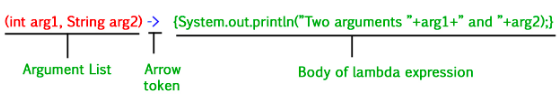

# Lambdas and Streams in Java

This section discussed about the the 2 major concepts in Java programming language.

- Lambdas
- Streams

## Java Lambdas

###### What are lambda expressions ?

- Lambda expressions basically express instances of [functional interfaces](https://www.geeksforgeeks.org/functional-interfaces-java/) .
- An interface with single abstract method is called ***functional interface***. 
- ***Example:***  ***java.lang.Runnable***. 
- lambda expressions implement the only abstract function and therefore implement functional interfaces.



#### Functionalities:

- Enable to treat functionality as a method argument, or code as data.
- A function that can be created without belonging to any class.
- A lambda expression can be passed around as if it was an object and executed on demand

## Java Streams

###### What are Java Streams ?

- Introduced in Java 8, the Stream API is used to process collections of  objects.
- A stream is a sequence of objects that supports various methods which can be pipelined to produce the desired result.

###### Features of Java Stream :

- A stream is not a data structure instead it takes input from the **Collections**, **Arrays** or **I/O channels**.
- Streams ***don’t change the original data structure***, they only provide the result as per the pipelined methods.
- Each intermediate operation is lazily executed and returns a stream  as a result, hence various intermediate operations can be pipelined.
- Terminal operations mark the end of the stream and return the result.

### Operations on Streams

##### 1. Intermediate Operations 

- [`map(lambdaMapper):`]() Used to returns a stream consisting of the results of applying the given function to the elements of this stream.

```java
List<Integer> numbers = Arrays.asList(2,3,4,5);
List<Integer> squares = numbers.stream().map(e -> e*e).collect(Collectors.toList());
```


- [`filter(lambdaFilterer):`]() - Used to select elements as per the Predicate passed as argument.

```java
List<String> names = Arrays.asList("Reflection", "Collection", "Stream");
List<String> filteredNames = names.stream().filter(e -> e.startsWith("S")).collect(Collectors.toList());
```


- [`sorted(lambdaComparator):`]() - Used to sort the stream.

```java
List<String> names = Arrays.asList("Reflection", "Collection", "Stream");
List<String> sortedNames = names.stream().sorted((e1, e2) -> e2.compareTo(e1)).collect(Collectors.toList());
```


##### 2. Terminal Operations :

- [`collect(container):`]() - Used to return the result of the intermediate operations performed on the stream.

```java
List<Integer> numbers = Arrays.asList(2,3,4,5,3);
Set<Integer> squareSet = numbers.stream().map(e -> e*e).collect(Collectors.toSet());
```


- [`forEach(operations):`]() - Used to iterate through every element of the stream.

```java
List<Integer> numbers = Arrays.asList(2,3,4,5);
numbers.stream().forEach(e -> System.out.print(e + " "));
```


- [`reduce(binaryOperator):`]() - used to reduce the elements of a stream to a single value, it takes a BinaryOperator as a parameter.

```java
List<Integer> numbers = Arrays.asList(2,3,4,5);
int evenSum = numbers.stream().filter(e -> e%2==0).reduce(0, (sum, i) -> sum+i);
// Here sum variable is assigned 0 as the initial value and i is added to it .
```


***Example:***

```java
import java.util.Arrays;
import java.util.List;
import java.util.Set;
import java.util.stream.Collectors;

public class StreamCreationAndOperations {
    public static void main(String[] args){
        List<Integer> numbers = Arrays.asList(2, 3, 4, 5, 2);
        List<String> names = Arrays.asList("Reflection", "Collection", "Stream");

        // Map each element to another value using :=> map(lambdaMapper)
        List<Integer> squares = numbers.stream().map(e -> e*e).collect(Collectors.toList());
        System.out.println(squares);

        // Filter elements using :=> filter(lambdaFilterer)
        List<String> filteredNames = names.stream().filter(e -> e.startsWith("S"))
                                                        .collect(Collectors.toList());
        System.out.println(filteredNames);

        // Sort elements using :=> sorted(lambdaComparator)
        List<String> sortedNames = names.stream().sorted((e1, e2) -> e2.compareTo(e1))
                                                    .collect(Collectors.toList());
        System.out.println(sortedNames);

        // Collect from stream using :=> collect(container)
        Set<Integer> squareSet = numbers.stream().map(e -> e*e).collect(Collectors.toSet());
        System.out.println(squareSet);

        // Iterate over each element in stream using :=> forEach(operations)
        numbers.stream().forEach(e -> System.out.print(e + " "));
        System.out.println();

        // Reduce the stream to a single entity using :=> reduce(binaryOperator)
        int evenSum = numbers.stream().filter(e -> e%2==0).reduce(0, (sum, i) -> sum+i);
        System.out.println(evenSum);
    }
}
```

**Output:**

```
[4, 9, 16, 25, 4]
[Stream]
[Stream, Reflection, Collection]
[16, 4, 9, 25]
2 3 4 5 2 
8
```


###### Important Notes :

- A stream consists of source followed by zero or more  intermediate methods combined together (pipelined) and a terminal method to  process the objects obtained from the source as per the methods  described.
- Stream is used to compute elements as per the pipelined methods without altering the original value of the object.


----

