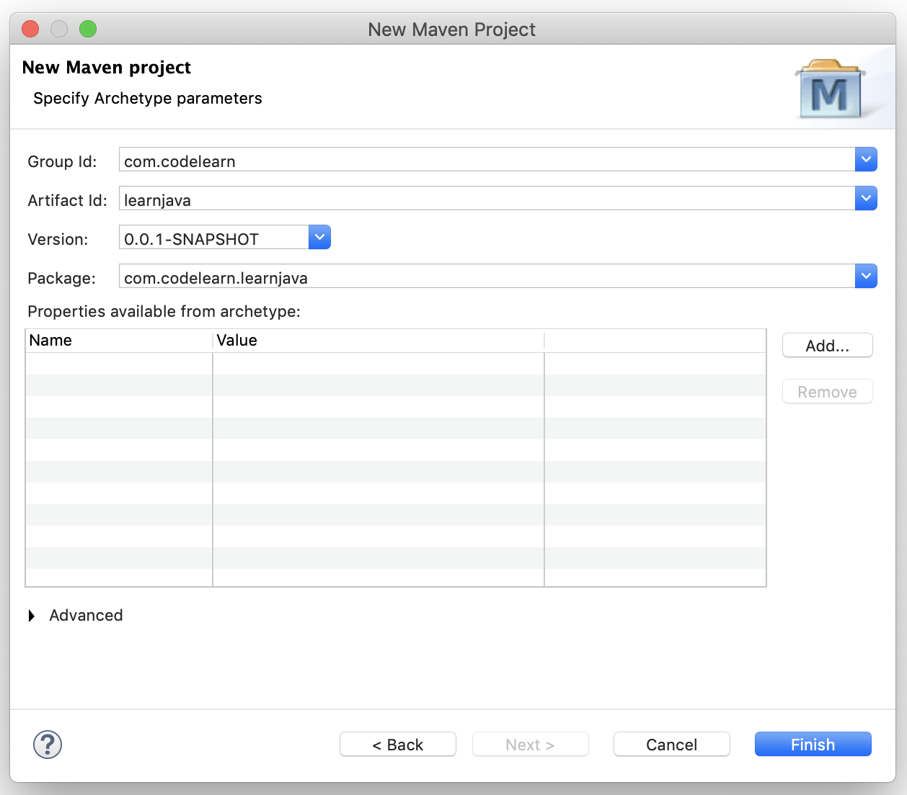

# IDEs for Java

There are 2 very popular IDEs for Java.

- Intellij
- Eclipse

## Learning Intellij

- **`sout()`** : For System.out.println()
- 

## Learning Eclipse

### Creating a Maven Project

###### groupId:

- It will identify the project uniquely across all projects, so we need to enforce a naming schema.
- It has to follow the package name rules, means that it has to be at least as a domain name we control, and we can create as many subgroups as we want.
- ***Examples:*** `org.apache.maven`, `org.apache.commons`
- A good way to determine the granularity of the groupId is to use the project structure i.e if the current project is a multiple module project, it should append a new identifier to the parent's groupId
- ***Examples:*** `org.apache.maven`, `org.apache.maven.plugins`, `org.apache.maven.reporting`

###### artifactId:

- It is the name of the jar without version.
- If we are creating it then we can choose whatever name we want with lowercase letters and no strange symbols.
- But if it's a third party jar we have to take the name of the jar as it's distributed.
- ***Examples:*** `maven`, `commons-math`

###### version:

- If we distribute it then we can choose any typical version with numbers and dots (1.0, 1.1, 1.0.1, ...).
- Don't use dates as they are usually associated with SNAPSHOT (nightly) builds.
- If it's a third party artifact, we have to use their version number whatever it is, and as strange as it can look.
- ***Examples:*** `2.0`, `2.0.1`, `1.3.1`

##### Basic Structure Example:

> ***groupId:*** &nbsp; **`com.companyname.project`**
>
> ***artifactId:*** &nbsp; **`project`**
>
> ***version:*** &nbsp; **`0.0.1`**

### Understanding Files & Folders

###### pom.xml

- Gives information of the project we are currently working on.

### Eclipse Shortcuts

###### Text Edit

> **⇧↵** &nbsp;      Insert line below current line
>
> **⇧⌘↵**    Insert line above current line
>
> 
>
> **⌥⌘UP**            Copy line above current line
>
> **⌥⌘DOWN**     Copy line below current line
>
> 
>
> **⇧⌘X**      To upper case
>
> **⇧⌘Y**      To lower case
>
> 
>
> **⌘D**                       Delete line
>
> **⌥BACKSPACE**     Delete previous word
>
> 
>
> **⌘LEFT**         Line start
>
> **⌘RIGHT**      Line end
>
> 
>
> **⌥UP**                Move lines up
>
> **⌥DOWN**         Move lines down
>
> 
>
> **⌃.**                Word completion
>
> **⌘/**               Toggle comment
>
> **⇧⌘O**         Organize imports

###### Text Selection

> **⇧⌘LEFT**         Select line start
>
> **⇧⌘RIGHT**      Select line end
>
> 
>
> **⇧⌥LEFT**         Select previous word
>
> **⇧⌥RIGHT**      Select next word

###### Java Source Code 

> **⌃⌘/**           Add block comment
>
> **⌃⌘\\**           Remove block comment
>
> 
>
> **⇧⌘F**         Format
>
> **⇧⌘M**        Add import
>
> 
>
> **⌥⌘J**        Add javadoc comment
>
> 
>
> **⌥⌘R**      Rename refactor

