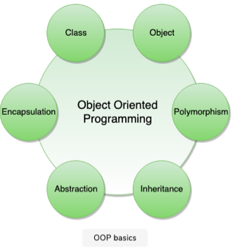

# Low Level Design Basics

###### Object-Oriented Programming

- **Object-Oriented Programming:** A style of programming that focuses on using objects to design and applications.
- **Procedure-Oriented Programming:**  Programs are designed as blocks of statements to manipulate data.
- OOP organizes the program to combine data and functionality and wrap it inside **object.**

- [Object:]() Represents a real world entity and the basic building block of OOP.
  - *Example: Online Shopping System* - Shopping Cart, Customer, Product Item are some of objects.
- [Class:]() Prototype or blueprint of an object. Template definition of the attributes and methods of object.
  - *Example: Online Shopping System* - Customer Object will have attributes like name, shipping address, cards etc.. and methods for placing order, cancel order etc.

###### 4 Principles of Object-Oriented Programming

1. **Encapsulation:**
   - Mechanism of binding the data together and hiding it from outside world.
   - Achieved when each object keeps its state private so that other objects don't have direct access to its state.
   - This state can only be accessed through a set of public functions.
2. **Abstraction:**
   - Can be thought as a natural extension of encapsulation.
   - It means hiding all but the relevant data about an object to reduce the complexity of the system.
   - In a large system, objects talk to each other, which makes it difficult to maintain a large code base.
   - Abstraction helps by hiding internal implementation details of objects and only reveals operations that are relevant to other objects.
3. **Inheritance**
   - Mechanism of creating new classes from existing ones.
4. **Polymorphism**
   - It is the ability of an object to take diffferent forms.

 

## OO Analysis and Design

- A structured method for analyzing and designing a system by applying object-oriented concepts.
- An investigation into the objects constituing the system.
- Starts by first identifying the objects of the system and then figuring out the interactions b/w the various objects.

###### Process of OO Analysis and Design

1. Identifying the objects in the system.
2. Defining the relationship b/w objects.
3. Establishing the interface of each object.
4. Making a design that can be converted to executables (code) using OO languages.

###### Standard Method / Modeling Tool to document all these informations

- We use **UML (Unified Modeling Language)** to document/ model these informations.
- UML can be considered as the **succesor of the OO Analysis and Design**.
- Powerful enough to represent all the concepts that exists in OO Analysis and Design.
- UML diagrams are representation of OO concepts.

 

 

----

<a href="unified-modeling-language-uml" class="next-button">Next: Unified Modeling Language (UML)  &rarr;</a>

