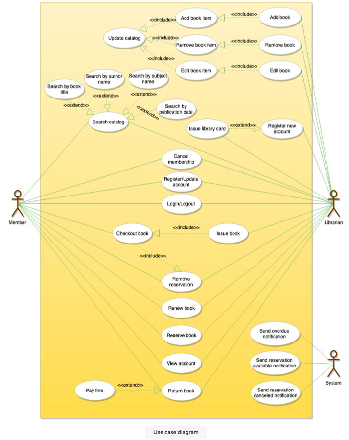
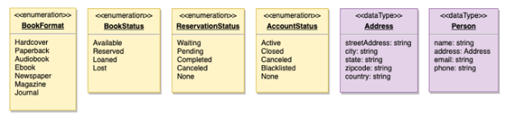
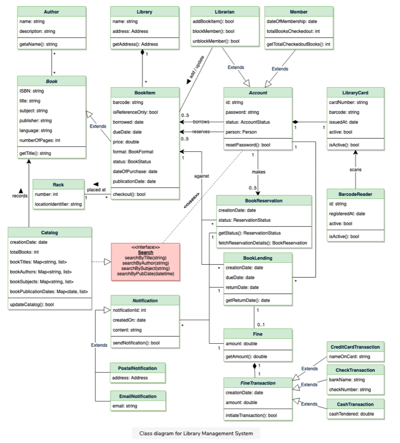
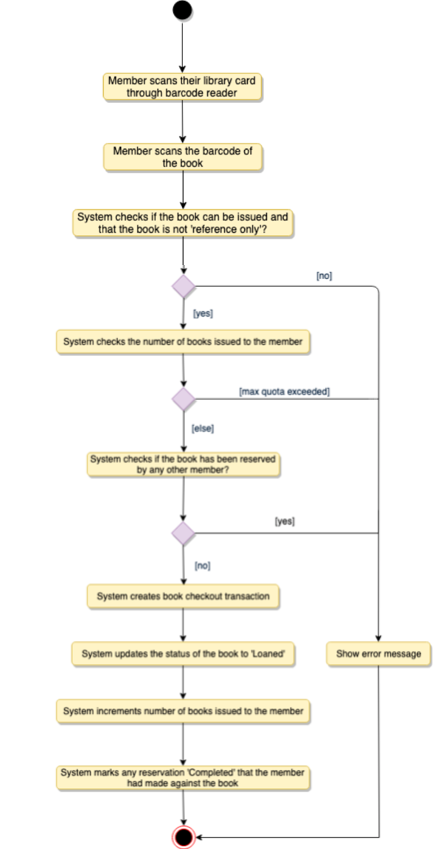
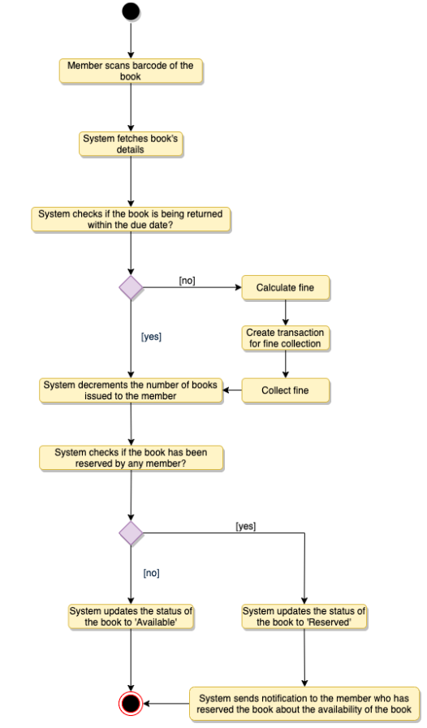
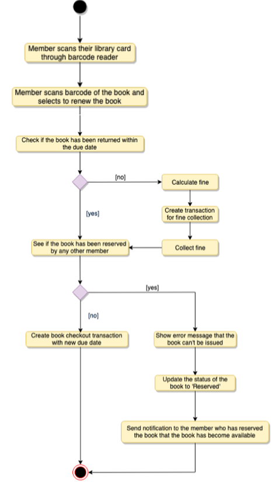

# Design Library Management System

###### Problem Statement:

- Lets design a Library Management System.

 

#### Step-1: What is a Library Management System ?

- It is a software built to handle the primary housekeeping functions of a library.
- Libraries rely on Library Management systems to manage asset collections as well as reltaionships with their members.
- Library Management systems helps libraries keep track of the books and their checkouts as well as members' subscriptions and profiles.
- These systems also involve maintaining the database for entering new books and keeping record of borrowed books with due dates.

 

 

#### Step-2: System Requirements

We will focus on the following set of requirements of while designing the Library Management System:

1. Any library member should be able to search books by their title, author, subject category as well by the publication date.
2. Each book will have a unique identification number and other details including a rack number which helps to physically locate a book.
3. There can be more than 1 copy of a book (each copy is a book item). A library member should be able to checkout & reserve any copy.
4. System should be able to retrieve information like who took a particular book or what are the books checkout out by a member.
5. There should be a maximum limit (5) on no. of books a member can checkout.
6. There should be a maximum limit (10) on no. of days a member can keep a book.
7. The system should be able to collect fines for books afte the due date.
8. Members should be available to reserve books that are currently not available.
9. System should be able to send notifications whenever the reserved books become available & for books not returned within due dates.
10. Each book and member will have unique barcode. The system should be able to read barcodes from books and members' library cards.

> **Note:** *Always clarify requirements at the begining of the interview and ask questions to find exact scope of system that interviewer is expecting.*

 

 

#### Step-3: Use-Case Diagram

###### 3 Main Actors of the System

1. **Librarian:**  Mainly responsible for adding books and book items and users. Can also issue, reserve and return book.
2. **Member:** All members can search a catalog, as well as check-out, reserve, renew and return a book.
3. **System:** Mainly responsible for sending notifications for overdue books, cancelled reservations etc.

###### Top Use-Cases of  the System:

- **Add/Remove/Edit Book:** To add, remove or modify a book or book item.
- **Search Catalog:** To search books by title, author, subject or publication date.
- **Register Account / Cancel Membership:** To add a new member or cancel the membership of an existing member.
- **Check-out Book:** To borrow a book from the library.
- **Reserve Book:** To reserve a book currently not available.
- **Renew Book:** To reborrow an already checked-out book.
- **Return BooK:** To return a book back to library which was issued to particular member.

 

 

#### Step-4: Class Diagram

Here are the main classes of our Library Management System:

- **Library:** The central part of the organization for which this software has been designed. It has attributes like *"Name"* to distinguish it from any other libraries and *"Address"* to desribe its location.
- **Book:** The basic building block of the system. Every book will have ISBN, Title, Subject, Publishers.
- **BookItem:** Any book can have multiple copies, each copy will be considered a book item and each book item will have unique barcode.
- **Account:** We will have 2 types of accounts in the system, one will be a general member and the other will be a librarian.
- **LibraryCard:** Each library user will be issued a library card, which will be used to identify users while issuing or returning books.
- **BookReservation:** Responsible for managing reservations against book items.
- **BookLending:** Managing the checking-out of book items.
- **Catalog:** Catalogs contains list of books stored on certain criteria. Our system supports searching through 4 catalogs - Title, Author, Subject and Publish-date.
- **Fine:** This class will be responsible for calculating and collecting fines from library members.
- **Author:** This class will encapsulate a book author.
- **Rack:** Books will be placed on racks. Each rack will be identified by a Rack number and will have a location identifier to describe the physical location of the rack in the library.
- **Notification:** This class will be responsible for sending notifications to library members.

 

 

#### Step-5: Activity Diagrams

###### Check-out a Book

Any library member or librarian can perform this activity. Here are the steps to check-out a book.

 

###### Return a Book

Any library member or librarian can perform this activity. The system will collect fines from members if they return books after the due date.

Here are the steps for returning a book.

 

###### Renew a Book

 

 

#### Step-6: Code

Here is the code for the use cases mentioned above: 1) Check-out a book  2) Return a book  3) Renew a book.

> **Note:** *This code only focuses on the design part of the use cases. Since it is not required to write a fully executable code in interview. We can assume parts of the code to interact with the database, payment system.*

