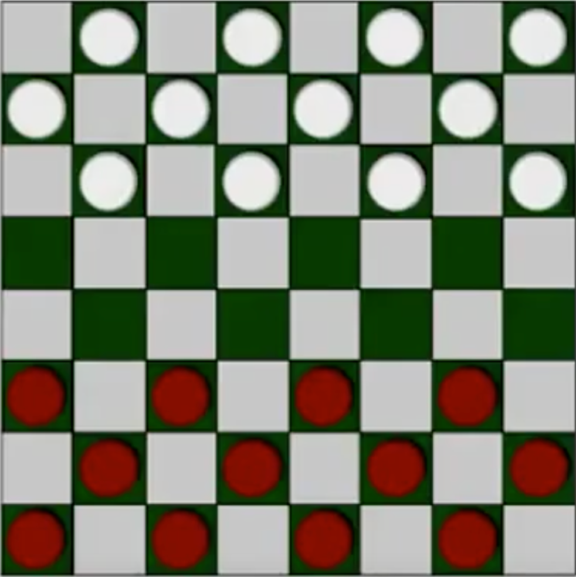
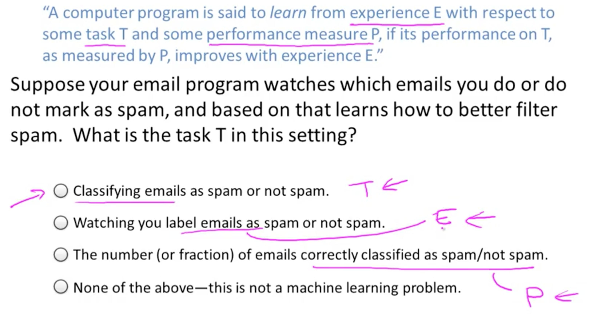
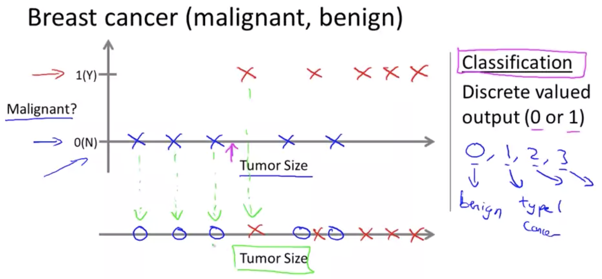
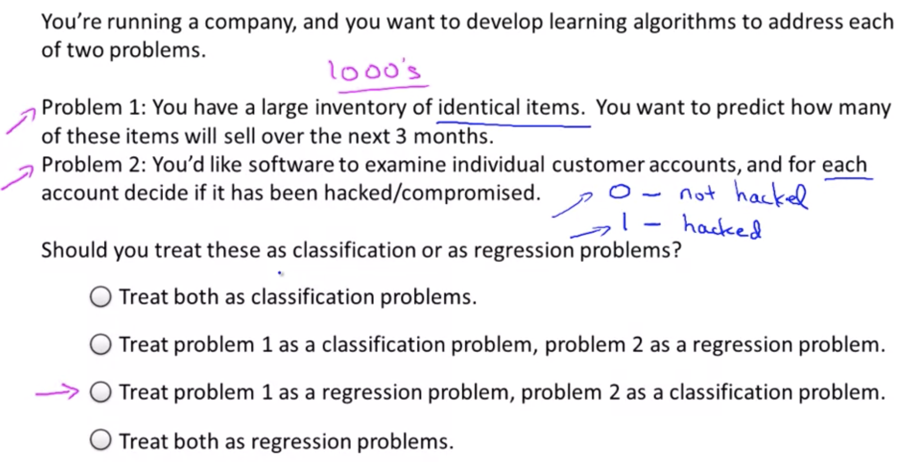
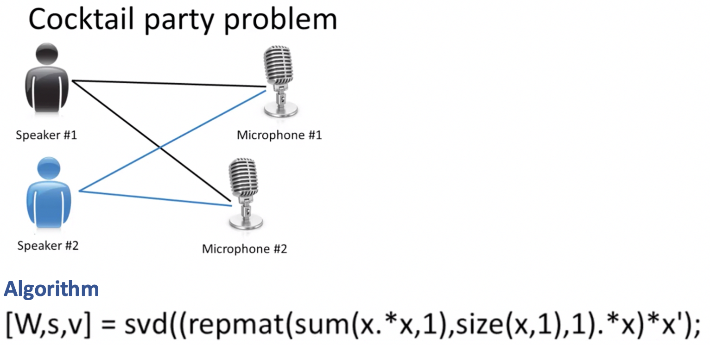
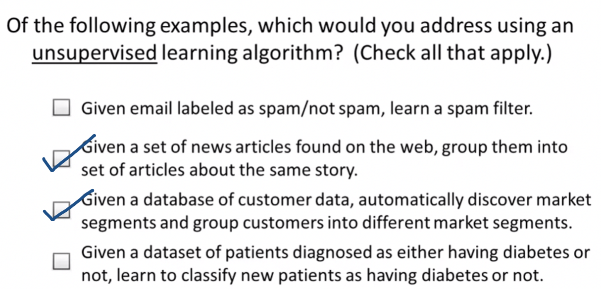

# Introduction to Machine Learning

Machine learning is the science of getting computers the ability to learn, without being explicitly programmed.

###### We've probably used a learning algorithm dozens of times a day without knowing it.

- Every time we use a web search engine like Google or Bing to search the internet, one of the reasons that works so well is because a learning algorithm, one implemented by Google or Microsoft, has learned how to rank web pages.
- Every time we use Facebook or Apple's photo typing application and it recognizes our friends' photos, that's also machine learning.
- Every time we read our email and the spam filter saves us from having to wade through tons of spam email, that's also a learning algorithm.

### Machine Learning

- Grew out of work on AI
- New capability for computers

###### Examples:

- **Database Mining :** Large datasets from growth of automation/web. Ex: Web click data, Medical Records, Biology, Engineering.
- **Applications can't programmed by hand :** Autonomous Helicopter, Handwriting Recoginition, NLP, Computer Vision.
- **Self-customizing Programs :** Amazon, Netflix product recommendations.
- **Understanding human learning :** Brain, Real AI

### Machine Learning Definition

Even among machine learning practitioners there isn’t a well accepted definition of what is and what isn’t machine learning.

###### But here are some people who have tried to define it:

- **Arthur Samuel(1959) :** Field of study that gives computers the ability to learn, without being explicitly programmed.

_Samuel’s claim to fame was that back in the 1950’s, he wrote a checkers playing program. And the amazing thing about this checkers playing program, was that Arthur Samuel himself, wasn’t a very good checkers player. But what he did was, he had to program for it to play 10’s of 1000’s of games against itself. And by watching what sorts of board positions tended to lead to wins, and what sort of board positions tended to lead to losses. The checkers playing program learns over time what are good board positions and what are bad board positions. And eventually learn to play checkers better than Arthur Samuel himself was able to. This was a remarkable result. Although Samuel himself turned out not to be a very good checkers player. But because the computer has the patience to play tens of thousands of games itself. No human, has the patience to play that many games. By doing this the computer was able to get so much checkers-playing experience that it eventually became a better checkers player than Arthur Samuel himself._

- **Tom Mitchell(1998) :**  Well-posed Learning Problem: A computer program is said to learn from experience E with respect to some task T and some performance measure P, if its performance on T, as measured by P, improves with experience E.

> **Example:** playing checkers.
>
> E = the experience of playing many games of checkers
>
> T = the task of playing checkers.
>
> P = the probability that the program will win the next game.

##### Note:

- In general, any machine learning problem can be assigned to one of two broad classifications:
    - Supervised learning
    - Unsupervised learning.

### Machine learning algorithms

- Supervised learning
- Unsupervised learning

###### Others:

- Reinforcement learning
- Recommender systems. 

 

## Supervised  Learning  Algorithm

- In supervised learning, we are given a data set and already know what our correct output should look like, having the idea that there is a relationship between the input and the output.
- Supervised learning problems are categorized into "regression" and "classification" problems. 

### Regression Problems

- In a regression problem, we try to predict results within a continuous output, meaning that we try to map input variables to some continuous function.

> ***Example:*** 
>
> Given data about the size of houses on the real estate market, try to predict their price.
>
> Price as a function of size is a continuous output, so this is a regression problem.

### Classification Problems

- In a classification problem, we instead try to predict results in a discrete output.
- In other words, we try to map input variables into discrete categories.

> ***Example:***
>
> Given a patient with a tumor and its sizes, we have to predict whether the tumor is malignant or benign.

##### Notes:

- We could turn the **housing price prediction** example into a classification problem by instead making our output about whether the house "sells for more or less than the asking price." Here we are classifying the houses based on price into two discrete categories.
- In the Breast Cancer prediction problem we have done the classification only on the basis one feature or attribute i.e tumor size but there can be more than 1 attribute responsible for it.
- A learning algorithm can deal with not only 2 or 3 or 5 features/attributers but an infinite no. of features.

 

> **Practice Problem:**

 

> **Other Examples**:
>
> (a) Regression - Given a picture of a person, we have to predict their age on the basis of the given picture
>
> (b) Classification - Given a patient with a tumor, we have to predict whether the tumor is malignant or benign.

 

## Unsupervised  Learning  Algorithm

- Unsupervised learning allows us to approach problems with little or no idea what our results should look like.
- We can derive structure from data where we don't necessarily know the effect of the variables.
- We can derive this structure by clustering the data based on relationships among the variables in the data.
- With unsupervised learning there is no feedback based on the prediction results.

- Unsupervised Learning problems can be categorised into **Clustering** and **Non-clustering** problems.

 

### Clustering Problems

- Clustering Example: Take a collection of 1,000,000 different genes, and find a way to automatically group these genes into groups that are somehow similar or related by different variables, such as lifespan, location, roles, and so on.

 

### Non-Clustering Problems

- Non-clustering Example: The "Cocktail Party Algorithm", allows us to find structure in a chaotic environment. (i.e. identifying individual voices and music from a mesh of sounds at a cocktail party).

> ***Example Problem:***

 

------

<a href="setup-and-resources" class="prev-button">&larr; Previous: Setup and Resources</a> 

<a href="linear-regression-one-variable" class="next-button">Next: Linear Regression with One Variable &rarr;</a>

