# Linear Regression with One Variable

Linear regression is the first learning algorithm, we need to see how the model looks like and more importatnly what is the overall process of supervised learning looks like.

## Model Representation

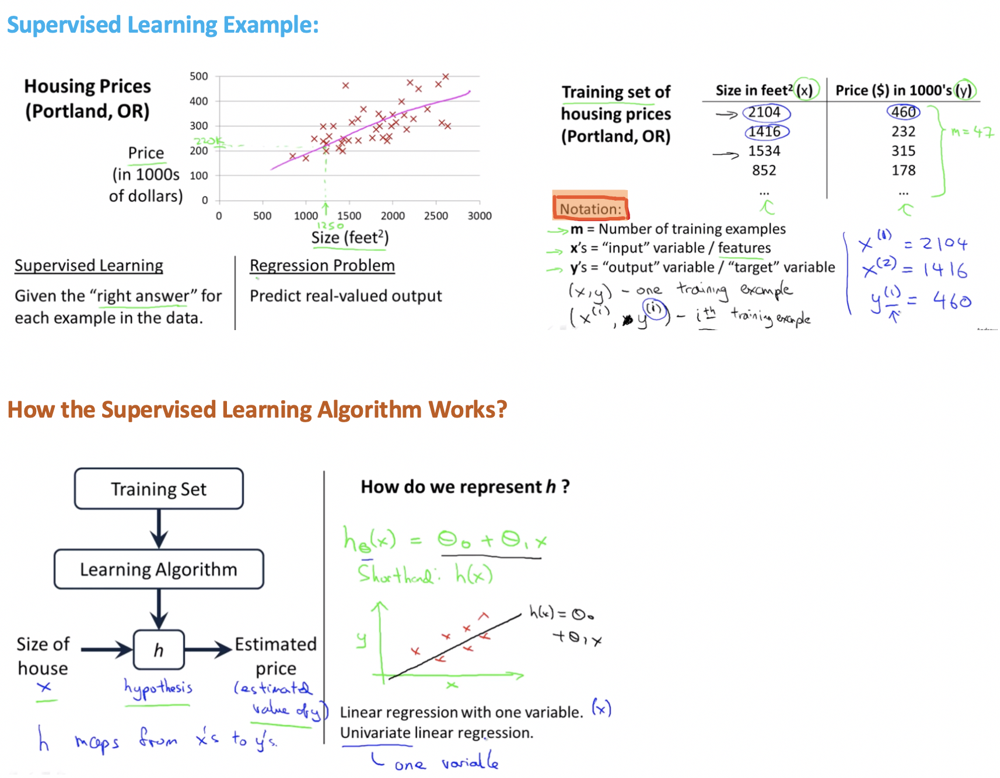

 

## Cost Function

### Cost Function Intuition-1:

> Analyzing Cost Funciton by Simplified Hypotheiss Function by making **θ0=0**

 

### Cost Function Intuition-2: 

> Analyzing Cost Funciton by Actual Hypotheiss Function

- Earlier we saw that when we considered only one parameter **θ1** we got a bowl shaped graph of cost function in 2-D plane.
- But now when we consider both  **θ0** and **θ1** we again get a bowl shaped graph but now in 3-D plane.

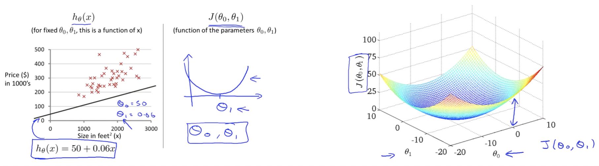

##### Note:

- For the purpose of illustration ahead we are not going to use these sort of 3D surfaces to show the cost function J, instead we will use **contour plots / figures**.

#### Contour Plots

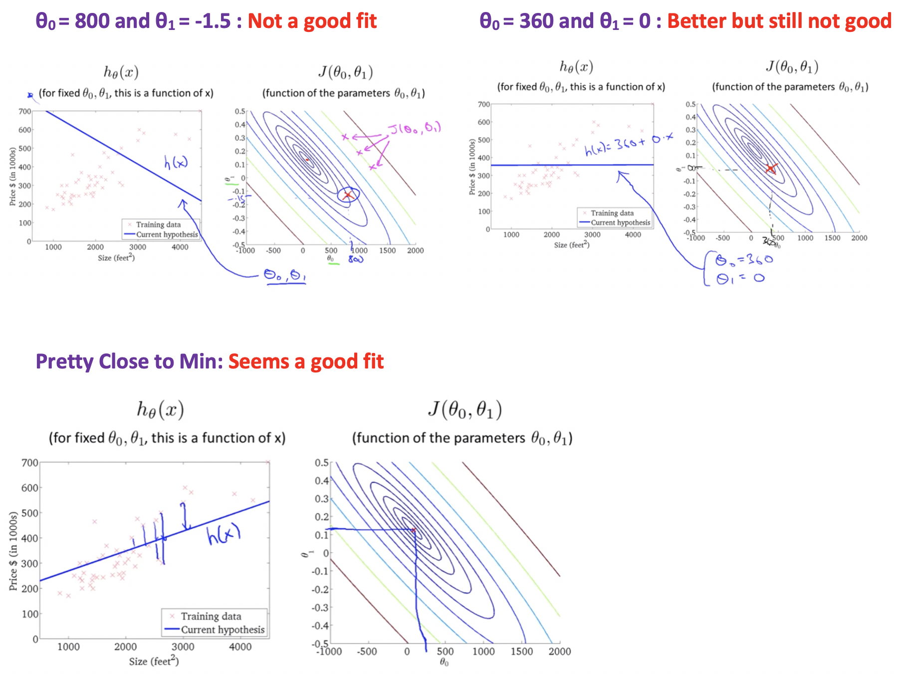

##### Notes:

- Now we want is an **efficient algorithm / software** for automatically finding values of **θ0** and **θ1**, that minimizes the cost function J.
- In cases of complicated examples with high dimensional figures (more parameters) it cannot really be plotted, and becomes much harder to visualize, so we need software to find those values.

 

## Gradient Descent Algorithm

- Used to minimize the cost funnction J.
- It is a more general algorithm and is used not only in linear regression but all over the place in machine learning.
- We use gradient descent to minimize other functions as well, not just the cost function J for the linear regression.

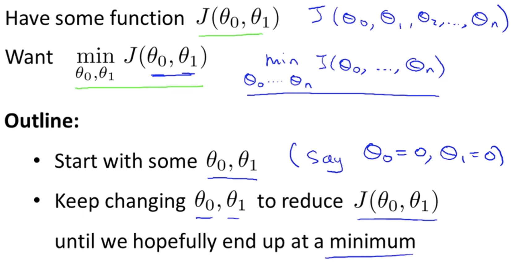

 

### Minimizing Gradient Descent

- So we have our hypothesis function and we have a way of measuring how well it fits into the data.
- Now we need to estimate the parameters in the hypothesis function, that's where gradient descent comes in.
- In gradient descent, what we do is look all around 360 degrees and ask, if I had to take a little baby step in some direction, and I want to go downhill as quickly as possible, what direction do I take that little baby step in?

- We will know that we have succeeded when our cost function is at the very bottom of the pits in our graph, i.e. when its value is the minimum. The red arrows show the minimum points in the graph.
- The way we do this is by taking the derivative (the tangential line to a function) of our cost function. The slope of the tangent is the derivative at that point and it will give us a direction to move towards. We make steps down the cost function in the direction with the steepest descent. The size of each step is determined by the parameter α, which is called the learning rate.

> **Example:**
>
> - The distance between each 'star' in the graph above represents a step determined by our parameter α, a smaller α would result in a smaller step and a larger α results in a larger step.
> - The direction in which the step is taken is determined by the partial derivative of  **J(θ0, θ1)**. 
> - Depending on where one starts on the graph, one could end up at different points, the image above shows us two different starting points that end up in two different places.

 

### Gradient Descent Intuition

- To have an intuition about what each of these two terms (learning rate and derivative) is doing and why when put together, this entire update makes sense.In order to convey these intuitions, we will try to minimize the function of just one parameter.
- So say we have a cost function, J of just one parameter, **θ1**. So we can have plots, which are a little bit simpler to look at.

###### Understanding the derivative term:

- **Case-1:** When we start with a **θ1** right to minimum
    We will see that after the update **θ1** will move towards left to attain the minimum as slope will be +ve and **α** being already positive.
- **Case-2:** When we start with a **θ1** left to minimum
    We will see that after the update **θ1** will move towards right to attain the minimum as slope will be -ve and **α** being already positive.

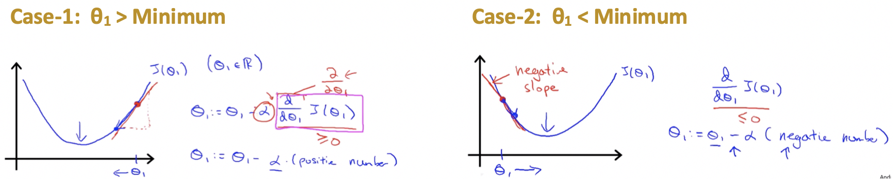

###### Understanding the learning rate α:

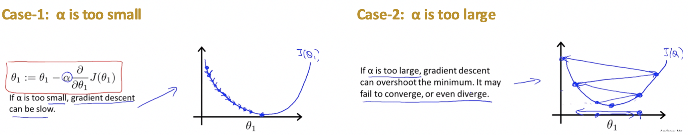

##### Notes:

- If we are already at the local optimum it leaves **θ1** unchanged coz it updates as **θ1** equals **θ1**. So if the parameters are already at a local minimum one step with gradient descent does absolutely nothing it doesn’t change the parameter which is what we want because it keeps our solution at the local optimum.
- Gradient descent can converge to a local minimum, even with the learning rate α fixed.

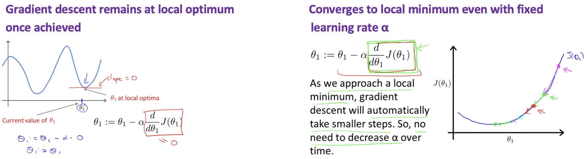

 

### Gradient Descent for Linear Regression

- Now we put together gradient descent with our cost function, and that will give us an algorithm for linear regression (putting a straight line to our data).
- To apply gradient descent to minimize our squared error cost function, the key term we need is the derivative term.

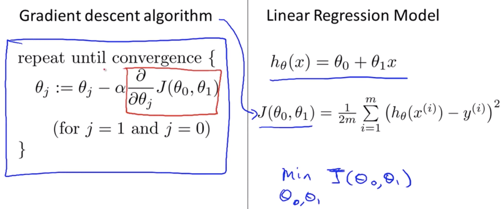

- Need to figure out what is this partial derivative term and plugging it in the definition of the cost function J.

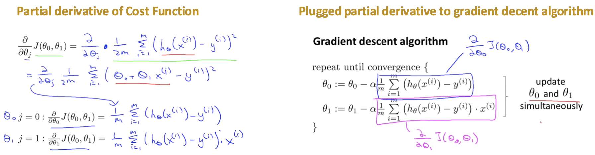

 

> **Problem with Gradient Descent Algorithm:** &nbsp;Susceptible to local optimmum
>
> **Solution:** Th Cost function for linear regression is always going to be a bowl-shaped function or convex function for which no other local optimum, only global optimum.

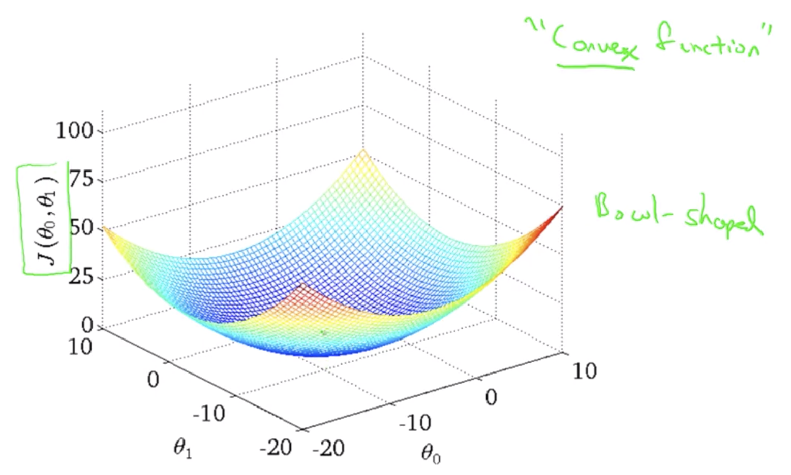

 

> **Algorithm in Action:**

 

> **Finally:  *The closest fit line to training data set***

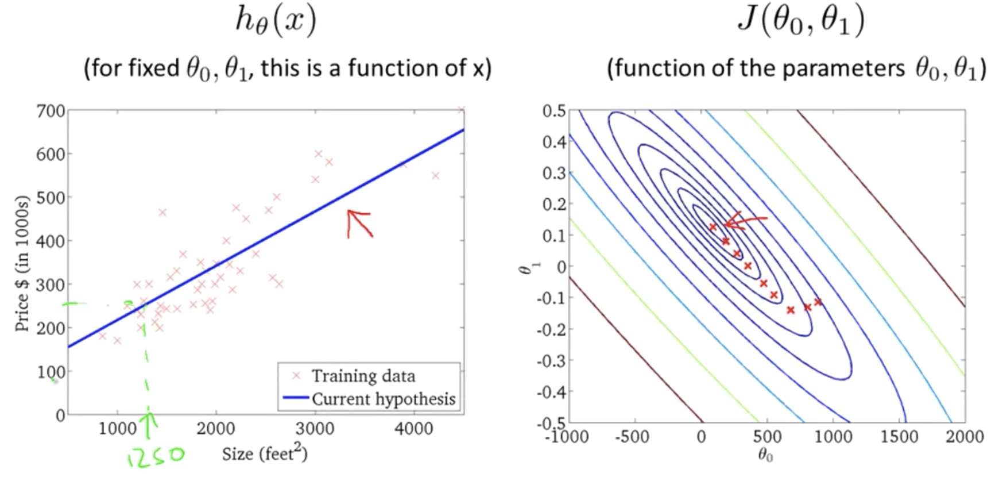

 

#### Batch Gradient Descent Algorithm

- The point of all this is that if we start with a guess for our hypothesis and then repeatedly apply these gradient descent equations, our hypothesis will become more and more accurate.
- So, this is simply gradient descent on the original cost function J.
- This method looks at every example in the entire training set on every step, and is called batch gradient descent.
- There are some other versions of gradient descent that are not batch versions coz they don't look at the entire training set but look at small subsets of the training sets at a time.

 

------

<a href="introduction" class="prev-button">&larr; Previous: Introduction to Machine Learning</a> 

<a href="linear-algebra" class="next-button">Next: Linear Algebra &rarr;</a>

