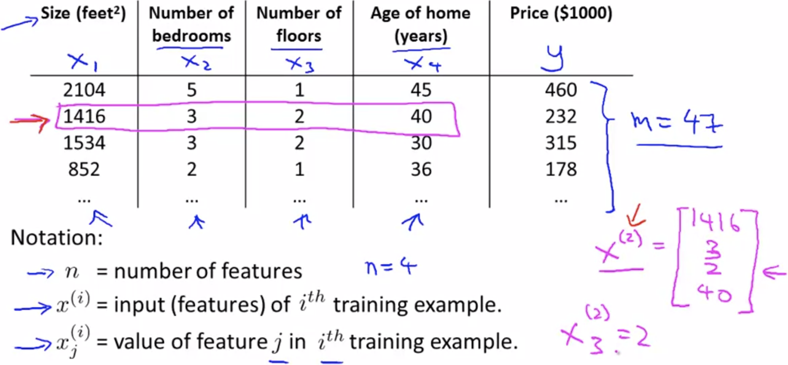
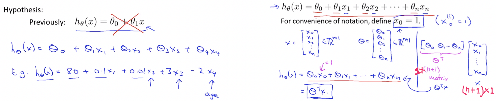
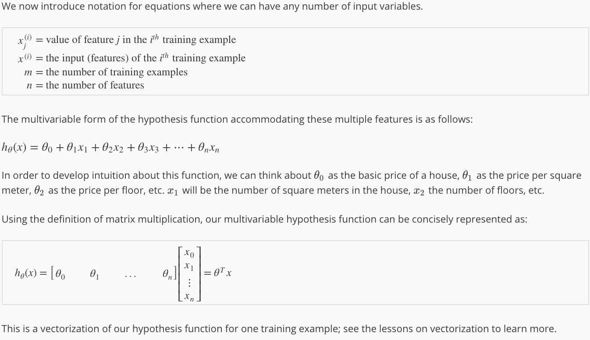
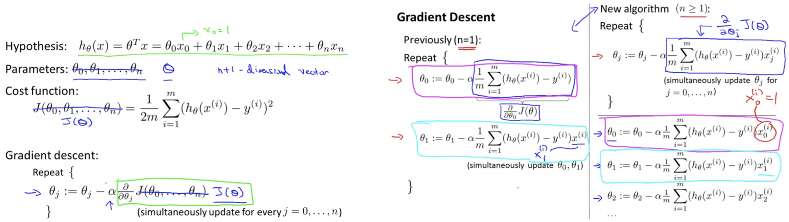
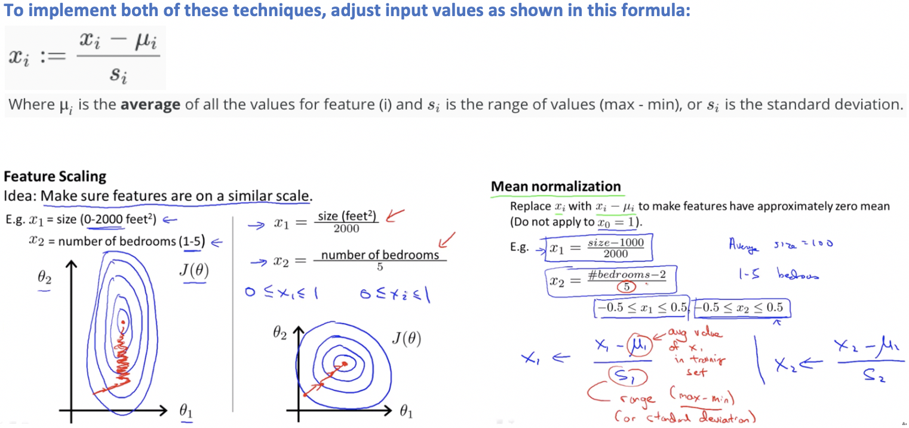
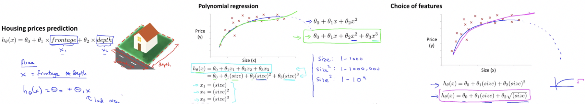
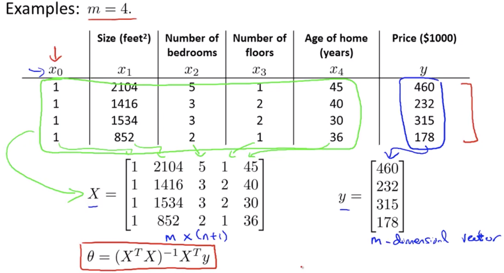
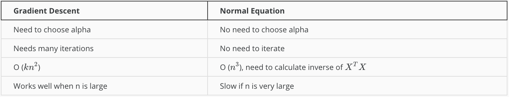
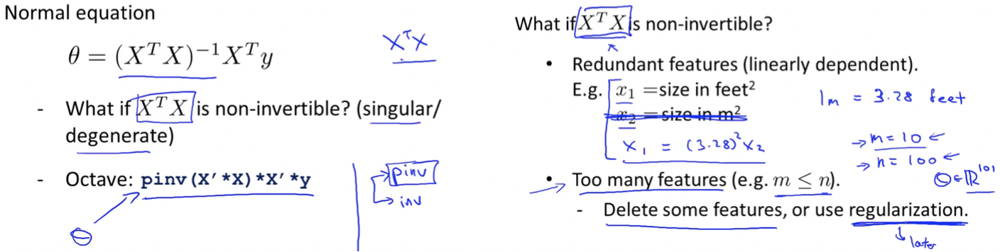

# Linear Regression with multiple variables

## Multivariate Linear Regression

Linear regression with multiple variables is also known as "multivariate linear regression".

### Multiple Features

###### Hypothesis:

###### Concepts:

 

### Gradient descent for multiple variables

The gradient descent equation itself is generally the same form; we just have to repeat it for our 'n' features:

 

###### Concepts:

 

#### Feature Scaling:

We can speed up gradient descent by having each of our input values in roughly the same range.

This is because θ will descend quickly on small ranges and slowly on large ranges, and so will oscillate inefficiently down to the optimum when the variables are very uneven.

> The way to prevent this is to modify the ranges of our input variables so that they are all roughly the same.
>
> ***Ideally:*** &nbsp; **−1 ≤ x(i) ≤ 1** &nbsp;or&nbsp; **0.5 ≤ x(i) ≤ 0.5**

##### Two techniques to help with this are:

- **Feature Scaling:** Involves dividing the input values by the range (i.e. the maximum value minus the minimum value) of the input variable, resulting in a new range of just 1.
- **Mean Normalization:** Mean normalization involves subtracting the average value for an input variable from the values for that input variable resulting in a new average value for the input variable of just zero.

#### Learning Rate:

Job of gradient descent is to find the value of **θ** that hopefully minimizes the cost function **J(θ)**.

###### Debugging gradient descent:

- Make a plot with ***number of iterations*** on the x-axis.
- Now plot the cost function, **J(θ)** over the number of iterations of gradient descent.
- If **J(θ)** ever increases, then probably need to decrease **α**.

###### Automatic convergence test:

- Declare convergence - if **J(θ)** decreases by less than **ε** in one iteration, where **ε** is some small value such as **10−3**.
- However in practice it's difficult to choose this threshold value.

> **Summary:**
>
> - **If α is too small:** slow convergence.
> - **If α is too large:** may not decrease on every iteration and thus may not converge.
>
> ***To choose α try:*** . . . . . . ,  0.001, 0.003, 0.01, 0.03, 0.1, 0.3, 1, 3, 10, 30, 100, . . . . . . . . .

 

### Features and Polynomial Regression

- Sometimes by defining new features we might actually get a better model than that of given features.
- Example: In case of house price prediction instead of using 2 given features length and breadth, we can define new feature area.
- Closely related to the idea of choosing our own features is the idea called **polynomial regression**.

##### Note:

If you choose our features in the way like squares and cubes then feature scaling becomes very important.

 

## Computing Parameters Analytically

Gradient descent gives one way of minimizing cost function J.

Let’s discuss a second way of doing so, this time performing the minimization explicitly and without resorting to an iterative algorithm.

#### Normal Equation Method

- We minimize **J(θ)** by explicitly taking its derivatives with respect to the **θj ’s**, and **setting them to zero**.
- This allows us to find the optimum theta without iteration.

> **Normal Equation Formula: &nbsp; θ = (XTX)-1XTy**

###### Gradient Descent Vs. Normal Equation:

##### Notes:

- There is **no need** to do feature scaling with the normal equation.
- With the normal equation, computing the inversion has complexity **O(n3)**, so if we have a very large number of features, the normal equation will be slow.
- In practice, when n exceeds 10,000 it might be a good time to go from a normal solution to an iterative process.

 

#### Normal Equation: Non-invertibility

- Not all matrices are invertible, non-invertible matrices are also called singular/degenerate.
- When implementing the normal equation in octave we want to use the **`'pinv'`** function rather than **`'inv'`**.
- The **`'pinv'`** function gives a value of **θ** even if **XTX** is not invertible.

###### If **XTX*** is **noninvertible,** the common causes might be having :

- Redundant features, where two features are very closely related (i.e. they are linearly dependent).
- Too many features (e.g. m ≤ n). In this case, delete some features or use **"regularization"**.

 

------

<a href="linear-algebra" class="prev-button">&larr; Previous: Linear Algebra</a> 

<a href="octave-matlab-tutorial" class="next-button">Next: Octave/Matlab Tutorial &rarr;</a>

