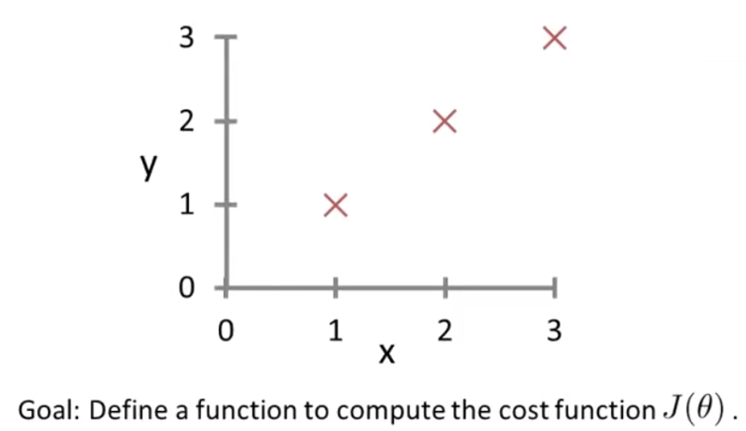

# Octave/Matlab Tutorial

### Basic Operations

```octave
% ======== Math Operators ========= %
5+6
3-2
5*8
3/4
3^5
sqrt(14)

% ======== Logical Opeartors ======= %
4 == 4
2 ~= 4  % Not Equal
1 && 0
1 || 0
xor(1, 0) % XOR

% ======== Other Opeartors ======== %
a = 3
b = "hi"
c = pi  % pi = 3.1416
disp(a)
disp(sprintf('2 decials: %0.2f', a))

% ======== Matrix & Vectors ======= %
M = [1 2 3; 4 5 6; 7 8 9]
V = [1; 2; 3]
A = 1:6 % 1 to 6
B = 1:0.5:3 % Starts from 0 and reaches till 3 with increment of 0.5
C = ones(2, 3) % 2x3 matrix of all 1s
D = 2*ones(2, 3)
E = zeros(1, 3)
W = rand(3, 3) % 3x3 matrix of random numbers --- Normal Distribution
Y = randn(1, 3) % 1 x 3 matrix with numbers follwing mean=0 standard deviation=1 --- Gaussian Distribution
I = eye(4) % 4x4 identity matrix

% ============= Plots ============= %
W = -6 + sqrt(10)*randn(1, 10000)
hist(W) % plots histogram
hist(W, 50) % histogram with 50 bins

% ============= Others ============ %
help(eye)
help(hist)
help(help)
pwd  % present directory
cd % change directory
ls % listy files
who % variables in current scope
whos % with details
clear % clears all variables in scope
a=1, b=2, c=3 % Comma chaning of commands - Mutiple commands one after other
```

<br>

### Moving Data Around

```octave
M = [1, 2; 3, 4; 5, 6]
size(M) % size of matrix : 3 2
size(M, 1) % Number of rows : 3
size(M, 2) % Number of columns : 2
length(M) % Longest Dimension : 3 -- Often used for vectors
M(3, 2) % Value at 3rd row 2nd column
M(3, :) % Complete 3rd row
M(:, 2) % Complete 2nd column
M([1, 3], :) % Complete 1st and 3rd row
M(:) % Put all elements into a single vector
B = [11, 12; 13, 14; 15, 16]
C = [M, B] % Put B beside matrix M : 3 x 4
D = [M; B] % Put B below matrix M : 6 x 2

% ============ File Handling =========== %
load filename % Loads file data to a variable filename
save test.mat v % Saves variable v in file test.mat
save test.text -ascii % Saves in human readable form
```

<br>

### Computing on Data

```octave
A = [1, 2; 3, 4; 5, 6]
B = [1; 2]
A*B % No. of columns in 1st matrix should match no. of row in 2nd matrix

C = [11, 12; 13, 14; 15, 16]
A.*C % Element wise multiplication
A.^2 % Element wise squaring of A
log(A) % Element wise logarithm
exp(A) % Element wise exponentian with base e
abs(A) % Element wise mod
-M % Negative of matrix or -1*M
A + 1 % Increment every element by 1
A < 3 % Element wise comparison

% ======= Other Operations ======== %
A' % Transpose of matrix
pinv(A) % Inverse of matrix
magic(5) % 5x5 matrix with property sum of every row, column, diagonal is same
[r, c] = find(A >= 4) % row and col for all the numbers greater or equal to 4
sum(A) % Sum of columns
sum(A, 2) % Sum of rows
prod(A) % Product of columns
prod(A, 2) % Product of rows
floor(A)
ceil(A)
max(A, [], 1) % column wise max
max(A, [], 2) % row wise max
```

<br>

### Plotting the Data

```octave
t=[0:0.01:0.98]
y1 = sin(2*pi*4*t)
plot(t, y1) % Plots sin graph with t as x-axis and y1 as y-axis
y2 = cos(2*pi*4*t)
plot(t, y2)
plot(t, y1)
hold on % Holds on the previous graph to put another graph on top of it.
plot(t, y2, 'r') % Puts this on top of previous with red color
xlabel('time') % Labels x-axis as time
ylabel('value') % Labels y-axis as value
legend('sin', 'cos') % Marks the color associated to legend on graph
title('muyPlot') % Gives title to graph
print -dpng 'myPlot.png' % Saves the graph as PNG file
help(plot) % To know about plot function
close % Closes the figure to go away

% ========= Figure Commands ========== %
figure(1): plot(t, y1)
figure(2): plot(t, y2)
subplot(1, 2, 1) % Divides plot as 1x2 grid, access first element
plot(t, y1)
subplot(1, 2, 2)
plot(t, y2)
axis([0.5 1 -1 1]) % Changes the scale of the axis
clf % Clears the figure

% ========= Other Commands ========== %
A = magic(5)
imagesc(A) % Draws image with color map as 5x5 matrix
imagesc(A), colorbar % Image with colorbar representing values of color
imagesc(A), colorbar, colormap gray % Changes color and map to gray color bar
imagesc(magic(15)), colorbar, colormap gray % Bigger graph
```

<br>

### For, While, If and Functions

```octave
% for loop
for i=1:10,
  v(i) = 2^i;
end;

% while loop
i = 1;
while i <=5,
  v(i) = i^2;
  i = i + 1;
end

% if, elseif, else
for i=1:5,
    if(i==1),
        disp('The value is 1');
    elseif i==2,
        disp('The value is 2');
    else
        disp('The value is neither 1 nor 2');
    end;
end;

% if and break statement
while true,
	v(i) = i^2;
	i = i+1;
	if(i==6),
		break;
	end;
end;

% ========== Writing Function ========== %
% Step-1: Create a file called squareNumber.m

% Step-2: Function prototype in file
function [outputArg1,outputArg2] = squareNumber(inputArg1,inputArg2)
	% SQUARENUMBER Summary of this function goes here
  % Detailed explanation goes here
  outputArg1 = inputArg1;
  outputArg2 = inputArg2;
end

% Step-3: Write Actual Function in file and save
function y = squareNumber(x)
    y = x^2;
end

% Call fucntion in terminal
squareNumber(5)
% => 25

% Another Example
[a, b] = squareAndCubeOfNumber(15)
```

> **Example-Problem:**



```octave
% Function in file costFunctionJ.m
function J = costFunctionJ(X, y, theta)
	% X is "Design Matrix" containing training examples
	% y is class labels
	m = size(X, 1); % No. of training examples = size of rows of Design matrix
	predictions = X*theta; % Predictions of hypothesis on all m examples : predicted_y = X.θ
	sqrErrors = (predictions-y).^2;  % (predicted_val-actual_val)^2 for every element
	J = 1/(2*m)*sum(sqrErrors);
	

% Working of Function
X = [1, 1; 1, 2; 1, 3]
y = [1; 2; 3]
theta = [0; 1] % Fit line as : y = x
costFunctionJ(X, y, theta)
% => 0 : Output Value (All correct predictions with the fit line)

theta = [0; 0] % Change the fit line as y = 0
costFunctionJ(X, y, theta)
% => 2.33 : (1^2 + 2^2 +  3^2)/(2*3) = 2.33  - All wrong predictios with fit line
```

<br>

### Vectorization

- Whatever programming languages we use have differenrt numerical linear algebra libraries. 
- They're usually very well written, highly optimized,  often sort of developed by people that are specialized in numerical computing.
- When we are implementing machine learning algorithms, we need to take advantage of these linear algebra libraries.

#### Vectorization of Cost Function


#### Vectorization of Gradient Descent


<br>


------

<a href="linear-regression-multiple-variables" class="prev-button">&larr; Previous: Linear Regression with multiple variables</a> 

<a href="logistic-regression" class="next-button">Next: Logistic Regression &rarr;</a>

