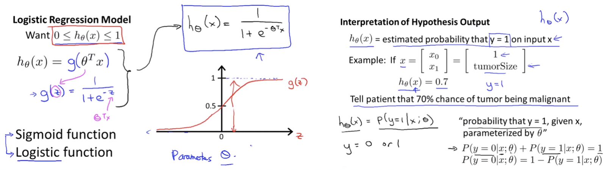
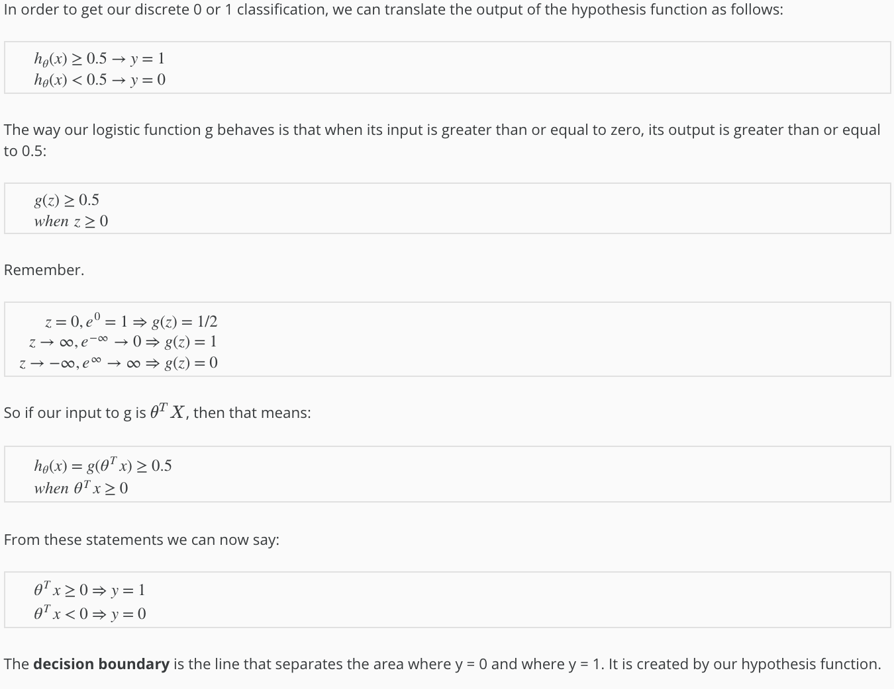
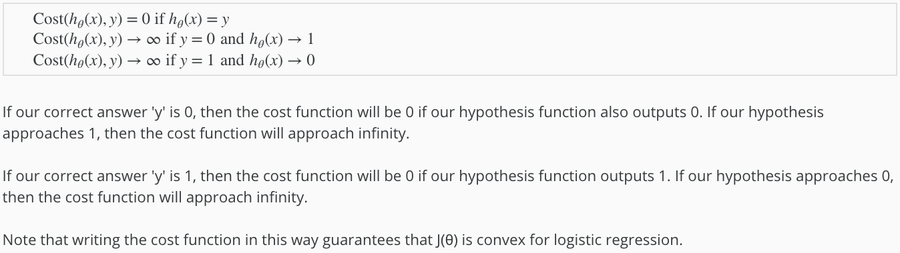
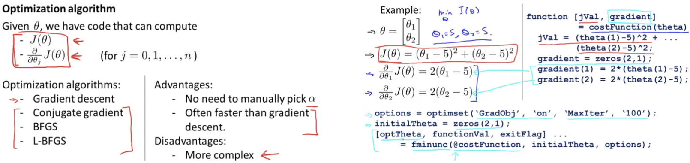
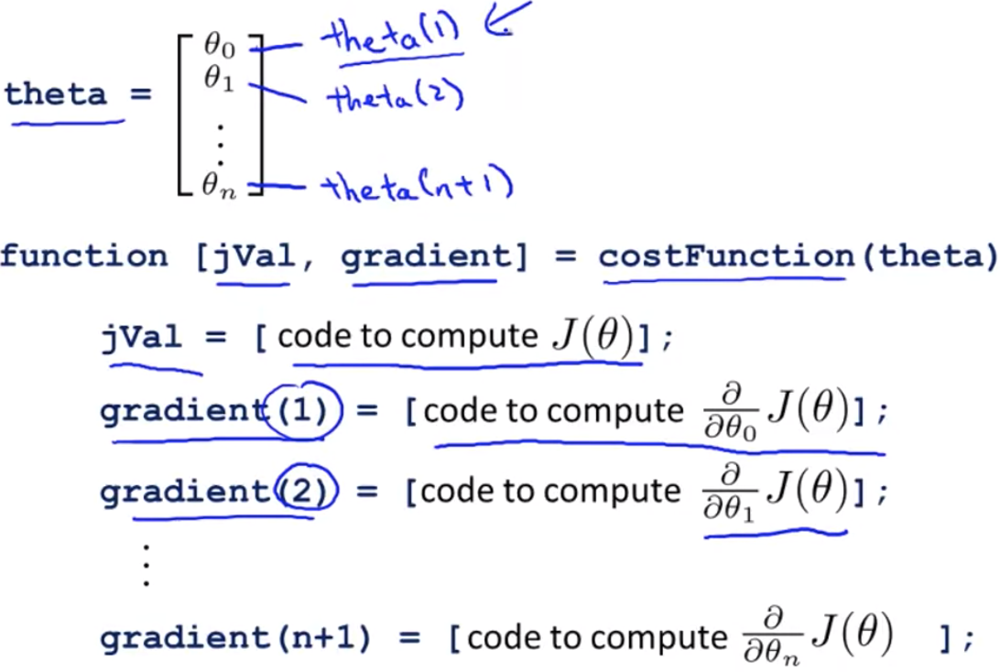
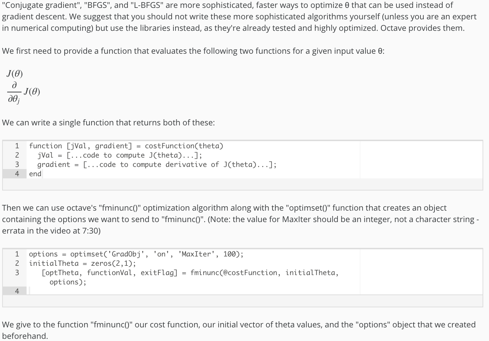
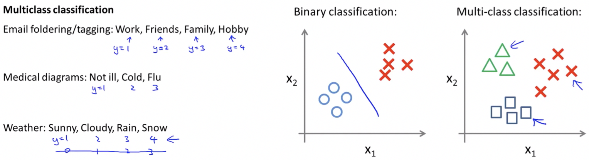
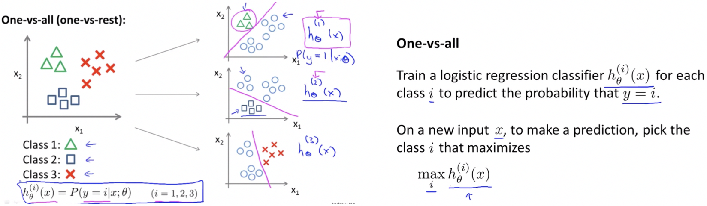

# Logistic Regression

- Logistic regression is a method for classifying data into discrete outcomes.
- For example, we might use logistic regression to classify an email as spam or not spam. 
- Here we will see:
    - The notion of classification
    - The cost function for logistic regression
    - The application of logistic regression to multi-class classification.

## Classification and Representation

### Classification

- The classification problem is just like the regression problem, except that the values we now want to predict take on only a small number of discrete values.

- Using liner regression in these kind of problems is not a good idea.

### Hypothesis Representation

- We could approach the classification problem ignoring the fact that y is discrete-valued, and use our old linear regression algorithm to try to predict y given x.
- However, it is easy to construct examples where this method performs very poorly.
- Intuitively, it also doesn’t make sense for **hθ(x)** to take values larger than 1 or smaller than 0 when we know that **y ∈ {0, 1}**. 

### Decision Boundary

 

> **Example:**

## Logistic Regression Model

### Cost Function

We cannot use the same cost function that we use for linear regression because the Logistic Function will cause the output to be wavy, causing many local optima. In other words, it will be a **non-convex** function.

 

> **Logistic Regression Cost Function:**

### Simplified Cost Function & Gradient Descent

> We can compress our cost function's two conditional cases into one case:
>
> **Cost(hθ(x), y) = -ylog(hθ(x)) - (1-y)log(1-hθ(x))**

##### Notes:

- Idea of feature scaling also applies to gradient descent for logistic regression.

### Advanced Optimization

> **How to use:**

> **Concept:**

## Multiclass Classification

Now we will approach the classification of data when we have more than two categories. Instead of y = {0,1} we will expand our definition so that y = {0,1...n}.

> **One-vs-All Approach:**

 

------

<a href="octave-matlab-tutorial" class="prev-button">&larr; Previous: Octave/Matlab Tutorial</a> 

<a href="regularization" class="next-button">Next: Regularization &rarr;</a>

