# Regularization

- Machine learning models need to generalize well to new examples that the model has not seen in practice.
- Regularization helps prevent models from overfitting the training data.

## Solving the Problem of Overfitting

### The Problem of Overfitting

When we apply machine learining algorithms to certain machine learning applications, they can run into a problem called overfitting that can cause them to perform very poorly.

> **Overfitting Examples:**

> **Addressing Overfitting:**

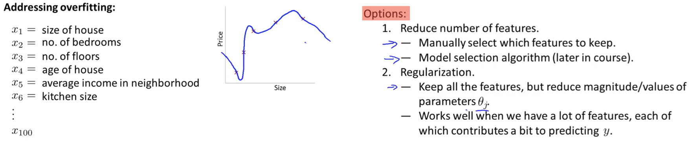

### Cost Function

If we have overfitting from hypothesis function, we can reduce the weight that some of the terms in function carry by increasing their cost.

##### Intuition:

> Say we wanted to make the following function more quadratic:
>
> **θ0 + θ1x + θ2x2 + θ3x3 + θ4x4** 

We'll want to eliminate the influence of **θ3x3 + θ4x4**  but without actually getting rid of these features or changing the form of our hypothesis, we can instead modify our **cost function**:

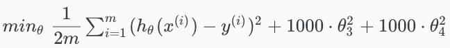

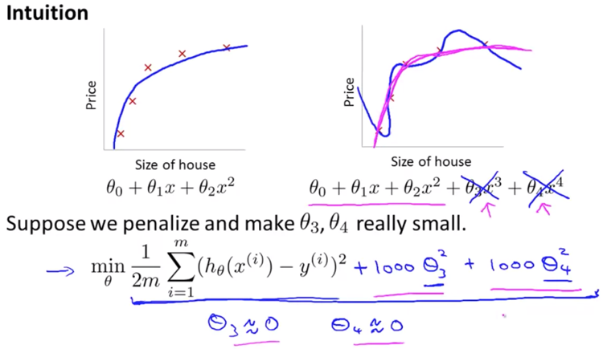

##### Regularizing all θ parameters

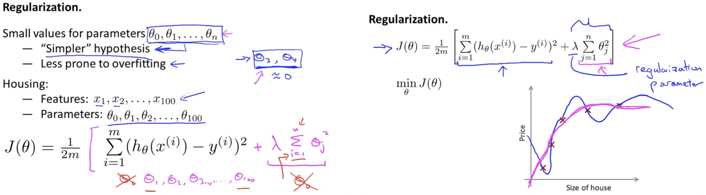

 

The **λ** is the **regularization parameter**. It determines how much the costs of our theta parameters are inflated.

Using the cost function with the extra summation, we can smooth the output of our hypothesis function to reduce overfitting.

> If lambda is chosen to be too large, it may smooth out the function too much and cause underfitting.

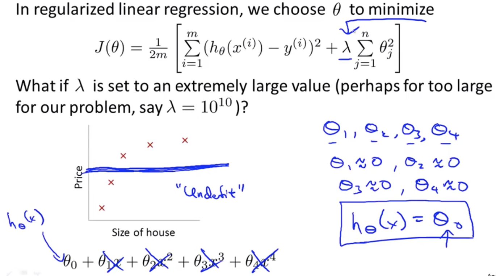

###### Note: For regularization to work properly λ should be choosen appropriately.

### Regularized Linear Regression

We can apply regularization to both linear regression and logistic regression.

#### Gradient Descent

We will modify our gradient descent function to separate out **θ0**  from the rest of the parameters because we do not want to penalize **θ0**.

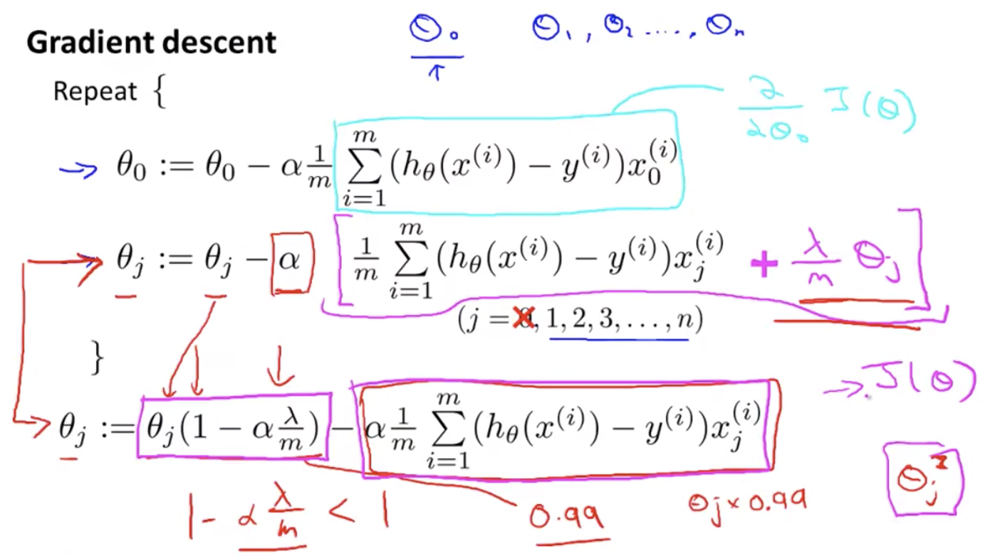

> **Concept:**

#### Normal Equation

Regularization can also be appraoched using the alternate method of the non-iterative normal equation.

To add in regularization, the equation is the same as our original, except that we add another term inside the parentheses:

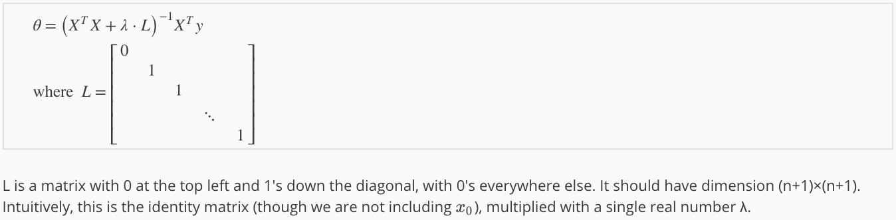

##### Note: 

- If **m < n**, then **XTX is non-invertible**. However, when we add the term **λ⋅L**, then **XTX + λ⋅L** becomes invertible.

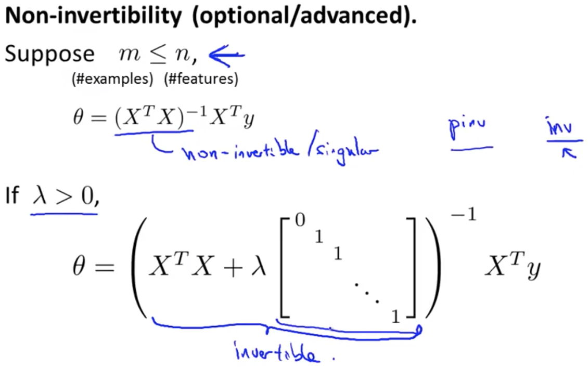

### Regularized Logistic Regression

We can regularize logistic regression in a similar way that we regularize linear regression to avoid overfitting. 

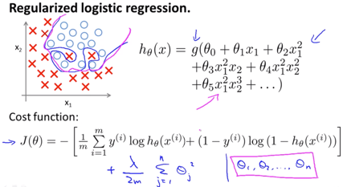

> **Concept:**

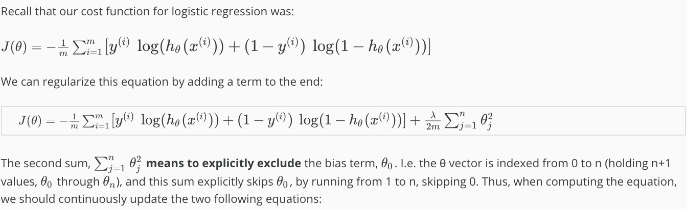

#### Gradient Descent

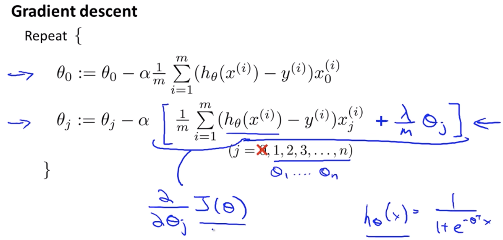

#### Advanced Optimization

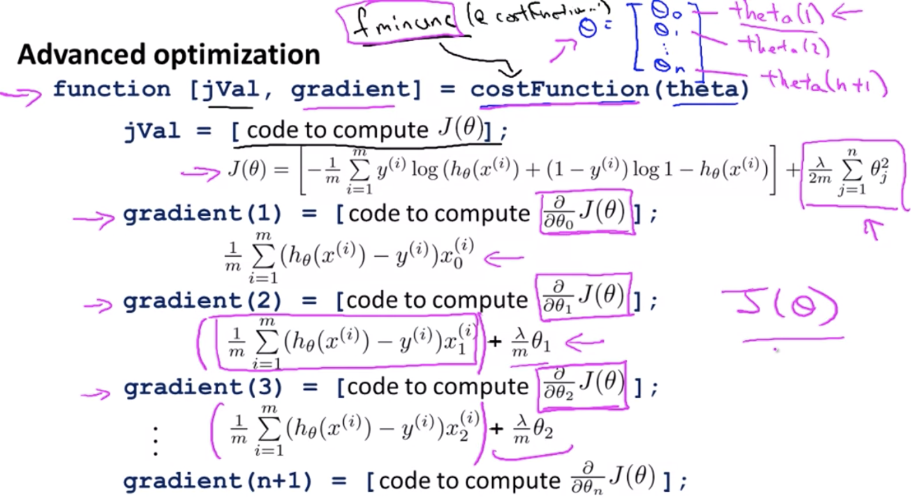

 

------

<a href="logistic-regression" class="prev-button">&larr; Previous: Logistic Regression</a> 

<a href="neural-networks" class="next-button">Next: Neural Networks &rarr;</a>

