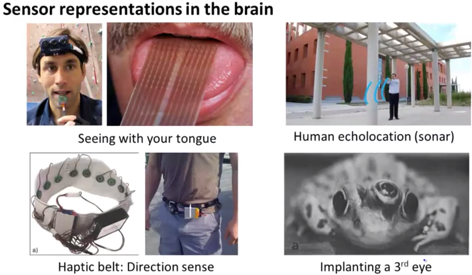
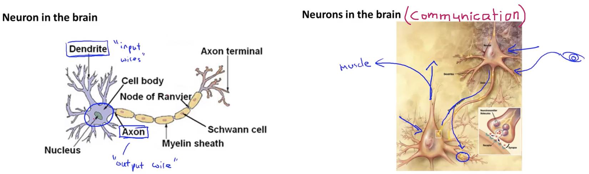
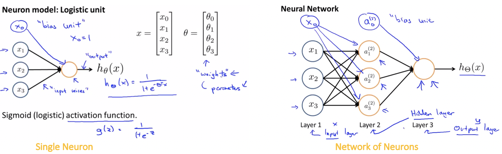
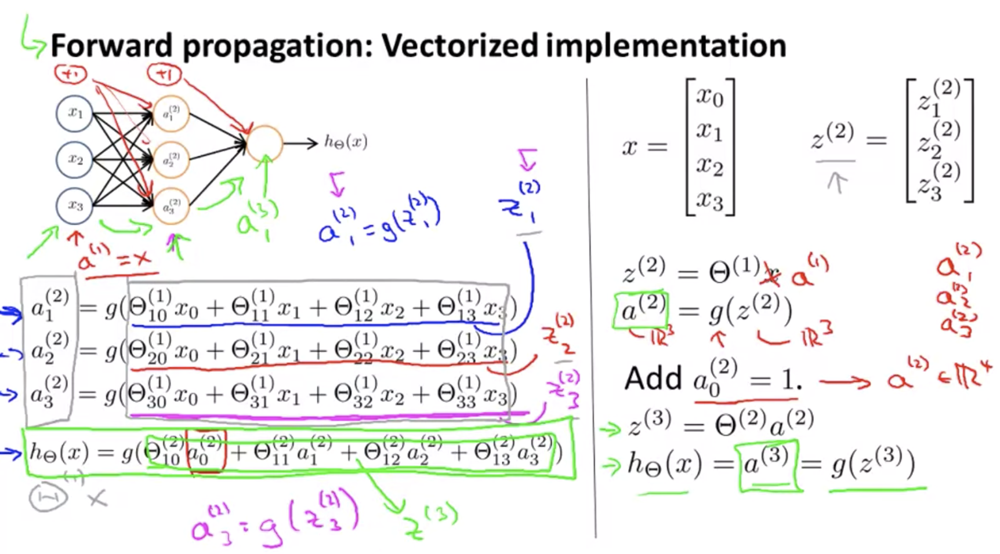
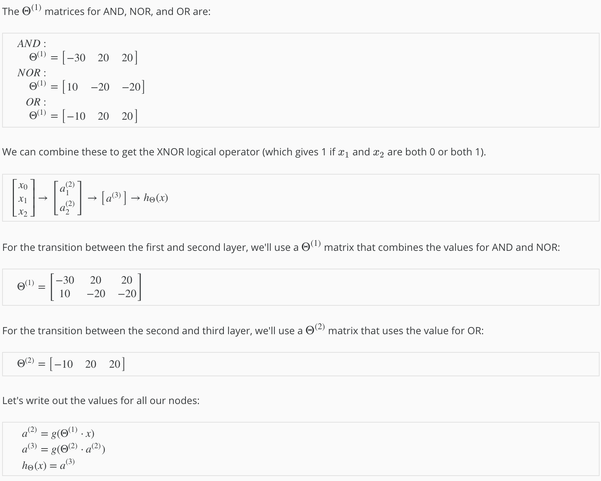
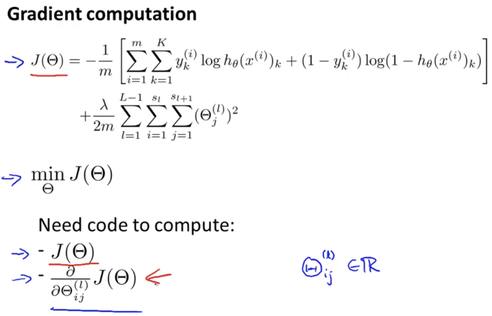
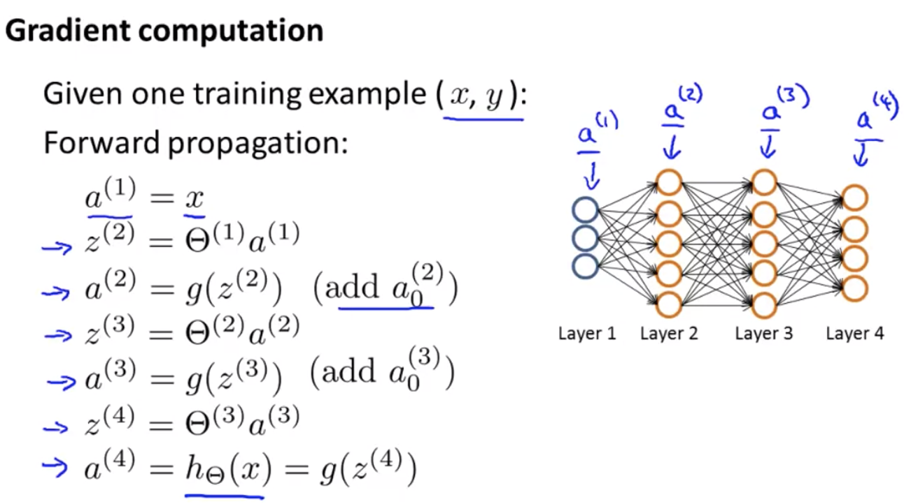

# Neural Networks

- Neural networks is a learning algorithm, it is a model inspired by how the brain works.
- A **neural network** is a software (or hardware) simulation of a biological brain sometimes called **Artificial Neural Network (ANN)**.
- The **purpose** of a **neural network** is to learn to recognize patterns in your data.
- It is widely used today in many applications: when our phone interprets and understand our voice commands, it is likely that a neural network is helping to understand our speech; when we cash a check, the machines that automatically read the digits also use neural networks.

## Motivations

In todays world it is the state of the art technique for many different machine learning problems.

#### Non-Linear Hypothesis

- It is very much difficult to go for linear regression algorithms when features are more.
- It becomes increasibly difficult to separate the classes.

> **Computer Vision:**

#### Neurons and the Brain

- Neural Networks are a pretty old algorithm that was originally motivated by the goal of having machines that can mimic the brain.
- **Origins:** Algorithms that try to mimic the human brain. Was very widely used in 80s and 90s but its popularity diminished in late 90s.
- **Recent Resurgence:** State of the art technique for many applications.

##### The One-Learning-Algorithm Hypothesis:

- The brain can learn to see, learn to process images, learn to hear, learn to process our sense of touch, also learn to do math, learn to do calculus and can do so many different and amazing things. 
- It seems like if we want to mimic the brain we will have to write lots of different pieces of software to mimic all of these different fascinating, amazing things.
- But there is a fascinating hypothesis that the way the brain does all of these different things is not worth like a thousand different programs, but instead, the way the brain does it is worth just a **single learning algorithm**.

- **Neuro-rewiring experiments** if we can plug in almost any sensor to almost any part of the brain and so, within the reason, the brain will learn to deal with it.

    

## Model Representation

- Neural networks were developed as simulating neurons or networks of neurons in the brain so to understand that we need to have a look at what a single neuron in the brain looks like.

    

- At a simplistic level a neuron is **a computational unit** that gets a number of inputs through **input wires (Dendrites)** does some computation and then outputs via its **Axon** to other nodes or to other neurons in the brain.

- Neurons communicate with each other is with little pulses of electricity (spikes) through Axon.

#### Neuron Model

#### Artificial Neural Network (ANN):

> **Example:** If layer 1 has 2 input nodes and layer 2 has 4 activation nodes. What is the dimension of Θ(1) ?
>
> **Solution:**
>
> Here sj = 2 and sj+1=4, so sj+1 x  (sj  + 1) = 4×3.
>
> Hence, dimension of Θ(1) is going to be 4×3.

#### Forward Propagation: Vectorized Implementation

> **Concept:**

##### Notes:

- Neural Network learns its own features coz even if layer-1 is covered the final layer learns its fearures thorugh previous layers.

 

## Basic Applications

Here we will see the detailed example showing how a neural network can compute a complex non linear function of the input.

#### Intuitive Examples

> **Neural Network: Logical AND** 

##### Notes:

- We have constructed one of the fundamental operations in computers using a small neural network rather than using actual AND gate. 
- Neural networks can also be used to simulate all the other logical gates. 

> **Designing XNOR using Neural Networks:**

#### Multiclass Classification

 

## Cost Function

###### Some New Notations:

- ***L*** = total number of layers in the network
- ***sl ***= number of units (not counting bias unit) in layer l
- ***K*** = number of output units/classes

###### Multi-class Classifier Neural Network

- In neural networks, we may have many output nodes, so we denote ***hΘ(x)k*** as being a hypothesis that results in the **kth** output.
- Our cost function for neural networks is going to be a generalization of the one we used for logistic regression.

###### Cost Function for Neural Networks

- We have added a few nested summations to account for our multiple output nodes.
- In the first part of the equation, before the square brackets, we have an additional nested summation that loops through the number of output nodes.
- In the regularization part, after the square brackets, we must account for multiple theta matrices.
- The number of columns in our current theta matrix is equal to the number of nodes in our current layer (including the bias unit).
- The number of rows in our current theta matrix is equal to the number of nodes in the next layer (excluding the bias unit).
- As before with logistic regression, we square every term.

##### Notes:

- The double sum simply adds up the logistic regression costs calculated for each cell in the output layer.
- The triple sum simply adds up the squares of all the individual Θs in the entire network.
- The i in the triple sum does **not** refer to training example i.

 

## Backpropagation Algorithm

In order to use either gradient descent or one of the advance optimization algorithms, we need to write code that takes the input parameters **Θ** and computes **J(Θ)** of theta and the partial derivative terms.

#### Computing partial derivative terms.

> **Step-1:** **Forward Propagation** - Calculation of activation values

The Vectorized implementation of forward propagation allows us to compute the activation values for all of the neurons in our neural network.

> **Step-2: Backpropagation** -  Calculate partial derivatives

----

<a href="regularization" class="prev-button">&larr; Previous: Regularization</a> 

