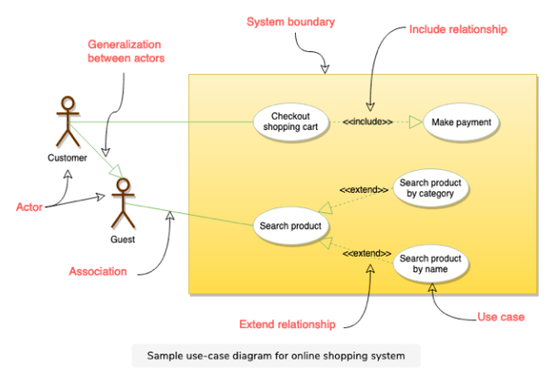

# Unified Modeling Language (UML)

###### What is UML ?

- Used to model the Object-Oriented Analysis of a software system.
- A way of visualizing and documenting a software system by using a collection of diagrams.
- It helps engineers, businesspeople and system architects understand the behaviour and structure of system being designed.

###### Benefits of using UML

- Helps develop a quick understanding of a software system.
- UML modeling helps in breaking a complex system into discrete pieces that can be easily understood.
- UML's graphical notatioins can be used to communicate design decisions.
- As UML is independent of any specific platform or language or technology, its easier to abstract out concepts.
- Becomes easier to hand over the system to new team.

###### Types of UML Diagrams

- Current UML standard has 14 different kinds of diagrams.
- [Structural UML Diagrams:]() These diagrams analyze and depict the structure of a system or process.
  - *Class Diagram*
  - *Object Diagram*
  - *Package Diagram*
  - *Component Diagram*
  - *Composite Structure Diagram*
  - *Deployment Diagram*
  - *Profile Diagram*
- [Behavioural UML Diagrams:]() These diagrams describe the bevaviour of the system, its actors and its building components.
  - *Use Case Diagram*
  - *Activity Diagram*
  - *Sequence Diagram*
  - *State Diagram*
  - *Communication Diagram*
  - *Interaction Overview Diagram*
  - *Timing Diagram*

###### Important UML Diagrams to be discussed

- **Use Case Diagram:** Used to describe a set of user scenarios, it illustrates the functionality provided by the system.
- **Class Diagram:** Used to describe structure and behaviour in the use cases, provides a conceptual model of the system in terms of entities and their relationships.
- **Activity Diagram:** Used to model the functional flow-of-control b/w two or more class objects.
- **Sequence Diagram:** Used to describe interactions among classes in terms of an exchange of messages over time.

 

 

## Use Case Diagrams

###### What are Use Case Diagrams ?

- Use case diagrams describe a **set of actions (called use cases)** that a system should or can perform in collaboration with one or more **external users of the system (called actors)**.
- Each use case should provide some observable and valuable results to the actors

###### Functionality of Use Case Diagrams

- It describes the high-level functional behaviour of the system.
- It answer what system does from the user point of view.
- It tells "What will the system do?" and "What it will not do?".

 ###### What is a Use Case ?

- A use case illustrates a unit of functionality provided by the system.
- Primary purpose of the use case diagrams is to help development teams visualize the functional requirements of a system.
- It also includes relationship of actors to the essential processes, as well as relationship among different use cases.

> **Drawing a Use Case Diagram:**

- To illustrate a use case on the diagram, draw an oval and put the name of use case in the oval.
- To show an actor (user of the system) on the diagram, draw a stick figure to the left or right of diagram.

 

###### Different Components of Use Case Diagram

- **System Boundary:**
  - Defines the scope and limits of the system.
  - Shown as rectangle that spans all use cases of the system.
- **Actors:**
  - An actor is an entity that performs specific actions.
  - The roles are actual business roles of the users in a given system.
  - An actor interacts with a use case of the system. 
  - *Example:- Banking System* - Customer is one actor, employee is another actor etc.
- **Use Case:** 
  - Every business functionality is a potential use case.
  - The use case should list the discrete business functionality specified in the problem statement.
- **Include Relationship:**
  - Represents an invocation of one use case by another use case.
  - From coding perspective its like one function being called by another function.
- **Extend Relationship:**
  - Signifies that the extended use case will work exactly like base use case with some added steps.

 

## Class Diagram

----

<a href="ooo-design-basics" class="prev-button">&larr; Previous: OO Design Basics</a>   

<a href="sorting-algorithms" class="next-button">Next: Sorting Algorithms  &rarr;</a>

