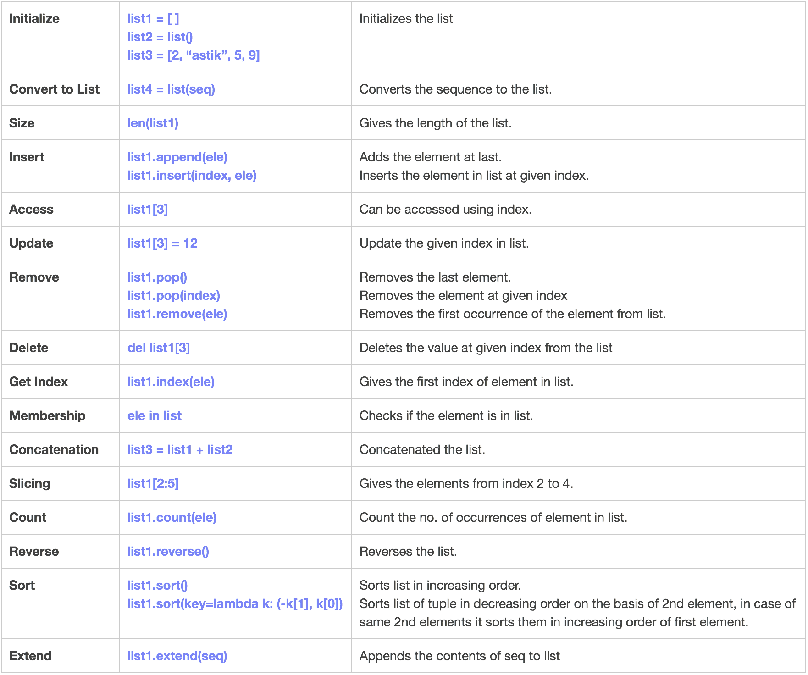
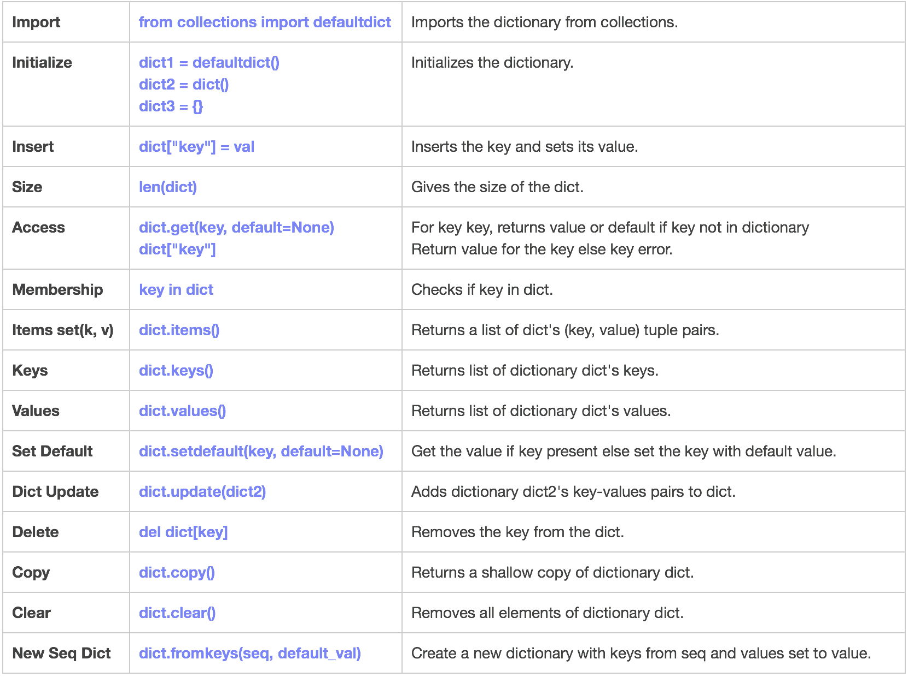
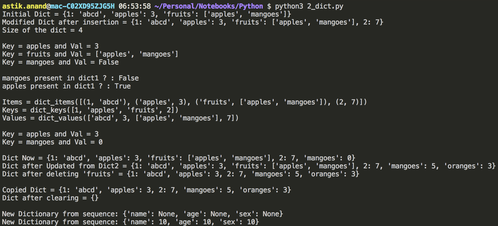
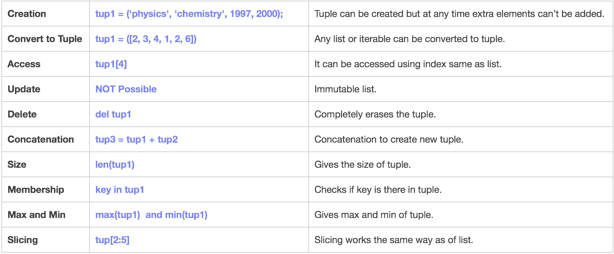
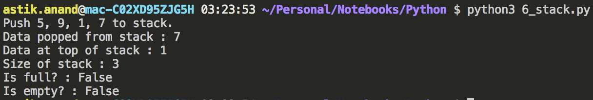
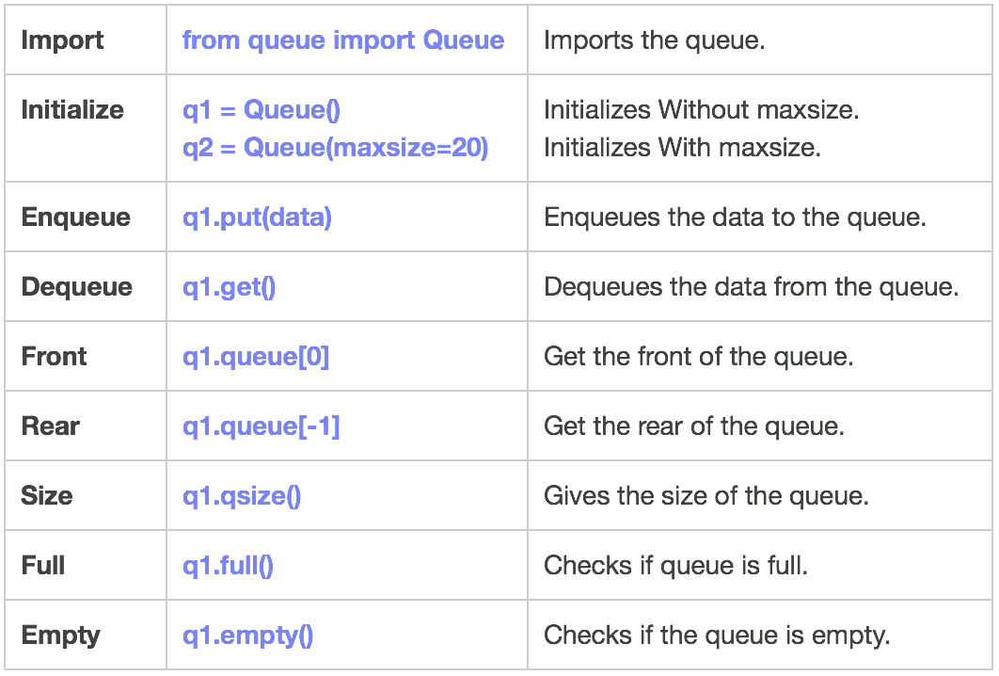
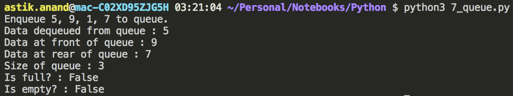
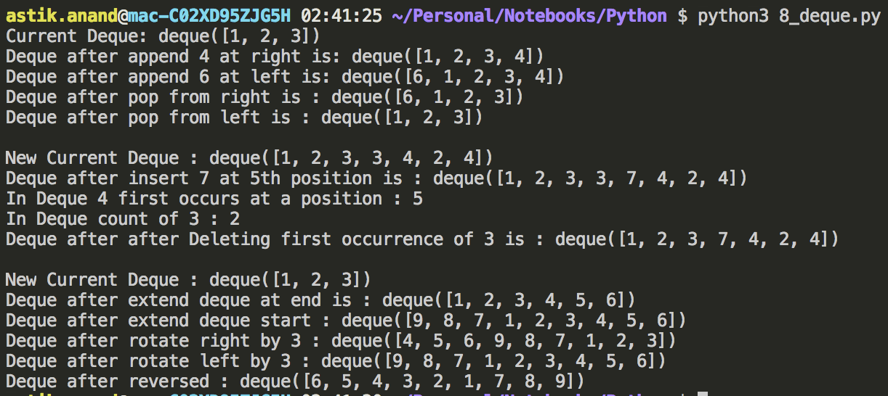
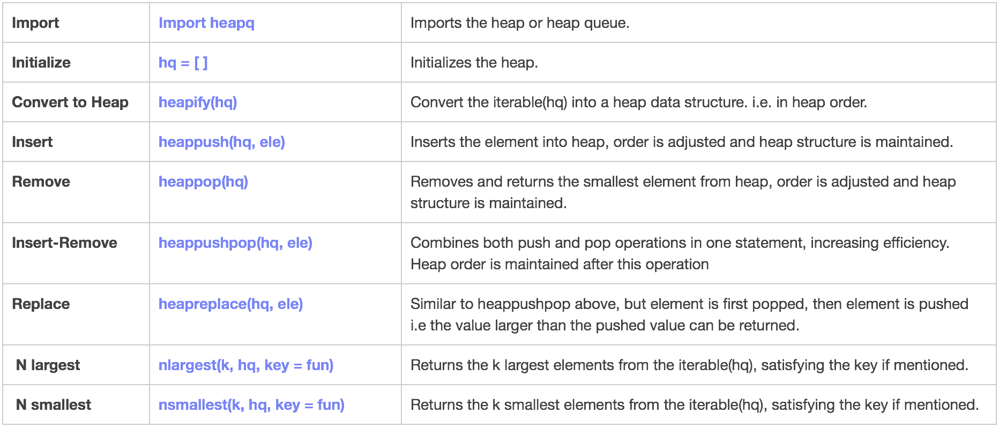

# Python Data Structures

There are different types of data structures available in python which can be broadly categorised into 3 categories:

- **Primary**

    - List

    - Dictionary

- **Secondary**

    - Tuple

    - Set

- **Tertiary**

    - Stack

    - Queue

    - Deque

    - Heap / Priority Queue

## List



## Dictionary

- Dictionary in Python is an unordered collection of data values, used to store data values like a map.
- Unlike other Data Types that hold only single value as an element, Dictionary holds key:value pair.
- Key value is provided in the dictionary to make it more optimized.
- Each key-value pair in a Dictionary is separated by a colon :, whereas each key is separated by a ‘comma’.
- A Dictionary in Python works similar to the Dictionary in a real world.
- **Keys** of a Dictionary must be **unique** and of **immutable** data type such as **Strings, Integers and tuples**, but the **key-values** can be repeated and be of **any type**. 



##### Implementation

```python
# initialize
dict1 = {1: "abcd", "apples": 3, "fruits": ["apples", "mangoes"], }
print("Initial Dict = {}".format(dict1))

# Insert
dict1[2] = 7
print("Modified Dict after insertion = {}".format(dict1))

# len(): size of the dict
print("Size of the dict = {}\n".format(len(dict1)))

# get(): access
print("Key = {} and Val = {}".format("apples", dict1["apples"]))
print("Key = {} and Val = {}".format("fruits", dict1.get("fruits", False)))
print("Key = {} and Val = {}\n".format("mangoes", dict1.get("mangoes", False)))

# key in dict: Membership check
print("mangoes present in dict1 ? : {}".format("mangoes" in dict1))
print("apples present in dict1 ? : {}\n".format("apples" in dict1))

# items(): set of key, val 
print("Items = {}".format(dict1.items()))

# keys(): all the keys of dict
print("Keys = {}".format(dict1.keys()))

# values(): all the values of dict
print("Values = {}\n".format(dict1.values()))

# setdefault(): get the value if key present else sets the default value to key
print("Key = {} and Val = {}".format("apples", dict1.setdefault("apples", 0)))
print("Key = {} and Val = {}\n".format("mangoes", dict1.setdefault("mangoes", 0)))

print("Dict Now = {}".format(dict1))

# update(): update from other dictionary
dict2 = {"mangoes": 5, "oranges": 3}
dict1.update(dict2)
print("Dict after Updated from Dict2 = {}".format(dict1))

# del: delete the key
del dict1["fruits"]
print("Dict after deleting 'fruits' = {}\n".format(dict1))

# copy(): copy the dict
dict2 = dict1.copy()
print("Copied Dict = {}".format(dict2))

# clear(): clear the dict
dict1.clear()
print("Dict after clearing = {}\n".format(dict1))

# fromkeys(): dict from keys
seq = ('name', 'age', 'sex')
print ("New Dictionary from sequence: {}".format(dict.fromkeys(seq)))
print ("New Dictionary from sequence: {}".format(dict.fromkeys(seq, 10)))
```

**Output:**




## Tuple

- A Tuple is a collection of Python objects separated by commas. 
- In someways a tuple is similar to a list in terms of indexing, nested objects and repetition but a tuple is **immutable** unlike lists which are mutable. 



###### **Implementation:**

```python
# creation of tuple
tup1 = ('physics', 'chemistry', 1997, 2000)

# Convert to tuple
tup2 = tuple([2, 3, 4, 1, 2, 6])

# Both tuple initially
print("Tuple tup1 : {}".format(tup1))
print("Tuple tup2 : {}\n".format(tup2))

# access
print("4th Element in tup1 : {}".format(tup1[3]))
print("4th Element in tup2 : {}\n".format(tup2[3]))

# Size of tup1
print("Size of tup1: {}".format(len(tup1)))

# Concatenation
tup3 = tup1 + tup2
print("Concatenated Tuple tup3 : {}\n".format(tup3))

# Membership
print("chemistry present in tup1 ? : {}".format('chemistry' in tup1))
print("chemistry present in tup2 ? : {}\n".format('chemistry' in tup2))

# Max-Min
print("Max of tup2 : {}".format(max(tup2)))
print("Min of tup2 : {}".format(min(tup2)))

# Slicing
print("tup2[2:5] : {}\n".format(tup2[2:5]))


# Delete
del tup1
print("Tuple tup1 after deleting: {}".format(tup1))
```

**Output:**


## Set

- A Set is an unordered collection data type that is **iterable**, **mutable**, and has **no duplicate** elements. 
- Python’s set class represents the mathematical notion of a set.
- The major advantage of using a set, as opposed to a list, is that it has a highly optimized method for checking whether a specific element is contained in the set.
- This is **based on** a data structure known as a **hash table**. 
- **Frozen sets** are immutable objects that only support methods and operators that produce a result without affecting the frozen set or sets to which they are applied. 
- However there are **two major pitfalls** in Python sets: 
    1. The set doesn’t maintain elements in any particular order.
    2. Only instances of immutable types can be added to a Python set.


###### **Implementation:**

```python
# set(): initilaize
set1 = set() 

# set(): convert to set
set2 = set([3, 4, 5, 3, 6, 5, 7, 5, 8])
  
# add(): Insert in set 
for i in range(1, 6): 
    set1.add(i) 
  
print("Set1 = {}\nSet2 = {}".format(set1, set2))

# discard(): Remove 8 from set2
set2.discard(8)
print("Set2 after 8 is removed = {}\n".format(set2))
  
# union(): Union of set1 and set2 
set3 = set1 | set2     # set1.union(set2) 
print("Union of Set1 & Set2: Set3 = {}".format(set3))
  
# intersection(): Intersection of set1 and set2 
set4 = set1 & set2     # set1.intersection(set2) 
print("Intersection of Set1 & Set2: Set4 = {}\n".format(set4))

# in : check membership
print("Is 7 present in set1 ? : {}".format(7 in set1))
print("Is 7 present in set2 ? : {}\n".format(7 in set2))

# Comparison Operators
# Checking relation between set3 and set4 
if set3 > set4:        # set3.issuperset(set4) 
    print("Set3 is superset of Set4.") 
elif set3 < set4:      # set3.issubset(set4) 
    print("Set3 is subset of Set4.") 
else : # set3 == set4 
    print("Set3 is same as Set4.") 
  
# displaying relation between set4 and set3 
if set4 < set3:        # set4.issubset(set3) 
    print("Set4 is subset of Set3.\n") 
  
# difference: between set3 and set4 
set5 = set3 - set4 
print("Elements in Set3 and not in Set4: Set5 = {}.".format(set5))
  
# isdisjoint(): Check if set4 and set5 are disjoint sets 
if set4.isdisjoint(set5): 
    print("Set4 and Set5 have nothing in common.") 
  
# clear(): Remove all the values of set5 
set5.clear() 
print("After applying clear on set5 now set5 = {}.".format(set5))
```

**Output:**


## Stack


###### Implementation

```python
# import
from queue import LifoQueue

# Initilaize
s = LifoQueue(maxsize=5) 
  
# put(): to psuh data to stack
print("Push 5, 9, 1, 7 to stack.")
s.put(5) ; s.put(9); s.put(1); s.put(7)

# get(): to pop data from stack
print("Data popped from stack : {}".format(s.get()))

# queue[-1]: top of the stack
print("Data at top of stack : {}".format(s.queue[-1]))

# qsize(): Size of stack
print("Size of stack : {}".format(s.qsize()))

# full(): Check full
print("Is full? : {}".format(s.full()))

# empty(): Check empty
print("Is empty? : {}".format(s.empty()))
```

**Output:**




## Queue



###### Implementation

```python
# import
from queue import Queue

# Initilaize
q = Queue(maxsize=5) 
  
# put(): to enqueue data to queue
print("Enqueue 5, 9, 1, 7 to queue.")
q.put(5) ; q.put(9); q.put(1); q.put(7)

# get(): to dequeue data from queue
print("Data dequeued from queue : {}".format(q.get()))

# queue[0]: front of the queue
print("Data at front of queue : {}".format(q.queue[0]))

# queue[-1]: rear of the queue
print("Data at rear of queue : {}".format(q.queue[-1]))

# qsize(): Size of queue
print("Size of queue : {}".format(q.qsize()))

# full(): Check full
print("Is full? : {}".format(q.full()))

# empty(): Check empty
print("Is empty? : {}".format(q.empty()))
```

**Output:**



## 3. Deque

A **double-ended queue** is an abstract data type that generalizes a queue. 

Here, **elements can be added to or removed from either the front or back**.


###### Implementation

```python
# import
from collections import deque
  
# initialize
dq = deque([1,2,3])

print ("Current Deque: {}".format(dq))
  
# append(): Insert 4 at end
dq.append(4) 
print ("Deque after append 4 at right is: {}".format(dq))
  
# append(): Insert 6 at start
dq.appendleft(6) 
print ("Deque after append 6 at left is: {}".format(dq))
  
# pop(): Pop from end
dq.pop()
print ("Deque after pop from right is : {}".format(dq))

# popleft(): Pop from start
dq.popleft()
print ("Deque after pop from left is : {}".format(dq))

#================================================================

dq = deque([1, 2, 3, 3, 4, 2, 4])
print ("\nNew Current Deque : {}".format(dq))

# insert(): Insert 7 at 5th position 
dq.insert(4, 7)
print ("Deque after insert 7 at 5th position is : {}".format(dq))

# insert(): Occurrence of 4 b/w 2nd and 7th index.
print ("In Deque 4 first occurs at a position : {}".format(dq.index(4, 2, 7)))

# count(): Count the occurrences of 3 
print ("In Deque count of 3 : {}".format(dq.count(3)))

# remove(): Remove the first occurrence of 3 
dq.remove(3) 
print ("Deque after after Deleting first occurrence of 3 is : {}".format(dq))

#================================================================

dq = deque([1, 2, 3])
print ("\nNew Current Deque : {}".format(dq))

# extend(): To add [4, 5, 6] at right end
dq.extend([4, 5, 6]) 
print ("Deque after extend deque at end is : {}".format(dq))
  
# extendleft(): adds 7,8,9 at left end
dq.extendleft([7,8,9]) 
print ("Deque after extend deque start : {}".format(dq))
  
# rotate(): rotates by 3 to right
dq.rotate(3) 
print ("Deque after rotate right by 3 : {}".format(dq))

# rotate(): rotates by 3 to left 
dq.rotate(-3) 
print ("Deque after rotate left by 3 : {}".format(dq))
  
# reverse(): reverse the deque 
dq.reverse()
print ("Deque after reversed : {}".format(dq))
```

**Output:**




## Heap

- Heap data structure is mainly used to represent a priority queue.
- In Python, it is available using “heapq" module.
- The property of this data structure in python is that each time the smallest of heap element is popped(min heap).
- Whenever elements are pushed or popped, heap structure in maintained.
- The heap[0] element also returns the smallest element each time.



###### **Implementation:**

```python
# import
import heapq 

# a normal list
hq = [5, 7, 9, 1, 3]

# heapify(): to convert list to heap or to constrain the heap order
heapq.heapify(hq) 
  
# Created Heap
print ("The created heap is : {}".format(hq))
  
# heappush(): push 4 to heap
heapq.heappush(hq, 4) 
print ("Heap after 4 is pushed : {}".format(hq))
  
# using heappop() to pop smallest element 
print ("The popped and smallest element is : {}".format(heapq.heappop(hq)))
print ("Heap after popping : {}".format(hq))

#===========================================================================
hq1 = [5, 7, 9, 4, 3]; hq2 = [5, 7, 9, 4, 3] 
heapq.heapify(hq1); heapq.heapify(hq2)
print("\nTwo same newly created heaps: {}".format(hq1))

# heappushpop(): to push and pop items simultaneously pops 2 
print ("The popped item from 1st using heappushpop(2) is: {}".format(heapq.heappushpop(hq1, 2)))
print("1st heap now: {}".format(hq1))
  
# heapreplace(): to push and pop items simultaneously pops 3 
print ("The popped item from 2nd using heapreplace(2) is: {}".format(heapq.heapreplace(hq2, 2)))
print("2nd heap now: {}".format(hq2))

#===========================================================================
 
hq = [6, 7, 9, 4, 3, 5, 8, 10, 1]
heapq.heapify(hq)
print("\nNewly created heap: {}".format(hq))
  
# nlargest(): to print 3 largest numbers prints 10, 9 and 8 
print("The 3 largest numbers in list are : {}".format(heapq.nlargest(3, hq)))
  
# nsmallest(): to print 3 smallest numbers prints 1, 3 and 4 
print("The 3 smallest numbers in list are : {}".format(heapq.nsmallest(3, hq)))
```

**Output:**


---

