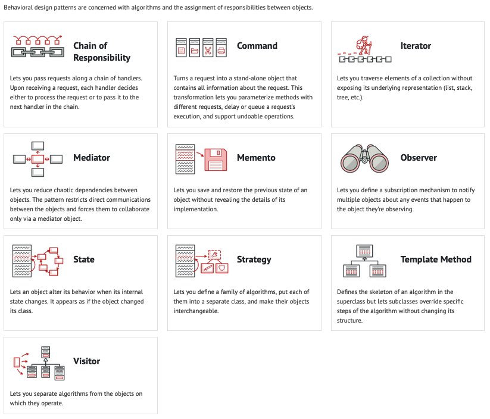

# Behavioral Design Patterns

 

## Strategy Pattern

> **Code Explanation:**

##### Strategy.java

##### OperationAdd.java

##### OperationSubtract.java

##### OperationMultiply.java

##### Context.java

##### StrategyPatternDemo.java

 

## Observer Pattern

> **Note:-** Observers are subscribed to subject and have one to many relationships and whenever subject publishes observers gets notifications. It follows push based approach and whenever they have something they push to the observers.

