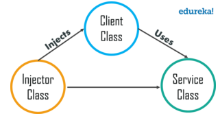
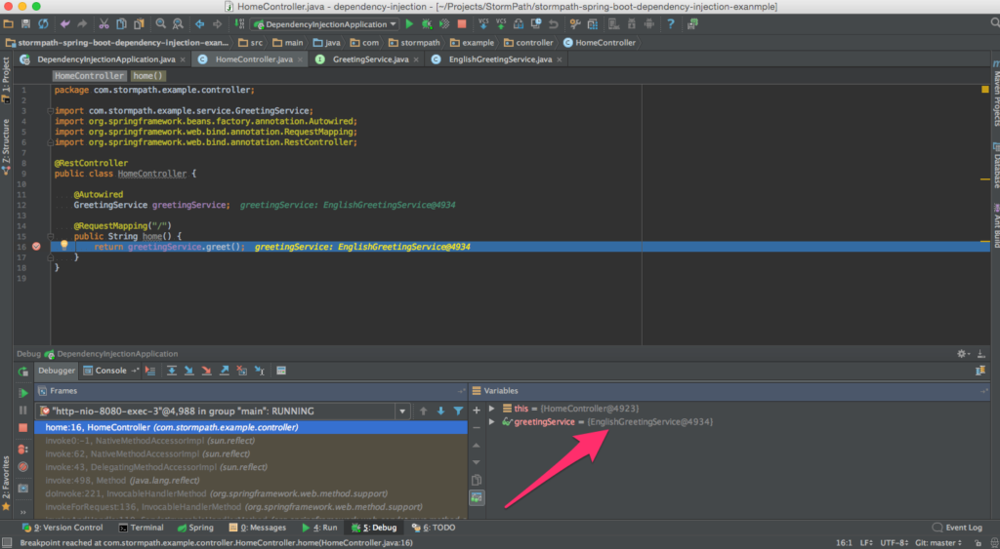

# Dependency Injection (DI)

###### What is Dependency Injection ?

- It is a technique in which an object receives other objects (dependencies) that it depends on.
- The receiving object is called a **client** and the passed object (that is "injected") is called a **service**.
- The code that passes the service to the client can be many kinds of things and is called the **injector**.
- Instead of the client specifying which service it will use, the injector tells the client what service to use.
- The **"injection"** refers to the **passing of a dependency (a service)** in**to the object (a client)** that would use it.
- The service is made part of the client's state.

>**Note :- **Passing the service to the client, rather than allowing a client to build or find the service, is the fundamental requirement of the pattern.



###### Why Dependency Injection ?

- The intent behind dependency injection is to achieve Separation of Concerns of construction and use of objects.
- This can increase readability and code reuse. 
- A client who wants to call some services should not have to know how to construct those services.
- Instead, the client delegates the responsibility of providing its services to external code (the injector).

<br>

### Understanding Dependency Injection

- Dependency or dependent means relying on something for support, so if we are relying too much on mobile phones then it means we are dependent on them.
- When class A uses some functionality of class B, then its said that class A has a dependency of class B.
- Before using methods of other classes, we first need to create the object of that class (i.e. class A needs to create an instance of class B).

> **Note :- **Transferring the task of creating the object to someone else and directly using the dependency is called dependency injection.

###### Why should we use dependency injection ?

- Let’s say we have a car class which contains various objects such as wheels, engine, etc.
- Here the car class is responsible for creating all the dependency objects.
- Now, what if we decide to ditch MRFWheels in the future and want to use Yokohama Wheels ?
- We will need to recreate the car object with a new Yokohama dependency.
- But when using dependency injection (DI), we can change the Wheels at runtime (because dependencies can be injected at runtime rather than at compile time).
- Think of DI as the middleman in our code who does all the work of creating the preferred wheels object and providing it to the Car class.
- It makes our Car class independent from creating the objects of Wheels, Battery, etc.

<br>

### 3 Types of Dependency Injection

- **Constructor Injection :** the dependencies are provided through a class constructor.

```java
// Constructor
Client(Service service) {
    // Save the reference to the passed-in service inside this client
    this.service = service;
}
```

- **Setter Injection :** the client exposes a setter method that the injector uses to inject the dependency.

```java
// Setter method
public void setService(Service service) {
    // Save the reference to the passed-in service inside this client.
    this.service = service;
}
```

- **Interface injection :** the dependency provides an injector method that will inject the  dependency into any client passed to it. Clients must implement an  interface that exposes a **setter method** that accepts the dependency.

```java
// Service setter interface.
public interface ServiceSetter {
    public void setService(Service service);
}

// Client class
public class Client implements ServiceSetter {
    // Internal reference to the service used by this client.
    private Service service;

    // Set the service that this client is to use.
    @Override
    public void setService(Service service) {
        this.service = service;
    }
}
```

###### So now its the dependency injection’s responsibility to:

1. Create the objects
2. Know which classes require those objects
3. And provide them all those objects

> **Note :-** If there is any change in objects, then DI looks into it and it should not concern the class using those objects. This way if the objects change in the future, then its DI’s responsibility to provide the appropriate objects to the class.

<br>

### Inversion of control (IOC) — Concept behind DI

- States that a class should not configure its dependencies statically but should be configured by some other class from outside.
- It is the 5th principle of S.O.L.I.D — which states that a class should depend on abstraction and not upon concretions (hard-coded).
- A class should concentrate on fulfilling its responsibilities and not on creating objects that it requires to fulfill those responsibilities.
- And that’s where dependency injection comes into play: it provides the class with the required objects.

###### Benefits of using DI

- Helps in Unit testing.
- Boiler plate code is reduced, as initializing of dependencies is done by the injector component.
- Extending the application becomes easier.
- Helps to enable loose coupling, which is important in application programming.

###### Disadvantages of DI

- It’s a bit complex to learn, and if overused can lead to management issues and other problems.
- Many compile time errors are pushed to run-time.
- Dependency injection frameworks are implemented with reflection or dynamic programming.
- This can hinder use of IDE automation, such as “find references”, “show call hierarchy” and safe refactoring.

<br>

> **Note :- ** We can implement dependency injection on your own (Pure Vanilla) or use third-party libraries or frameworks.

##### Libraries and Frameworks that implement DI

- Spring (Java)
- Google Guice (Java)
- Dagger (Java and Android)
- Castle Windsor (.NET)
- Unity(.NET)

<br>

### Using Dependency Injection

- Ideally Java classes should be as independent as possible from other Java classes.
- This increases the possibility of reusing these classes and to be able to test them independently from other classes.
- If the **Java class creates an instance of another class via the new *operator***, it cannot be used (and tested) independently from this class and this is called a hard dependency.
- The following example shows a class which has **no hard dependencies**.

```java
package com.vogella.tasks.ui.parts;

import java.util.logging.Logger;

public class MyClass {
    private Logger logger;
    
    public MyClass(Logger logger) {
        this.logger = logger;
        // write an info log message
        logger.info("This is a log message.")
    }
}
```

- T be noted that this class is just a normal Java class, there is nothing special about it, except that it avoids direct object creation.
- A framework class, usually called the dependency container, could analyze the dependencies of this class.
- With this analysis it is able to create an instance of the class and inject the objects into the defined dependencies, via Java reflection.
- This way the Java class has no hard dependencies, which means it does not rely on an instance of a certain class.
- This allows us to test our class in isolation, for example by using mock objects.
- If dependency injection is used, a Java class can be tested in isolation.

###### Using annotations to describe class dependencies

- Different approaches exist to describe the dependencies of a class.
- The most common approach is to use **Java annotations** to describe the dependencies directly in the class.
- The standard Java annotations for describing the dependencies of a class are **@Inject** and **@Named** annotations.

```java
public class MyPart {
    @Inject private Logger logger;

    // inject class for database access
    @Inject private DatabaseAccessClass dao;

    @Inject
    public void createControls(Composite parent) {
        logger.info("UI will start to build" + parent + " " + dao.getNumber());
    }
}
```

<br>

## Dependency Injection --- Spring

- Dependency Injection is the main functionality provided by **Spring IOC** (Inversion of Control).
- The Spring-Core module is responsible for injecting dependencies through either **Constructor** or **Setter** methods. 
- Dependency Injection in Spring also ensures **loose-coupling** between the classes.
- The task of **instantiating objects** is done by the **container** according to the **configurations** specified by the developer.

##### 2 Types of Spring Dependency Injection

###### 1. Setter Dependency Injection (SDI) :

- In this, the DI will be injected with the help of setter and/or getter methods.
- Now to set the DI as SDI in the bean, it is done through the bean-configuration file for this.
- The property to be set with the SDI is declared under the `<property>` tag in the bean-config file. 

```java
import com.geeksforgeeks.org.IGeek; 
  
public class GFG { 
    // The object of the interface IGeek 
    IGeek geek; 
  
    // Setter method for property geek 
    public void setGeek(IGeek geek) { 
        this.geek = geek; 
    } 
} 
```

###### 2. Constructor Dependency Injection (CDI) :

- In this, the DI will be injected with the help of contructors.
- Now to set the DI as CDI in bean, it is done through the bean-configuration file for this.
- The property to be set with the CDI is declared under the `<constructor-arg>` tag in the bean-config file. 

```java
import com.geeksforgeeks.org.IGeek; 
  
public class GFG { 
    // The object of the interface IGeek 
    IGeek geek; 
  
    // Constructor to set the CDI 
    GFG(IGeek geek) { 
        this.geek = geek; 
    } 
} 
```

<br>

## Dependency Injection --- Spring Boot

- Spring introduced the **@Autowired** annotation for dependency injection.

```java
@RestController
public class HomeController {
    @Autowired
    GreetingService greetingService;
 
    @RequestMapping("/")
    public String home() {
        return greetingService.greet();
    }
}
```

- **Any of the Spring components can be autowired.**
- These include, components, configurations, services and beans.
- It’s a common pattern for controllers to be responsible for managing requests and responses while services perform business logic.

###### Running Example: 

- Let’s look at our GreetingService:

```java
public interface GreetingService {
    String greet();
}
```

- Pretty straightforward. Here’s an implementation class:

```java
@Service
public class EnglishGreetingService implements GreetingService {
    @Override
    public String greet() {
        return "Hello World!";
    }
}
```

- **The *@Service* annotation makes it autowireable.**
- Spring injects the dependency into our controller.
- If we set a breakpoint, we can see the implementation class backing greetingService:



- Together, this setup adheres to the Dependency Inversion Principle.
- If the internals of the implementation class change, we don’t need to touch HomeController.

###### Supporting another Service Implementation

- Let say we want to support another GreetingService implementation **FrenchGreetingService**.

```java
@Service
public class FrenchGreetingService  implements GreetingService {
    @Override
    public String greet() {
        return "Bonjour Monde!";
    }
}
```

- Running Spring Boot app now, will give an error.

`Caused by: org.springframework.beans.factory.NoUniqueBeanDefinitionException: No qualifying bean of type [com.stormpath.example.service.GreetingService] is defined: expected single matching bean but found 2: englishGreetingService,frenchGreetingService`

<br>

###### Dealing with this situation :

- Spring Boot has no way of knowing which one of the implementation classes we want to inject into the HomeController.
- However, it does have a number of powerful annotations to deal with this.
- Let’s say that we want to inject the language specific version of the greeting service based on a property setting.
- We can use a **Configuration** to tell Spring Boot which Service we want.

```java
@Configuration
public class GreetingServiceConfig {
    @Bean
    @ConditionalOnProperty(name = "language.name", havingValue = "english", matchIfMissing = true)
    public GreetingService englishGreetingService() {
        return new EnglishGreetingService();
    }
 
    @Bean
    @ConditionalOnProperty(name = "language.name", havingValue = "french")
    public GreetingService frenchGreetingService() {
        return new FrenchGreetingService();
    }
}
```

- Here we are telling Spring Boot that this is a **@Configuration**.
- Causes this class to be instantiated and the beans defined within to (potentially) be exposed for use throughout the Spring ecosystem.
- We also removed the @Service annotation from the EnglishGreetingService and FrenchGreetingService classes as it’s now this **@Configuration's** responsibility to instantiate and expose the services as beans.
- The **@Bean** tells Spring Boot to expose a GreetingService (this is how it is able to be autowired into our HomeController).
- But, we are defining both beans with the same return type. That doesn’t seem right.
- The **@ConditionalOnProperty** annotation ensures that only one of these beans will be injected.
- It’s looking for the language.name property. Notice that there’s a **matchIfMissing** parameter in the case of the EnglishGreetingService. 
- By default, that property is false. By setting it to true here, we are indicating to Spring Boot that if it doesn’t find a language.name property, that EnglishGreetingService is the default.

<br>

[Seeing in Action : ]()

- Spring Boot automatically converts environment variables that are in all-caps with underscores to lowercase, dotted properties.
- Try executing the following after doing `mvn clean install` from the command line.

<br>

**Calling English :**

```
java -jar target/*.jar &
http localhost:8080
```

**Also English :**

```
LANGUAGE_NAME=english java -jar target/*.jar &
http localhost:8080
```

**Calling French :**

```
LANGUAGE_NAME=french java -jar target/*.jar &
http localhost:8080
```

<br>

<br>

---

