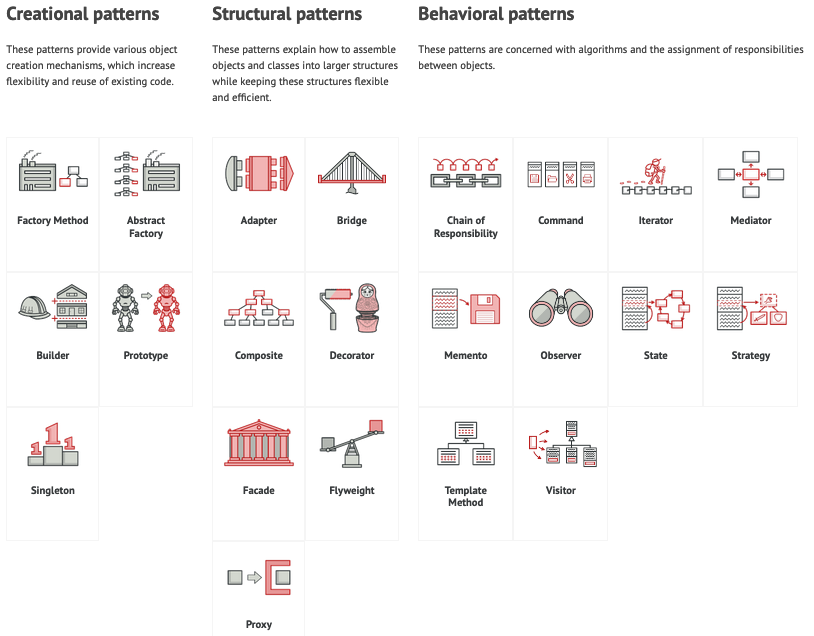
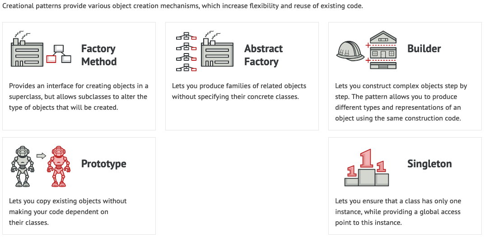
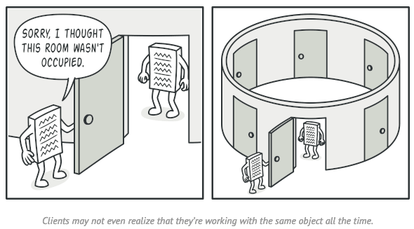
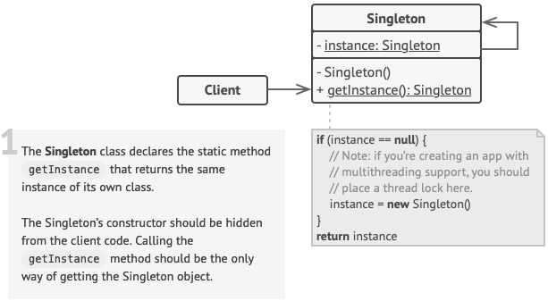

# Design Patterns

###### What are design patterns ?

**Design patterns** are typical solutions to commonly  occurring problems in software design.

They are like pre-made blueprints that we can customize to solve a recurring design problem in our  code.


We can’t just find a pattern and copy it into our program, the way  we can with off-the-shelf functions or libraries.

The pattern is not a  specific piece of code, but a general concept for solving a particular  problem.

We can follow the pattern details and implement a solution  that suits the realities of our own program.

###### What does the pattern consist of ?

Most patterns are described very formally so people can reproduce  them in many contexts.

Here are the sections that are usually present in a pattern description:

-  **Intent** of the pattern briefly describes both the problem and the solution.
-  **Motivation** further explains the problem and the solution the pattern makes possible.
-  **Structure** of classes shows each part of the pattern and how they are related.
-  **Code example** in one of the popular programming languages makes it easier to grasp the idea behind the pattern.

Some pattern catalogs list other useful details, such as  applicability of the pattern, implementation steps and relations with  other patterns.

###### Why to learn patterns ?

- Design patterns are a toolkit of **tried and tested solutions** to common problems in software design.
- Even if we never encounter these problems, knowing patterns is still useful coz it teaches to solve all sorts of problems using principles of object-oriented  design.
- We might manage to work as a programmer for many  years without knowing about a single pattern. Even in that case, though, we might be implementing some patterns without even knowing it.

###### Criticism of Patterns

- **Kludges for a weak programming language: ** 
  - Usually the need for patterns arises when people choose a programming language or a technology that lacks the necessary level of abstraction. In this case, patterns become a kludge that gives the language much-needed super-abilities.
  - Example:- [Strategy pattern]() can be implemented with a simple anonymous (lambda) function in most modern languages.

- **Inefficient solutions**
  - Patterns try to systematize approaches that are already widely used. This unification is viewed by many as a dogma and they implement  patterns “to the point”, without adapting them to the context of their  project.
- **Unjustified use**
  - If all you have is a hammer, everything looks like a nail.
  - Novices having learned about patterns, try to apply them everywhere, even in situations where simpler code would do just fine.

#### Patterns Classification:

- Design patterns differ by their complexity, level of detail and scale of applicability to the entire system being designed. 

- In analogy to road construction: we can make an intersection safer by  either installing some traffic lights or building an entire multi-level  interchange with underground passages for pedestrians.

- The most basic and low-level patterns are often called [*idioms*]() and usually apply only to a single programming language.

- The most universal and high-level patterns are [*architectural patterns*](). Developers can implement these patterns in virtually any language.  Unlike other patterns, they can be used to design the architecture of an entire application.

  

> ###### All patterns can be categorized by their *intent*, or purpose. There are 3 main groups of patterns:




## Creational Design Patterns




### Singleton Pattern

##### @ Intent:

A creational design pattern that ensures that a class has only one instance, while providing a global  access point to this instance.


##### :( Problem:

*The Singleton pattern solves 2 problems at the same time thus violating the [Single Responsibility Principle]():*

**1. Ensure that a class has just a single instance.**

- Why  would anyone want to control how many instances a class has ? The most  common reason for this is to control access to some shared resource—for  example, a database or a file.

- Here’s how it works: imagine that you created an object, but after a  while decided to create a new one. Instead of receiving a fresh object,  you’ll get the one you already created.

- This behavior is impossible to implement with a regular constructor since a constructor call **must** always return a new object by design.




**2. Provide a global access point to that instance.**

- Remember those global variables that we used to store some essential objects ? While they’re very  handy, they’re also very unsafe since any code can potentially overwrite the contents of those variables and crash the app.
- Just like a global variable, the Singleton pattern lets us access some object from anywhere in the program. However, it also protects that instance from being overwritten by other code.
- There’s another side to this problem: we don’t want the code that  solves problem-1 to be scattered all over the program. It’s much  better to have it within one class, especially if the rest of your code  already depends on it.
- Nowadays, Singleton pattern become so popular that people calls something a *singleton* even if it solves just one of the above problems.


##### :) Solution

*All implementations of the Singleton have these two steps in common:*

- Make the **default constructor private**, to prevent other objects from using the [new operator]() with the Singleton class.
- Create a **static creation method** that acts as a constructor. Under  the hood, this method calls the private constructor to create an object  and saves it in a static field. All following calls to this method  return the cached object.

If code has access to the Singleton class, then it’s able to  call the Singleton’s static method. So whenever that method is called,  the same object is always returned.


##### ® Real-World Analogy

The government is an excellent example of the Singleton pattern. A  country can have only one official government.

Regardless of the  personal identities of the individuals who form governments, the title,  “The Government of X”, is a global point of access that identifies the  group of people in charge.


##### ∆ Structure

Class can’t have a public constructor, so the only way to get its object is to call the getInstance method. This method caches the first created object and returns it in all subsequent calls.




##### Ω Applicability

**Use the Singleton pattern when a class in the program should have just a single instance available to all clients; for example, a single database object shared by different parts of the program.**

The Singleton pattern disables all other means of creating objects of a class except for the special creation method. This method either creates a new object or returns an existing one if it has already been created.


**Use the Singleton pattern when you need stricter control over global variables.**

Unlike global variables, the Singleton pattern guarantees that there’s just one instance of a class. Nothing, except for the Singleton class itself, can replace the cached instance.


[Note:-]() We can always adjust this limitation and allow creating any number of Singleton instances. The only piece of code that needs changing is the body of the getInstance method.


##### [√] How to Implement

1. Add a private static field to the class for storing the singleton instance.
2. Declare a public static creation method for getting the singleton instance.
3. Implement **lazy initialization** inside the static method. It should  create a new object on its first call and put it into the static field.  The method should always return that instance on all subsequent calls.
4. Make constructor of the class private. The static method of the class will still be able to call the constructor, but not the other  objects.
5. Go over the client code and replace all direct calls to the singleton’s constructor with calls to its static creation method.


##### ∑ Pros and Cons

**Pros:**

- We can be sure that a class has only a single instance.
- We gain a global access point to that instance.
- The singleton object is initialized only when it’s requested for the first time.

**Cons:**

- Violates the Single Responsibility Principle. The pattern solves two problems at the time.
- Can mask bad design, for instance, when the components of the program know too much about each other.
- Requires special treatment in a multithreaded environment so that multiple threads won’t create a singleton object several times.
- It may be difficult to unit test the client code of the Singleton because many test frameworks rely on inheritance when producing mock objects. Since the constructor of the singleton class is private and overriding static methods is impossible in most languages, we will need to think of a creative way to mock the singleton. Or just don’t write the tests. Or don’t use the Singleton pattern.


##### £ Relations with Other Patterns

- A [Facade class]() can often be transformed into a **Singleton** since a single facade object is sufficient in most cases.
- [Flyweight]() would resemble Singleton if we somehow managed to reduce all shared states of the objects to just one flyweight object. But there are two fundamental differences between these patterns:
  - There should be only one Singleton instance, whereas a Flyweight class can have multiple instances with different intrinsic states.
  - The Singleton object can be mutable. Flyweight objects are immutable.

- Abstract Factories, Builders and Prototypes can all be implemented as Singletons.


##### </> Java Code Example

###### Naive Singleton (single-threaded)

It’s pretty easy to implement a sloppy Singleton. Just need to hide the constructor and implement a static creation method.


**Singleton.java : Singleton** 

```java
public final class Singleton {
    private static Singleton instance;
    public String value;

    private Singleton(String value) {
        // The following code emulates slow initialization.
        try {
            Thread.sleep(1000);
        } catch (InterruptedException ex) {
            ex.printStackTrace();
        }
        this.value = value;
    }

    public static Singleton getInstance(String value) {
        if (instance == null) {
            instance = new Singleton(value);
        }
        return instance;
    }
}
```


**DemoSingleThread.java:  Client code**

```java
public class DemoSingleThread {
    public static void main(String[] args) {
        Singleton singleton = Singleton.getInstance("FOO");
        Singleton anotherSingleton = Singleton.getInstance("BAR");
        System.out.println(singleton.value);
        System.out.println(anotherSingleton.value);
    }
}
```

**Output:**

```
FOO
FOO
```


###### Naïve Singleton (Multi-Threaded)

The same class behaves incorrectly in a multithreaded environment.

Multiple threads can call the creation method simultaneously and get several instances of Singleton class.


**Singleton.java:  Singleton**

```java
public final class Singleton {
    private static Singleton instance;
    public String value;

    private Singleton(String value) {
        // The following code emulates slow initialization.
        try {
            Thread.sleep(1000);
        } catch (InterruptedException ex) {
            ex.printStackTrace();
        }
        this.value = value;
    }

    public static Singleton getInstance(String value) {
        if (instance == null) {
            instance = new Singleton(value);
        }
        return instance;
    }
}
```


**DemoMultiThread.java:  Client code**

```java
public class DemoMultiThread {
    public static void main(String[] args) {
        Thread threadFoo = new Thread(new ThreadFoo());
        Thread threadBar = new Thread(new ThreadBar());
        threadFoo.start();
        threadBar.start();
    }

    static class ThreadFoo implements Runnable {
        @Override
        public void run() {
            Singleton singleton = Singleton.getInstance("FOO");
            System.out.println(singleton.value);
        }
    }

    static class ThreadBar implements Runnable {
        @Override
        public void run() {
            Singleton singleton = Singleton.getInstance("BAR");
            System.out.println(singleton.value);
        }
    }
}
```

**Output:**

```
FOO
BAR
```


###### Thread-safe Singleton with lazy loading

To fix the problem, we have to synchronize threads during first creation of the Singleton object.


```java
public final class Singleton {
    // The field must be declared volatile so that double check lock would work
    // correctly.
    private static volatile Singleton instance;

    public String value;

    private Singleton(String value) {
        this.value = value;
    }

    public static Singleton getInstance(String value) {
        // The approach taken here is called double-checked locking (DCL). It
        // exists to prevent race condition between multiple threads that may
        // attempt to get singleton instance at the same time, creating separate
        // instances as a result.
        //
        // It may seem that having the `result` variable here is completely
        // pointless. There is, however, a very important caveat when
        // implementing double-checked locking in Java, which is solved by
        // introducing this local variable.
        Singleton result = instance;
        if (result != null) {
            return result;
        }
        synchronized(Singleton.class) {
            if (instance == null) {
                instance = new Singleton(value);
            }
            return instance;
        }
    }
}
```


