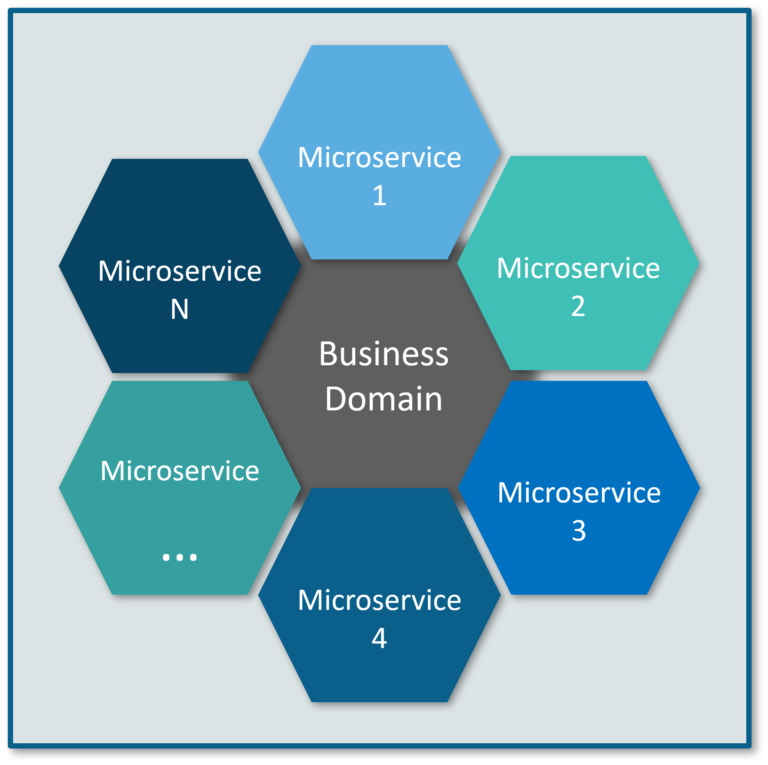
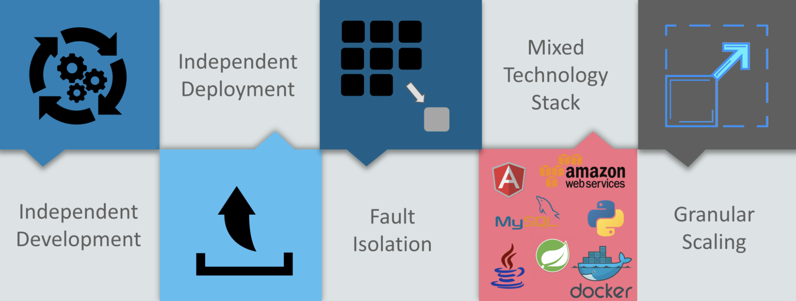
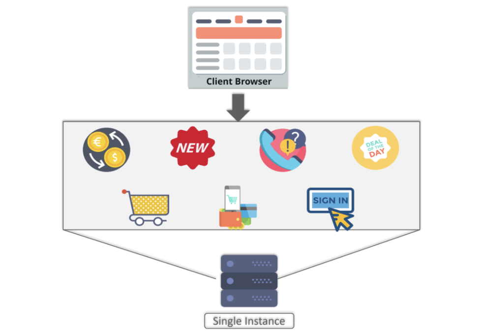
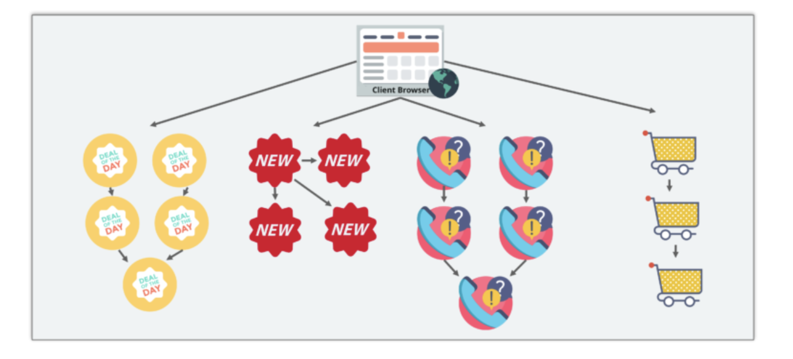
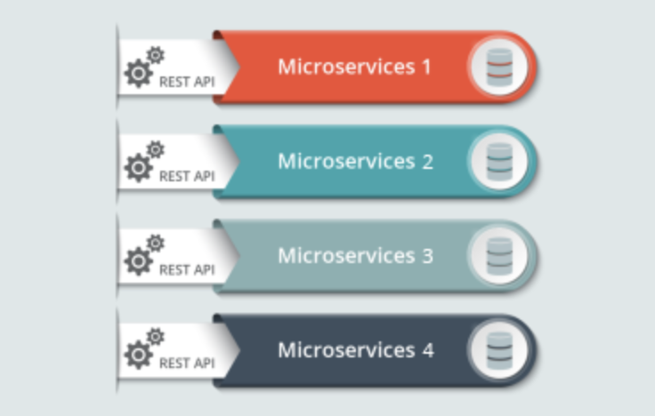

# Understanding Microservices

###### What are microservices?

- An architectural style that structures an application as a collection of small autonomous services, modeled around a business domain.
- A microservice is basically a self contained process that provides a unique business capability.
- Different microservices act in concert as one larger system, but behind the scenes, it's microservices all the way.

> **Example:** 
>
> Take `Amazon.com` for instance. All we see is the website. 
>
> Behind the scenes, Amazon has a **service for accepting orders**, a **service for determining a list of recommended items to buy**, a **service to handle wish lists**, a **service for authenticating credit cards**, and so on. 

 

### Traditional Architecture Vs Microservices

- The main difference we observe in the above diagram is that all the features initially were under a single instance sharing a single database.
- But then, with microservices, each feature was allotted a different microservice, handling their own data, and performing different functionalities.  

 

### Microservice Architecture 

* Different clients from different devices try to use different services like search, build, configure and other management capabilities
* All the services are separated based on their domains and functionalities and  are further allotted to individual microservices
* These microservices have their own `load balancer` and `execution environment` to execute their functionalities & at the same time **captures data in their own databases**
  *All the microservices communicate with each other through a stateless server which is either `REST` or `Message Bus`
* Microservices know their path of communication with the help of **Service Discovery** and perform operational capabilities such as automation, monitoring
* Then all the functionalities performed by microservices are communicated to clients via `API Gateway`
* All the internal points are connected from the API Gateway. So, anybody who connects to the API Gateway automatically gets connected to the complete system

#### Microservices Features

* **Decoupling** – Services within a system are largely decoupled. So the application as a whole can be easily built, altered, and scaled
* **Componentization** – Microservices are treated as independent components that can be easily replaced and upgraded
* **Business Capabilities** – Microservices are very simple and focus on a single capability 
* **Autonomy** – Developers and teams can work independently of each other, thus increasing speed
* **Continous Delivery** – Allows frequent releases of software, through systematic automation of software creation, testing, and approval 
* **Responsibility** – Microservices do not focus on applications as projects. Instead, they treat applications as products for which they are responsible 
* **Decentralized Governance** – The focus is on using the right tool for the right job. That means there is no standardized pattern or any technology pattern. Developers have the freedom to choose the best useful tools to solve their problems 
* **Agility** – Microservices support agile development. Any new feature can be quickly developed and discarded again

#### Advantages Of Microservices

* **Independent Development** – All microservices can be easily developed based on their individual functionality
* **Independent Deployment** – Based on their services, they can be individually deployed in any application 
* **Fault Isolation** – Even if one service of the application does not work, the system still continues to function
* **Mixed Technology Stack** – Different languages and technologies can be used to build different services of the same application
  **Granular Scaling** –  Individual components can scale as per need, there is no need to scale all components together

#### Best Practices To Design Microservices

In today’s world, complexity has managed to creep into products. Microservice architecture promises to keep teams scaling and function better.

 

### Use-Case : Shopping Cart Application

- When you open a shopping cart application, all you see is just a website.
- But, behind the scenes, the shopping cart application has a service for accepting payments, a service for customer services and so on.
- Assume that this application developed using **monolithic framework**.

 

- So, all the features are put together in a single code base and are under a **single underlying database**.
- Now, let’s suppose that there is a new brand coming up in the market and developers want to put all the details of the upcoming brand in this application.
- Then, they not only have to rework on the service for new labels, but they also have to reframe the complete system and deploy it accordingly.

> To avoid such challenges developers of this application decided to shift their application from a monolithic architecture to microservices.

- This means that developers don’t create a web microservice, a logic microservice, or a database microservice. 
- Instead, they create separate microservices for search, recommendations, customer services and so on.
- This type of architecture for the application not only helps the developers to overcome all the challenges faced with the previous architecture but also helps the shopping cart application to be built, deployed, and scale up easily.

 

### Working of Microservice Architecture

* **Clients:** The architecture starts with different types of clients, from different devices trying to perform various management capabilities such as search, build, configure etc.
* **Identity Providers:** These requests from the clients are then passed on the identity providers who authenticate the requests of clients and communicate the requests to API Gateway. The requests are then communicated to the internal services via well-defined  API Gateway.
* 
* **API Gateway:** Since clients don’t call the services directly, API Gateway acts as an entry point for the clients to forward requests to appropriate microservices. 
  **The advantages of using an API gateway include:**
  * All the services can be updated without the clients knowing.
  * Services can also use messaging protocols that are not web-friendly.
  * The API Gateway can perform cross-cutting functions such as providing security, load balancing etc.
  * After receiving the requests of clients, the internal architecture consists of microservices which communicate with each other through messages to handle client requests.
* **Messaging Formats:** 
  There are two types of messages through which they communicate:
  * **Synchronous Messages:** In the situation where clients wait for the responses from a service, Microservices usually tend to use REST (Representational State Transfer) as it relies on a stateless, client-server, and the HTTP protocol. This protocol is used as it is a distributed environment each and every functionality is represented with a resource to carry out operations
  * **Asynchronous Messages:** In the situation where clients do not wait for the responses from a service, Microservices usually tend to use protocols such as AMQP, STOMP, MQTT.These protocols are used in this type of communication since the nature of messages is defined and these messages have to be interoperable between implementations.
* **Data Handling:** Well, each Microservice owns a private database to capture their data and implement the respective business functionality.Also, the databases of Microservices are updated through their service API only. 

The services provided by Microservices are carried forward to any remote service which supports inter-process communication for different technology stacks.

* **Static Content:** After the Microservices communicate within themselves, they deploy the static content to a cloud-based storage service that can deliver them directly to the clients via Content Delivery Networks (CDNs).
* **Management:** This component is responsible for balancing the services on nodes and identifying failures.
* **Service Discovery:**Acts as a guide to Microservices to find the route of communication between them as it maintains a list of services on which nodes are located.

 

 

---

