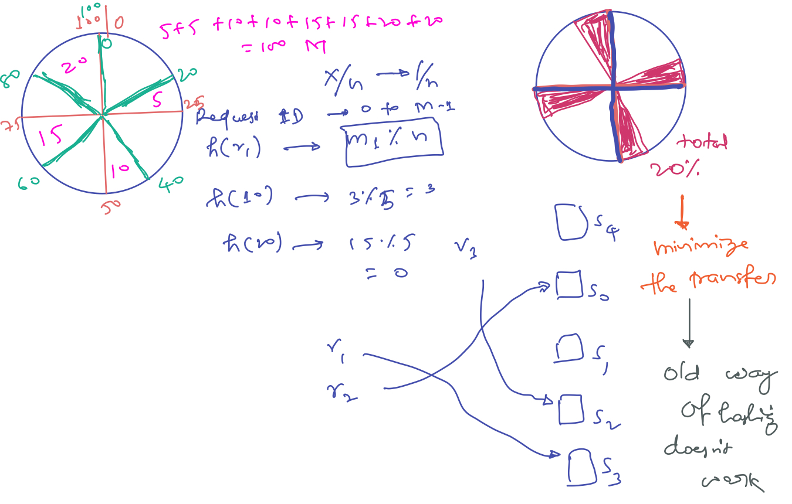
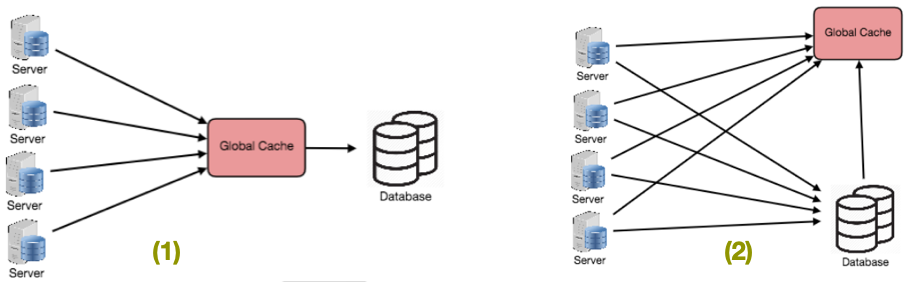
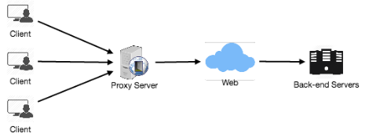

# System Design Concepts - 1

###### Here we will have a look into following important System Design Concepts.

- Scaling
- Consistent Hashing
- CAP Theorem
- Load Balancing
- Caching
- Sharding / Data Partitioning
- Index 
- Proxies

 

## Scaling

- **Vertical Scaling:**
  - Add more memory, CPU and Hard-drive to an existing host.
  - It can be expensive and also has a limitation on how much memory and CPU we can add to a single host.
  - But it doesn’t have distributed systems problem.
- **Horizontal Scaling:**
  - Keep one host small but add another host.
  - Can infinitely keep adding more hosts but we need to deal with all the distributed system challenges.
- Horizontal scaling is more preferred than Vertical Scaling.

 

## Consistent Hashing

- **Distributed Hash Table (DHT)** is one of the fundamental component used in distributed scalable systems.
- Hash Tables need key, value and a hash function, where hash function maps the key to a location where the value is stored.

###### Designing a Distributed Cache System:

- Suppose we are designing a distributed caching system.
- Given ‘n’ cache servers, an intuitive hash function would be ‘key % n’.
- It is simple and commonly used, but it has two major drawbacks:
  1. It is **NOT horizontally scalable**. Whenever a new cache host is added to the system, all existing mappings are broken.
  2. It may **NOT be load balanced**, especially for non-uniformly distributed data. In practice, it can be easily assumed that the data will not be distributed uniformly.

- So, here problem is when we are adding and removing servers.

- In such situations, consistent hashing is a good way to improve the caching system.

###### What is Consistent Hashing ?

- We need a distribution scheme that does not depend directly on the number of servers, so that, when adding or removing servers, the number of keys that need to be relocated is minimized. One such scheme—a clever, yet surprisingly simple one—is called consistent hashing, and was first described by Karger et al. at MIT in an academic paper from 1997 

- Consistent hashing is a very useful strategy for distributed caching system and DHTs. It allows distributing data across a cluster in such a way that will minimize reorganization when nodes are added or removed. Hence, making the caching system easier to scale up or down.
- In Consistent Hashing when the hash table is resized (e.g. a new cache host is added to the system), only k/n keys need to be remapped, where k is the total number of keys and n is the total number of servers.
- Recall that in a caching system using the ‘mod’ as the hash function, all keys need to be remapped. In consistent hashing objects are mapped to the same host if possible. When a host is removed from the system, the objects on that host are shared by other hosts; and when a new host is added, it takes its share from a few hosts without touching other’s shares.

###### How Consistent Hashing Works ?

- As a typical hash function, consistent hashing maps a key to an integer. Suppose the output of the hash function is in the range of [0, 256). Imagine that the integers in the range are placed on a ring such that the values are wrapped around.
- Here’s how consistent hashing works:
  1. Given a list of cache servers, hash them to integers in the range.
  2. To map a key to a server,
     - Hash it to a single integer.
     - Move clockwise on the ring until finding the first cache it encounters.
     - That cache is the one that contains the key.

- To [add a new server](), say D, keys that were originally residing at C will be split. Some of them will be shifted to D, while other keys will not be touched.
- To [remove a cache or if a cache failed, say A](), all keys that were originally mapping to A will fall into B, and only those keys need to be moved to B, other keys will not be affected.
- For [load balancing](), as we discussed in the beginning, the real data is essentially randomly distributed and thus may not be uniform. It **may make the keys on caches unbalanced**.
- To [handle this issue, we add virtual replicas for caches](). Instead of mapping each cache to a single point on the ring, we map it to multiple points on the ring, i.e. replicas. This way, each cache is associated with multiple portions of the ring.
-  If the hash function is “mixes well,” as the number of replicas increases, the keys will be more balanced.

 

## CAP (Consistency, Availability, Partition Tolerance) Theorem

- Also k/a **Brewer's theorem** it states that it is impossible for a distributed data store to simultaneously provide more than two out of the following three guarantees: 
    - **Consistency:** Every read receives the most recent write or an error. 
    - **Availability:** Every request receives a (non-error) response – without the guarantee that it contains the most recent write. 
    - **Partition tolerance or Failure acceptance of Distributed System:** System continues to operate despite an arbitrary number of messages being dropped (or delayed) by the network between nodes. 
- **In particular, the CAP theorem implies that in the presence of a network partition or failure, one has to choose between consistency and availability.**
- **Note:** Consistency as defined in the CAP theorem is quite different from the consistency guaranteed in ACID database transactions. 
- No distributed system is safe from network failures, thus network partitioning generally has to be tolerated.
- In the **presence of a network partition or failure**, one is then left with two options: consistency or availability. 
    - **Consistency over Availability:** System will return an error or a time-out if particular information cannot be guaranteed to be up to date due to network partitioning.
    - **Availability over Consistency:** System will always process the query and try to return the most recent available version of the information, even if it cannot guarantee it is up to date due to network partitioning.
- In the **absence of network failure** – that is, when the distributed system is running normally – both availability and consistency can be satisfied. 
- CAP is **frequently misunderstood** as if one has to choose to abandon one of the three guarantees at all times. In fact, the choice is really between consistency and availability **only when a network partition or failure happens**; at all other times, no trade-off has to be made.

 

## Load Balancing

- Load balancer (LB) is another critical piece of any distributed system which helps to distribute load across multiple resources.
- It does that a/c to some metric (random, round-robin, random with weighting for memory or CPU utilization, etc.).
- LB also keeps track of the status of all the resources while distributing requests.
- If a server is not available to take new requests or not responding or has elevated error rate, LB will stop sending traffic to such a server.
- To utilize full scalability and redundancy, we can try to balance the load at each layer of the system. We can add LBs at three places:
  - Between the user and the web server
  - Between web servers and an internal platform layer, like application servers or cache servers
  - Between internal platform layer and database.

 

> ##### Ways of implementing Load Balancing

###### 1. Smart Clients

- A smart client will take a pool of service hosts and balances load across them.
- It also detects hosts that are not responding to avoid sending requests their way.
- Smart clients also have to detect recovered hosts, deal with adding new hosts, etc.
- Adding load-balancing functionality into the database (cache, service, etc.) client is usually an attractive solution for the developer.
- It looks easy to implement and manage especially when the system is not large.
- But as the system grows, LBs need to be evolved into standalone servers.

###### 2. Hardware Load Balancers

- The most expensive–but very high performance–solution to load balancing is to buy a dedicated hardware load balancer (something like a [Citrix NetScaler]()).
- While they can solve a remarkable range of problems, hardware solutions are very expensive, and they are not trivial to configure.
- As such, even large companies with large budgets will often **avoid using dedicated hardware for all their load-balancing needs**.
- Instead, they **use them only as the first point of contact for user requests to their infrastructure** and use ***other mechanisms (smart clients or the hybrid approach) for load-balancing for traffic within their network***.

###### 3. Software Load Balancers

- If we want to avoid the pain of creating a smart client, and since purchasing dedicated hardware is excessive, we can adopt a hybrid approach, called software load-balancers. **HAProxy** is a one of the popular open source software LB.
- Load balancer can be placed between client and server or between two server side layers.
- **If we can control the client's machine** where it is running, HAProxy could be running on the same machine.
  - Each service we want to load balance can have a locally bound port (e.g., localhost:9000) on that machine, and the client will use this port to connect to the server.
  - This port is, actually, managed by HAProxy; every client request on this port will be received by the proxy and then passed to the backend service in an efficient way (distributing load).
- **If we can’t manage client’s machine**, HAProxy can run on an intermediate server.
- Similarly, we can have proxies running between different server side components. 
- HAProxy manages health checks and will remove or add machines to those pools.
- It also balances requests across all the machines in those pools.

> **Note:-** For most systems, we should start with a software load balancer and move to smart clients or hardware load balancing as need arises.

 

## Caching

- Load balancing helps us scale horizontally across an ever-increasing number of servers, but caching will enable us to make vastly better use of the resources we already have, as well as making otherwise unattainable product requirements feasible.
- Caches take advantage of the **locality of reference principle**: recently requested data is likely to be requested again.
- They are **used in almost every layer of computing**: hardware, operating systems, web browsers, web applications and more.
- A cache is like **short-term memory**: it has a limited amount of space, but is typically faster than the original data source and contains the most recently accessed items.
- Caches **can exist at all levels in architecture** but are **often found at the level nearest to the front-end**, where they are implemented to return data quickly without taxing downstream levels.

###### 1. Application Server Cache

- Placing a cache directly on a request layer node enables the local storage of response data.
- Each time a request is made to the service, the node will quickly return local, cached data if it exists. If it is not in the cache, the requesting node will query the data from disk.
- The cache on one request layer node could also be located both in memory (which is very fast) and on the node’s local disk (faster than going to network storage).
- What happens when we expand this to many nodes? If the request layer is expanded to multiple nodes, it’s still quite possible to have each node host its own cache.
- However, if our load balancer randomly distributes requests across the nodes, the same request will go to different nodes, thus increasing cache misses. Two choices for overcoming this hurdle are [global caches]() and [distributed caches]().

###### 2. Distributed Cache

- In a distributed cache, each of its nodes own part of the cached data.
- Typically, the cache is divided up using a consistent hashing function, such that if a request node is looking for a certain piece of data, it can quickly know where to look within the distributed cache to determine if that data is available.
- In this case, each node has a small piece of the cache, and will then send a request to another node for the data before going to origin.
- Hence, one of the advantages of a distributed cache is the increased cache space just by adding nodes to the request pool.
- A disadvantage of distributed caching is remedying a missing node.
- Some distributed caches get around this by storing multiple copies of the data on different nodes; however, we can imagine how this logic can get complicated quickly, especially when we add or remove nodes from the request layer.
- Although even if a node disappears and part of the cache is lost, the requests will just pull from the origin—so it isn’t necessarily catastrophic.

###### 3. Global Cache

- A global cache is just as it sounds: all the nodes use the same single cache space.

- This involves adding a server, or file store of some sort, faster than your original store and accessible by all the request layer nodes.

- Each of the request nodes queries the cache in the same way it would a local one.

- This kind of caching scheme can get a bit complicated because it is very easy to overwhelm a single cache as the number of clients and requests increase, but is very effective in some architectures (particularly ones with specialized hardware that make this global cache very fast, or that have a fixed dataset that needs to be cached).

- There are **2 common forms of global caches** depicted in the following diagram.

  1. First, when a cached response is not found in the cache, the cache itself becomes responsible for retrieving the missing piece of data from the underlying store.
  2. Second, it is the responsibility of request nodes to retrieve any data that is not found in the cache.

  

- **Most applications leveraging global caches tend to use the first type**, where the cache itself manages eviction and fetching data to prevent a flood of requests for the same data from the clients.
- However, there are some cases where the second implementation makes more sense. For example, if the cache is being used for very large files, a low cache hit percentage would cause the cache buffer to become overwhelmed with cache misses; in this situation, it helps to have a large percentage of the total data set (or hot data set) in the cache.
- Another example is an architecture where the files stored in the cache are static and shouldn’t be evicted. (This could be because of application requirements around that data latency—certain pieces of data might need to be very fast for large data sets—where the application logic understands the eviction strategy or hot spots better than the cache.)

###### 4. Content Distribution Network (CDNs)

- CDNs are a kind of cache that comes into play for **sites serving large amounts of static media (Netflix)**. 
- In a typical CDN setup, a request will first ask the CDN for a piece of static media, the CDN will serve that content if it has it locally available, if not the CDN will query the back-end servers for the file and then cache it locally and serve it to the requesting user.
- If system we are building isn’t yet large enough to have its own CDN, we can ease a future transition by serving static medias off a separate subdomain (eg: static.ourservice.com) using a lightweight HTTP server like Nginx, & cutover the DNS from server to a CDN later.

 

> ##### Cache Invalidation

- While caching is fantastic, it does require some maintenance for keeping cache coherent with the source of truth (e.g., database).
- If the data is modified in the database, it should be invalidated in the cache, if not, this can cause inconsistent application behavior.
- Solving this problem is known as **cache invalidation**, there are **3 main schemes** that are used:
- [Write-through cache :]() 
  - Under this scheme data is written into the cache and the corresponding database at the same time.
  - The cached data allows for fast retrieval, and since the same data gets written in the permanent storage, we will have complete data consistency between cache and storage.
  - Also, this scheme ensures that nothing will get lost in case of a crash, power failure, or other system disruptions.
  - Although write through minimizes the risk of data loss, since every write operation must be done twice before returning success to the client, this scheme has the disadvantage of higher latency for write operations.
- [Write-around cache :]()
  - This technique is similar to write through cache, but data is written directly to permanent storage, bypassing the cache.
  - This can reduce the cache being flooded with write operations that will not subsequently be re-read, but has the disadvantage that a read request for recently written data will create a “cache miss” and must be read from slower back-end storage and experience higher latency.
- [Write-back cache :]()
  - Under this scheme, data is written to cache alone, and completion is immediately confirmed to the client.
  - The write to the permanent storage is done after specified intervals or under certain conditions.
  - This results in low latency and high throughput for write-intensive applications, however, this speed comes with the risk of data loss in case of a crash or other adverse event because the only copy of the written data is in the cache.

 

> ##### Cache Eviction Policies

Following are some of the most common cache eviction policies:
1. **First In First Out (FIFO) :** The cache evicts the first block accessed first.
2. **Last In First Out (LIFO) :** The cache evicts the block accessed most recently first.
3. **Least Recently Used (LRU) :** Discards the least recently used items first.
4. **Most Recently Used (MRU) :** Discards, in contrast to LRU, the most recently used items first.
5. **Least Frequently Used (LFU) :** Counts how often an item is needed, those that are used least often are discarded first.
6. **Random Replacement (RR) :** Randomly selects a candidate item and discards it to make space when necessary.

 

## Sharding or Data Partitioning

- Data partitioning (also known as sharding) is a technique to break up a big database (DB) into many smaller parts.
- It is the process of splitting up a DB/table across multiple machines to improve the manageability, performance, availability and load balancing of an application.
- The justification for data sharding is that, after a certain scale point, it is cheaper and more feasible to scale horizontally by adding more machines than to grow it vertically by adding beefier servers.

 

> ##### Partitioning Methods

- There are many different schemes one could use to decide how to break up an application database into multiple smaller DBs.
- Below are **3 of the most popular schemes** used by various large scale applications.

###### 1. Horizontal partitioning : 

- In this scheme, we put different rows into different tables.
- ***Example :-*** if we are storing different places in a table, we can decide that locations with ZIP codes less than 10000 are stored in one table, and places with ZIP codes greater than 10000 are stored in a separate table. This is also called a range based sharding, as we are storing different ranges of data in separate tables.
- The **key problem** with this approach is that if the value whose range is used for sharding isn’t chosen carefully, then the partitioning scheme will lead to unbalanced servers.
- In the previous example, splitting location based on their zip codes assumes that places will be evenly distributed across the different zip codes, but this assumption is not valid as there will be a lot of places in a thickly populated area like Manhattan compared to other cities.

###### 2. Vertical Partitioning :

- In this scheme, we divide our data to store tables related to a specific feature to their own server.
- ***Example :-*** if we are building Instagram like application, where we need to store data related to users, all the photos they upload and people they follow, we can decide to place user profile information on one DB server, friend lists on another and photos on third server.
- Vertical partitioning is straightforward to implement and has a low impact on the application.
- The **main problem** with this approach is that if our application experiences additional growth, then it may be necessary
  to further partition a feature specific DB across various servers (e.g. it would not be possible for a single server to handle all the metadata queries for 10 billion photos by 140 million users).

###### 3. Directory Based Partitioning :

- A loosely coupled approach to work around issues mentioned in above schemes is to create a lookup service which knows our current partitioning scheme and abstracts it away from the DB access code.
- So, to find out where does a particular data entity resides, we query our directory server that holds the mapping between each tuple key to its DB server.
- This loosely coupled approach means we can perform tasks like adding servers to the DB pool or change our partitioning scheme without having to impact your application.

 

> ##### Partitioning Criteria

###### 1. Key or Hash-based partitioning :

- Under this scheme, we apply a hash function to some key attribute of the entity we are storing, that yields the partition number. 
- *Example:-* If we have 100 DB servers and our ID is a numeric value that gets incremented by one, each time a new record is inserted. Here the hash function could be **`ID % 100`**, which will give us the server number where we can store/read that record.
- This approach should ensure a uniform allocation of data among servers.
- The **fundamental problem** with this approach is that it effectively fixes the total number of DB servers, since adding new servers means changing the hash function which would require redistribution of data and downtime for the service.
- A workaround for this problem is to use **Consistent Hashing**.

###### 2. List partitioning :

- In this scheme, each partition is assigned a list of values, so whenever we want to insert a new record, we will see which partition contains our key and then store it there.
- *Example:-* we can decide to store users living in Iceland, Norway, Sweden, Finland or Denmark in a partition for the Nordic countries.

###### 3. Round-robin partitioning :

- This is a very simple strategy that ensures uniform data distribution. With ‘n’ partitions, the ‘i’ tuple is assigned to partition (i mod n).

###### 4. Composite partitioning : 

- Under this scheme, we combine any of above partitioning schemes to devise a new scheme.
- *Example:-* first applying a list partitioning and then a hash based partitioning. Consistent hashing could be considered a composite of hash and list partitioning where the hash reduces the key space to a size that can be listed.

 

> ##### Common Problems of Sharding

- On a sharded database, there are certain extra constraints on the different operations that can be performed.
- Most of these constraints are due to the fact that, operations across multiple tables or multiple rows in the same table, will no longer run on the same server.
- Below are some of the **constraints and additional complexities introduced by sharding**:

###### 1. Joins and Denormalization: 

- Performing joins on a database which is running on one server is straightforward, but once a database is partitioned and spread across multiple machines it is often not feasible to perform joins that span database shards.
- Such joins will not be performance efficient since data has to be compiled from multiple servers.
- A common workaround for this problem is to denormalize the database so that queries that previously required joins can be performed from a single table.
- Offcourse, the service now has to deal with all the perils of denormalization such as data inconsistency.

###### 2. Referential integrity: 

- As we saw that performing a cross-shard query on a partitioned database is not feasible, similarly trying to enforce data integrity constraints such as foreign keys in a sharded database can be extremely difficult.
- Most of RDBMS do not support foreign keys constraints across databases on different database servers.
- Which means that applications that require referential integrity on sharded databases often have to enforce it in application code.
- Often in such cases, applications have to run regular SQL jobs to clean up dangling references.

###### 3. Rebalancing:

- There could be many reasons we have to change our sharding scheme:
  - The data distribution is not uniform e.g. there are a lot of places for a particular ZIP code, that cannot fit into one database partition.
  - There are a lot of load on a shard, e.g., there are too many requests being handled by the DB shard dedicated to user photos.
- In such cases, either we have to create more DB shards or have to rebalance existing shards, which means changing partitioning scheme and moving all existing data to new locations.
- Doing this without incurring downtime is extremely difficult. Using a scheme like directory based partitioning does make rebalancing a more palatable experience at the cost of increasing the complexity of the system and creating a new single point of failure (i.e. the lookup service/database).

 

## Indexes

- Indexes are well known when it comes to databases; they are used to improve the speed of data retrieval operations on the data store.
- An index makes the trade-offs of increased storage overhead, and slower writes (since we not only have to write the data but also have to update the index) for the benefit of faster reads.
- Indexes are used to quickly locate data without having to examine every row in a database table. Indexes can be created using one or more columns of a database table, providing the basis for both rapid random lookups and efficient access of ordered records.
- An index is a data structure that can be perceived as a table of contents that points us to the location where actual data lives.
- So when we create an index on a column of a table, we store that column and a pointer to the whole row in the index.
- Indexes are also used to create different views of the same data.
- For large data sets, it's an excellent way to specify different filters or sorting schemes without resorting to creating multiple additional copies of the data.
- Just as to a traditional relational data store, we can also apply this concept to larger data sets.
- The trick with indexes is that we must carefully consider how users will access the data.
- In the case of data sets being in TBs but with very small payloads (e.g, 1KB), indexes are a necessity for optimizing data access.
- Finding a small payload in such a large data set can be a real challenge as we can't iterate over that much data in any reasonable time.
- Furthermore, it is very likely that such a large data set is spread over several physical devices—this means we need some way to find the correct physical location of the desired data and indexes are the best way to do this.

 

## Proxies

- A proxy server is an **intermediary piece of hardware/software that sits between the client and the back-end server**.
- It receives requests from clients and relays them to the origin servers.
- Typically, proxies are used to filter requests or log requests, or sometimes transform requests (by adding/removing headers, encrypting/decrypting, or compression).
- Another advantage of a proxy server is that its cache can serve a lot of requests.
- If multiple clients access a particular resource, the proxy server can cache it and serve all clients without going to the remote server.
- Proxies are also extremely helpful when coordinating requests from multiple servers and can be used to optimize request traffic from a system-wide perspective. 
- *Example :-* we can collapse the same (or similar) data access requests into one request and then return the single result to the user; this scheme is called **collapsed forwarding**.
- Imagine there is a request for the same data across several nodes, and that piece of data is not in the cache. If these requests are routed through the proxy, then all them can be collapsed into one, which means we will be reading the required data from the disk only once.
- Another great way to use the proxy is to collapse requests for data that is spatially close together in the storage (consecutively on disk), this will result in decreasing request latency.
- *Example :-* let’s say a bunch of servers request parts of file: part1, part2, part3, etc. We can set up our proxy in such a way that it can recognize the spatial locality of the individual requests, thus collapsing them into a single request and reading complete file, which will greatly minimize the reads from the data origin.
- Such scheme makes a big difference in request time when we are doing random accesses across TBs of data.
- Proxies are particularly useful under high load situations, or when we have limited caching since proxies can mostly batch several requests into one.

 

 

------

<a href="basics" class="prev-button"><--- Previous: Basics</a> 

<a href="concepts-part-2" class="next-button">Next: Concepts - Part-2 ---></a>

