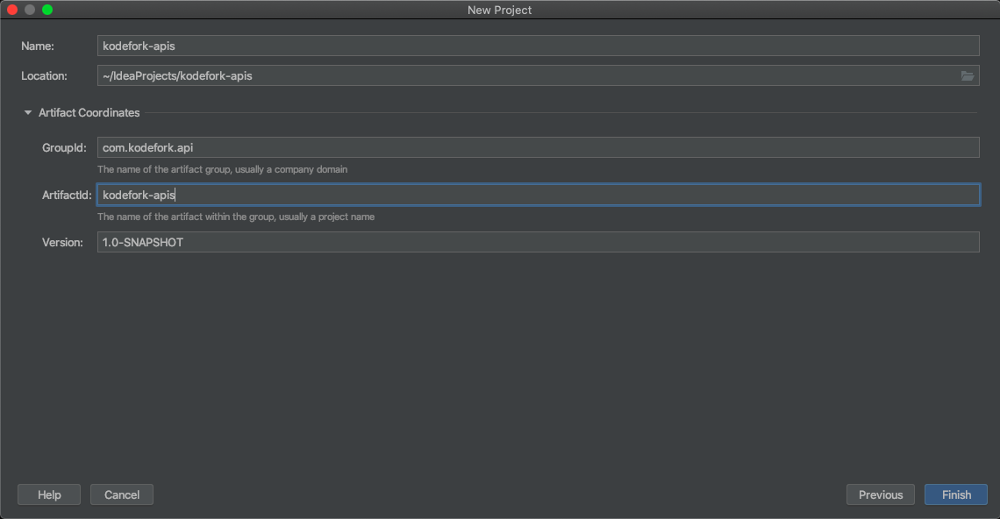
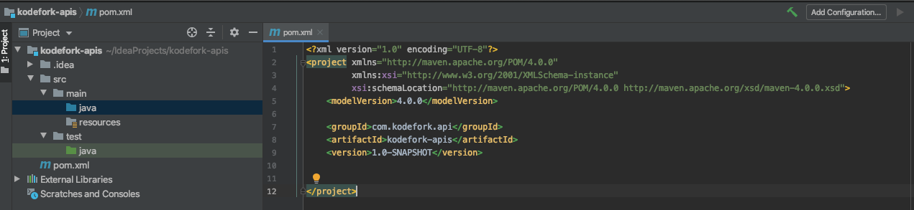

# Spring Boot Framework

###### What is Spring Boot ?

- Spring Boot makes it easy to create stand-alone, production-grade Spring grade applications that we can **just run.**

###### What is Spring ?

- Application Framework
- Dependecy Injection
- Provides a template which lets us build an enterprise application.
- Programming and Configuration Model
- Focus on business problem and let string handle other things.
- Infrastructure Support
  - Connecting to Database (R-DBMS database, MongoDB etc)

- [Problems with Spring]()
  - Huge Framework
  - Multiple Setup Steps
  - Multiple Configuration Steps
  - Multiple Build & Deploy Steps


## Introduction

###### Spring Boot

- Opinionated
- Convention over Configuration
- Stand-alone
- Production Ready

###### Maven

- Dependency management tool
- Mangaes dependency using pom.xml


## Creating a Project

###### Step-1: Create a simple Maven Project







###### Step-2: Convert to Spring Project using Spring Boot Convention

Put the below dependency in pom.xml.

```xml
<parent>
    <groupId>org.springframework.boot</groupId>
    <artifactId>spring-boot-starter-parent</artifactId>
    <version>2.2.6.RELEASE</version>
</parent>
```


###### Step-3: Converting it to a Web Application

Add the web dependencies to make it a web application.

```xml
<dependency>
    <groupId>org.springframework.boot</groupId>
    <artifactId>spring-boot-starter-web</artifactId>
    <version>2.2.6.RELEASE</version>
</dependency>
```


###### Step-4: Use the appropriate Java version

```xml
<properties>
    <java.version>1.8</java.version>
</properties>
```


## Starting the Spring Boot App

Create a class **App.java** with below code.

```java
package com.kodefork.articles;

import org.springframework.boot.SpringApplication;
import org.springframework.boot.autoconfigure.SpringBootApplication;

@SpringBootApplication
public class App {
    public static void main(String[] args){
        // Create a servlet container and run
        SpringApplication.run(App.class, args);
    }
}
```

> **Notes:**
>
> - **SpringApplication** has a static method [run()]() that does all the magic, it takes class **App** and starts spring boot application as it it annotated by **`@SpringBootApplication` **.


###### Starting Spring Boot

- Sets up default configuration.
- Starts Spring application context.
- Performs class path scan.
- Starts tomcat server.

- [Application Context]()
  - Spring is a container for all the code that runs on application server, and this container is called application context.
  - Application server has business services, controllers and data services and spring acts as container for all these services.
  - This container is k/a application context.
- Spring boot starter creates this application context.
- Spring boot also performs a class path scan.
- While scanning it looks for special annotations like if class has
  - **@Service** annotation it is a service 
  - **@Controller** annotation it is controller
- After scanning it treats class as the given annotation.


## Adding a Controller

###### Controller

- A Java Class
- Marked with annotations
- Has info about
  - What URL access triggers it ?
  - What method to run when accessed ?
- Also provides information about what URL access needs to trigger that controller to execute.

##### Spring MVC Framework

- The web layer in spring boot application leverages a spring framework **Spring MVC** a child project of while Spring Framework.
- It lets us build server-side code which maps to URLs and provides responses.
- Responses can be :
  - REST Api response in form of JSON.
  - A full HTML page.
  - A JSP or FTL Response.

###### Writing a REST Controller

- To make a class REST Controller just put [@RestController]() annotation above the class.
- Use [@RequestMapping]() annotation to map method to a particular request url.
- By default, @RequestMapping maps only to GET method, to map other method we need to specify it in annotation.


-----

Let's perform a quick side-by-side comparison, so we can have a  bird's eye view of the constraints' functionality and easily spot their  differences:

- *@NotNull:* a constrained *CharSequence*, *Collection*, *Map,* or *Array* is valid as long as it's not null, but it can be empty
- *@NotEmpty:* a constrained *CharSequence*, *Collection*, *Map,* or *Array* is valid as long as it's not null and its size/length is greater than zero
- *@NotBlank:* a constrained *String* is valid as long as it's not null and the trimmed length is greater than zero


