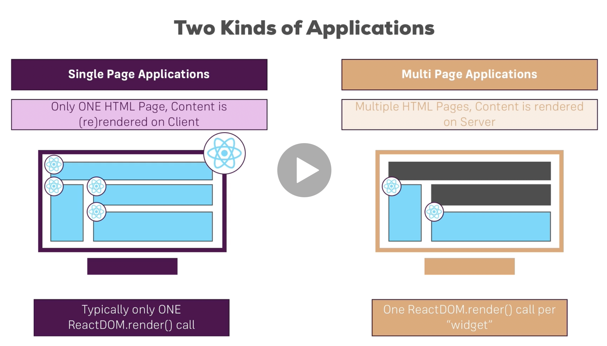
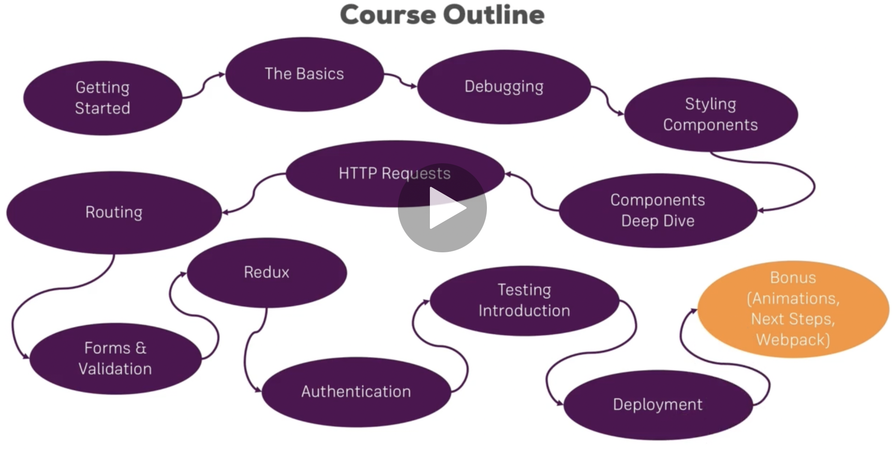
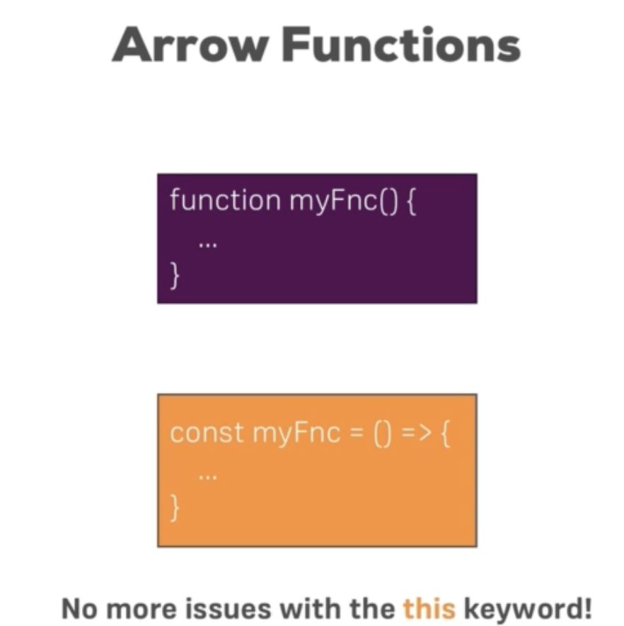
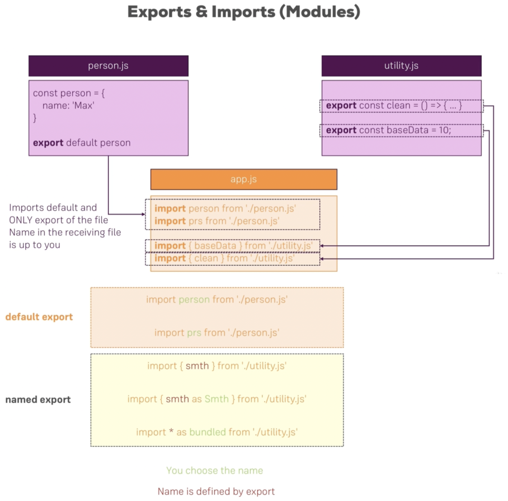
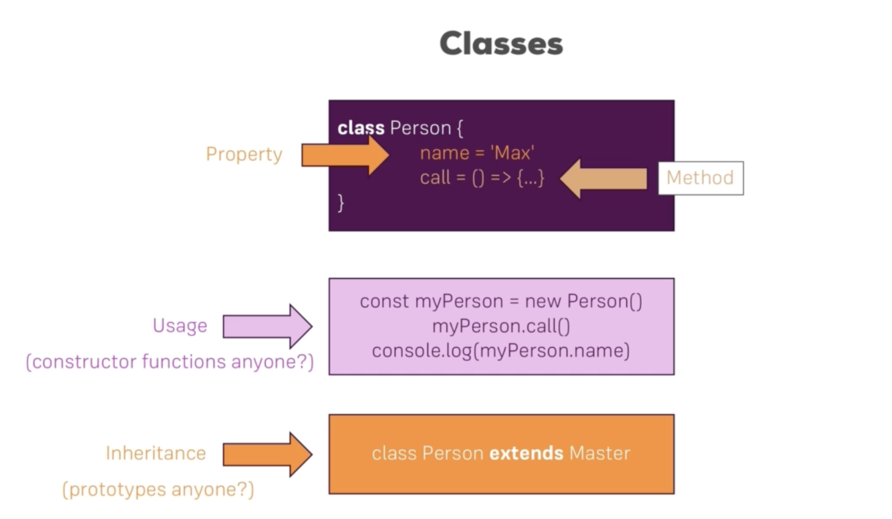
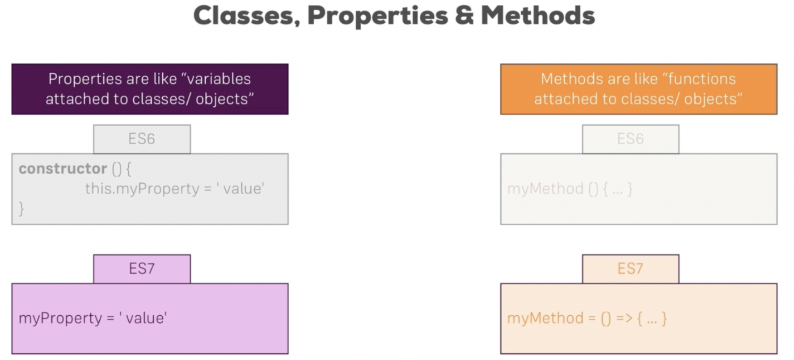
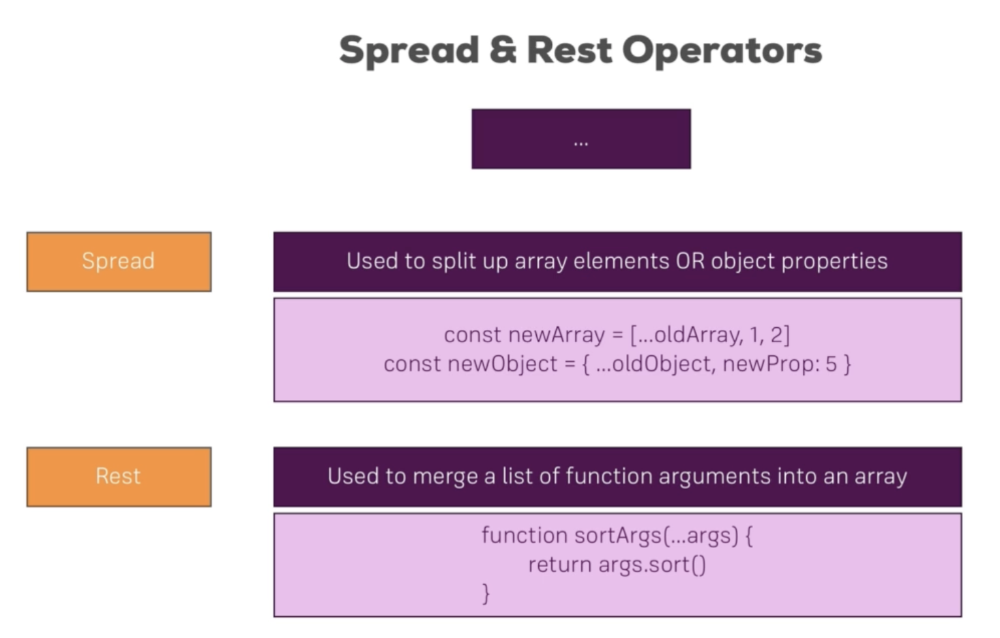
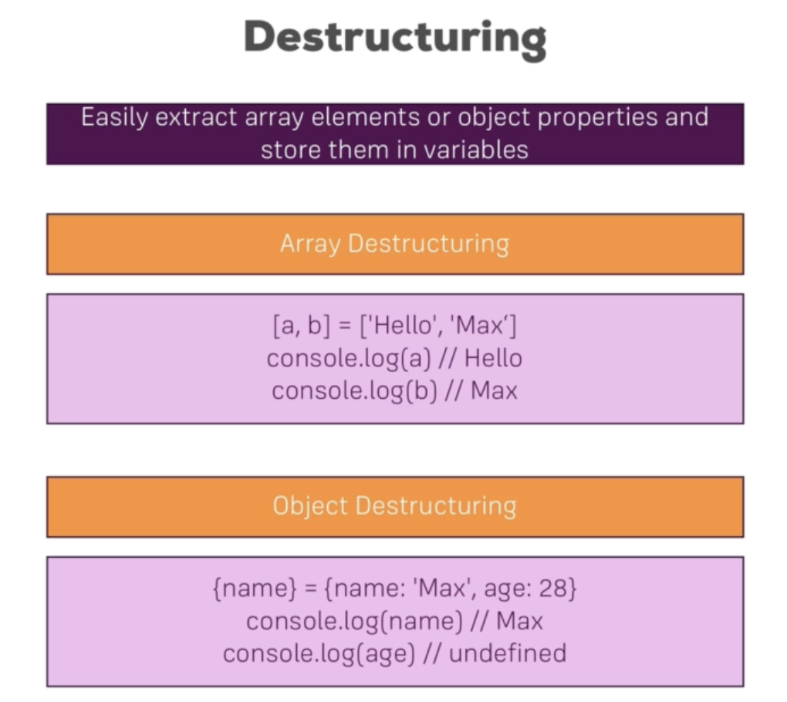
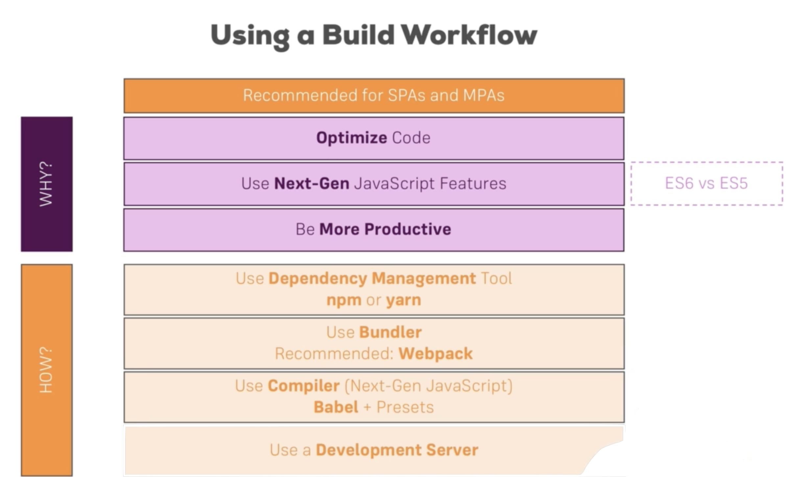

# React.js

The Frontend tech for developing using interfaces.

## 1. Introduction

###### What is React ?

- A javascript library for building user interfaces.
- It is all about components.

<br>

###### Why React ?

- UI states become difficult to handle with Vanilla Javascript.
- Focus on business logic, not on preventing app from exploding.
- Huge ecosystem, Active community, High performance.

<br>

###### Single-Page Vs Multi-Page Applications



<br>

<br>

###### Course Outline



<br>

<br>

<br>

## 2. Next-Gen JavaScript Features

###### let & const

- **let:** to declare actual variables
- **const:** to declare constant variables

<br>

###### Arrow Functions



```js
// Arrow Functions
const printMyName = (name, age) => {
    console.log("Name: " + name + ", Age:" + age);
}

const multiplyBy5 = num => num*5
```

<br>

###### Exports & Imports (Modules)



<br>

###### Classes



```js
class Human {
  constructor(){
    this.gender = 'Male';
  }
  
  printGender(){
    console.log(this.gender);
  }
}

class Person extends Human {
  constructor(){
    super();
    this.name = 'Astik';
  }
  
  printMyName(){
    console.log(this.name);
  }
}

const person = new Person();
person.printMyName();
person.printGender();
```

> [Note:]() Classes are used by react to create its components, this is one of 2 ways to create a component.

<br>

###### Classes, Properties and Methods



> [Note:]() We will be using the next-gen javascript ES7 type syntaxes.

```js
class Human {
  gender = 'Male';
  
  printGender = () => {
    console.log(this.gender);
  }
}

class Person extends Human {
  name = 'Astik';
  
  printMyName = () => {
    console.log(this.name);
  }
}

const person = new Person();
person.printMyName();
person.printGender();
```

<br>

###### Spread & Rest Operators



**Spread Operator Example:**

```js
const numbers = [1, 2, 3];
const newNumbers = [...numbers, 4]

console.log(newNumbers)
// [1, 2, 3, 4]

const person = {
  name: 'Astik'
};
const newPerson = {
  ...person,
  age: 28
};

console.log(newPerson);
// [object Object] {
//   age: 28,
//   name: "Astik"
// }
```

<br>

**Rest Operator Example:**

```js
cons myFilter = (...args) => {
  return args.filter(el => el === 1);
}

console.log(myFilter(1, 2, 3));
// [1]
```

<br>

###### Destructuring



**Example:**

```js
const numbers = [1, 2, 3]
num1, num2 = numbers
console.log(num1, num2)
// 1
// 2

num1, ,num3 = numbers
console.log(num1, num3)
// 1
// 3
```

<br>

###### Reference and Primitive Types Refresher

- **Primitive Types:** Numbers, Strings, Booleans are primitive types whenever we reassign or  store a variable in another variable it will copy the value
- **Reference Types:** Objects and Arrays are reference types, if we reassign it to different variable both points to same object and changing anyone  will change the object and will be reflected in both variable.

```js
const person = {
  name: 'Astik'
};

const secondPerson = person;
person.name = 'Anand';

console.log(secondPerson);
// [object Object] {
//  	name: "Anand"
// }
```

<br>

###### Refreshing Array Functions

- There are methods like `map()` and `filter()` which works on every element of an array and then creates a new array.

```js
const numbers = [1, 2, 3];
const numbersDoubles = numbers.map((num) => {
  return num*2;
});

console.log(numbers);
console.log(numbersDoubled);
// [1, 2, 3]
// [2, 4, 6]
```

<br>

<br>

## 3. Understanding Basic Features & Syntax

###### Using a Build Workflow




<br>

###### Setting up the project

**Step-1:** Download node js from https://nodejs.org/en/.

**Step-2:** Now create the react app project and run server.

```
npx create-react-app react-test-app
cd react-test-app
npm start
```

**Step-3:** Check the local server by hitting http://localhost:3000


